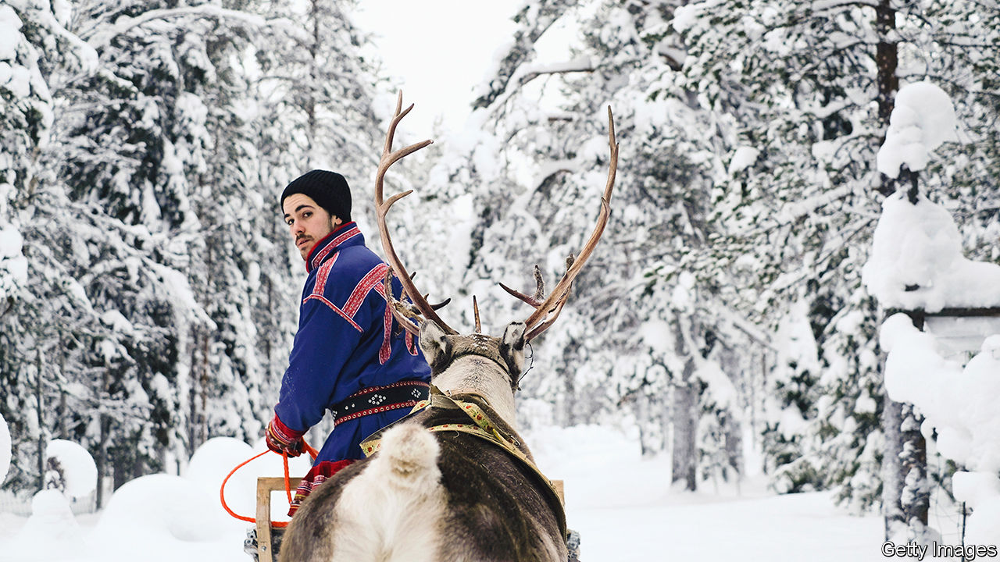

###### Reining in the reindeer

# Russia’s war is splitting the indigenous Sami in two 

##### Border restrictions keep Scandinavian and Russian Sami apart 

 

> Jan 18th 2024 

The sami are used to change. The indigenous people has been pushed north by settlers and pulled south by economics. They now number just 70,000, a small share of the population of the Sapmi, their ancestral homeland, which stretches across Scandinavia and the Kola peninsula. Now Russian aggression has split them in two.

Since Russia attacked Ukraine in 2022, border closings have cut off Russian Sami from their kin in Norway, Sweden and Finland. This winter Finland shut its border after influxes of migrants, leaving Norway’s Storskog the only open crossing from Russia to the EU. Some visa agreements have been cancelled. Russian-registered cars are banned.

States have often conflicted with indigenous peoples’ conceptions of space. Reindeer husbandry, central to Sami culture, has long been hampered by borders. Last August, Russia demanded $4.4m from Norway’s government after 42 Norwegian-owned reindeer wandered into its territory to graze. 

The fall of the Soviet Union allowed Sami in Russia to reconnect with their Scandinavian brethren after decades of isolation, but the war in Ukraine has turned the clock back. “We are back almost to the beginning in 1992,” laments Stefan Mikaelsson, deputy chair of the board of the Sami Parliament. Russia has stopped taking part in the Barents Euro-Arctic Council and the Arctic Council, two regional bodies. The International Sami Council suspended co-operation with its Russian members in April 2022 after its Russian vice-president was filmed playing a guitar marked with a Z, a symbol of support for Russia’s war. 

Sami in Russia have been subject to a crackdown on freedoms. In 2012 the state shut down the association of northern indigenous peoples, then let it reopen with a head from the ruling party. Russia’s foreign-agents law has stifled cross-border communication, says Silje Karine Muotka, president of the Norwegian Sami Council. Indigenous men are disproportionately recruited to the army. Andrei Danilov, a Russian Sami activist seeking asylum in Norway, says that Sami hunters and fishermen are classified as jobless by the state, which can then conscript them more easily.

All of this has serious consequences for the Sami. Cross-border political organising and cultural preservation projects have been suspended. But above all, the impact is personal. “We are suffering from being separated from our family,” says Mr Mikaelsson. ■


