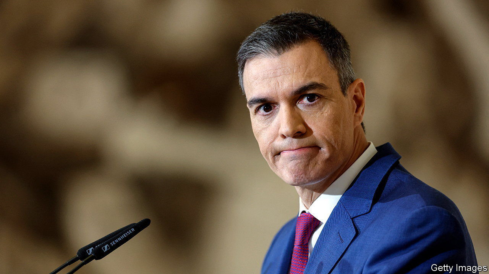
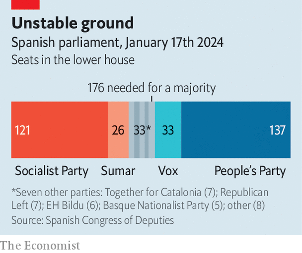

###### Ungainly Spain

# Spain shows regional nationalists make bad coalition partners 

##### Pedro Sánchez discovers how unwieldy his disparate coalition is 

 

> Jan 18th 2024 

WHEN THE conservative People’s Party (PP) won Spain’s elections in 1996, its supporters chanted “” They were taunting the diminutive separatist leader of Catalonia, Jordi Pujol: “Pujol! Dwarf! Speak Spanish!” The next day, though, it turned out the PP would need support from Mr Pujol’s party to govern, and it is said that the chant quickly changed to ““ “Pujol! Handsome! Speak whatever you like!”

Spain’s regional nationalists have a tendency to get their way. The two big national parties do not form grand coalitions. So when they lack majorities, both the PP and the centre-left Socialists devolve powers to Catalonia and the Basque Country in exchange for votes. But the current Socialist government of Pedro Sánchez, installed in November, is already testing the breaking point of such arrangements.

To secure the votes to return to power, Mr Sánchez promised a Catalan separatist party, Junts per Catalunya (Together for Catalonia), an amnesty for the organisers of an illegal independence referendum held in 2017. This infuriated many Spaniards. But Junts promised to provide “stability” in the legislature. 

Yet on January 10th, when the government needed parliamentary approval of three decrees, Junts held back. One decree included economic measures needed to unblock a €10bn ($10.9bn) tranche of European Union covid-recovery funds. In the end that decree and one other passed, but at a heavy cost. Junts and the Socialists agreed that the government would transfer control of immigration to Catalonia. Analysts scratched their head at what exactly control of immigration at a regional level would look like.

The parties had not worked that out either. The written deal referred to a “complete” transfer of authority on immigration. Mr Sánchez maintains this does not include border control or expelling migrants. Junts’s secretary-general, Jordi Turull, insists that “’complete’ must mean complete”, and threatens to pull the party’s backing for the government unless there is progress towards another independence referendum. Mr Sánchez defends his deals with Spain’s various national separatists by arguing that they guarantee a “progressive” government. But Junts is a conservative party close to Catalonia’s business interests, and its leaders flirt with Catalan chauvinism. 

 


To make matters worse, Mr Sánchez has trouble on his left. His third decree, on social spending, failed on January 10th not because of Junts but because of a split in Sumar, the prime minister’s smaller left-wing coalition partner, itself an amalgam. One element of Sumar, Podemos, quit the grouping after being given no ministries in the new government, and voted against the social-spending decree. Podemos argued it would cut unemployment benefits, though the claim is debatable. The real cause is probably lasting bitterness between Sumar and Podemos. Whatever the cause, Mr Sánchez cannot reliably count on Podemos as part of his wobbly majority.

Across Europe, parties of the centre-right and centre-left are failing to win the majorities they once enjoyed. But many countries solve this with broad coalitions. The refusal of Spain’s left and right to cross the aisle renders this harder. Divisions between the centre and the periphery—not just Catalan but Basque, Galician and so on—are making it almost impossible.

Mr Sánchez’s best hope for now might be distraction. An investigation by , a Barcelona-based newspaper, claims that the previous PP government, in power from 2011 to 2018, had engaged in illegal tricks against Catalan nationalist leaders. Mr Sánchez says the matter will be looked into “until the last consequence”. Bashing the right (and fear of the far right) has held the left and the separatists together. Yet focusing on past Spanish repression also feeds Catalonia’s drive for independence. The prime minister is an inveterate escape artist. But it is hard to imagine how he can survive almost four more years.■


