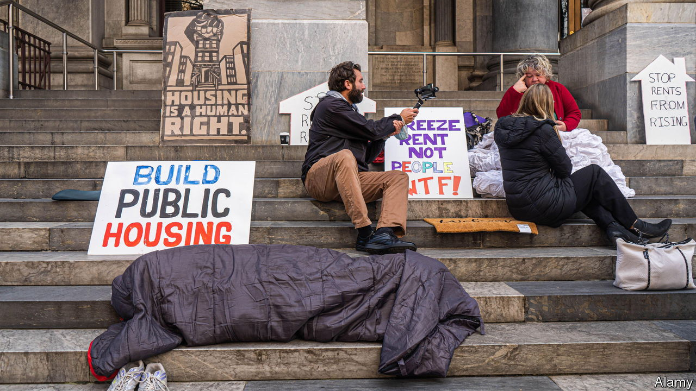

###### The turn of the screw

# Australian houses are less affordable than they have been in decades 

##### In spite of rising borrowing costs, prices have stayed stubbornly resilient 

 

> Jan 18th 2024 

In Australia, as in most places, waterfront property comes at a premium. But to see the full effects of high-cost Australian housing, look beyond trophy homes on Sydney Harbour and beach pads in Bondi. In cities across the country, tents and other makeshift shelters are springing up by the water. They are the dark side of a housing market that has held firm despite rising interest rates. For households of all incomes, the share of homes that are affordable is at its lowest in 30 years.

Australians are not alone. House prices are high relative to incomes across the rich world, and last year defied expectations by rebounding after only the briefest of blips. Rental markets are hot, too. Vacancies are at or near historic lows in many rich countries, while rents are climbing quickly. In previous decades, notes Peter Tulip, an economist, rising housing costs were offset by cheaper lending. Now mortgage rates have risen as well, meaning would-be buyers can afford to borrow less.

What is behind the unexpected resilience in prices? It is partly down to global trends, such as people working from home more and so placing a higher value on their living space. But Australian policymakers are increasingly focusing their attention on three domestic factors, too.

The first is that foreign demand for Australian housing is greater than ever. Net immigration was 500,000 in the year to June, more than twice the intake in 2019. At the same time some 650,000 international students call Australia home, and all need somewhere to stay. And even foreigners who do not live in Australia full-time seem keen on its housing market: such buyers snapped up 10% of newly built homes sold in the third quarter of 2023.

The second factor is the cost of materials. The producer price index for construction has risen by 30% since the start of 2021. As well as making houses costlier to build, this has left Australia with fewer builders. More than 1,500 construction firms collapsed in the year to June, mostly owing to cost overruns. The result is a reduced supply of new homes and even more upward pressure on prices.

But the biggest brake on home-building, says Mr Tulip—and the third factor driving house prices up—is local councils’ planning rules. A prime example is Sydney, where large numbers of homes face development restrictions. Meanwhile, zoning rules raise house prices well above the combined underlying cost. Mr Tulip’s research suggests that, again in Sydney, this increase is a whopping 73%.

Might the government be able to ease the squeeze? It has promised to reduce immigration, to triple the fees paid by foreign purchasers of existing homes and increase taxes on properties left vacant. A national target to build 1m homes over the next five years has been raised to 1.2m. And there are some signs of planning restrictions being loosened. The New South Wales state government is rewriting its zoning rules to force local councils to accept higher density housing. Such efforts will inevitably provoke furious objections. But they will not come from the growing number of Australians who settle down for the night in a waterside tent. ■


