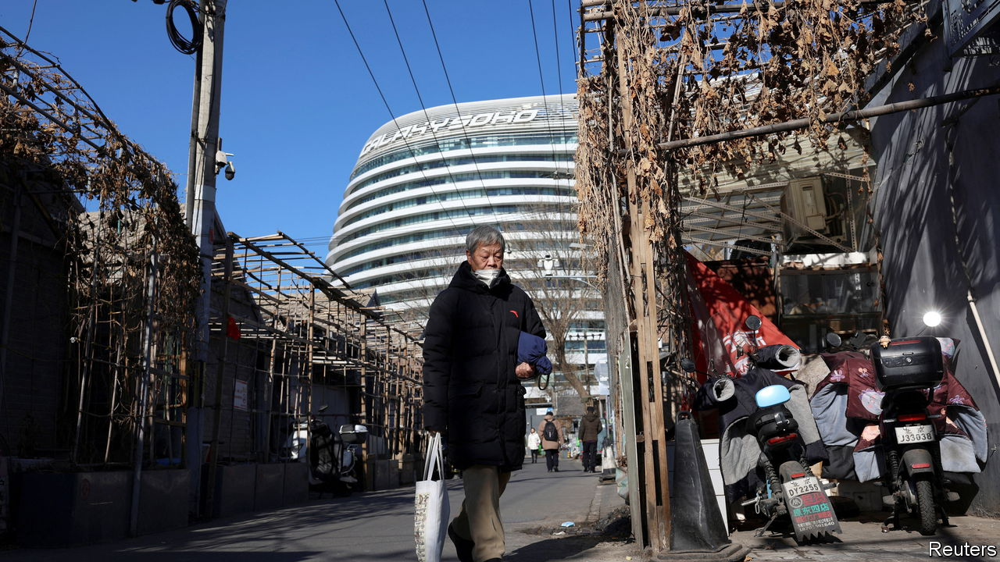
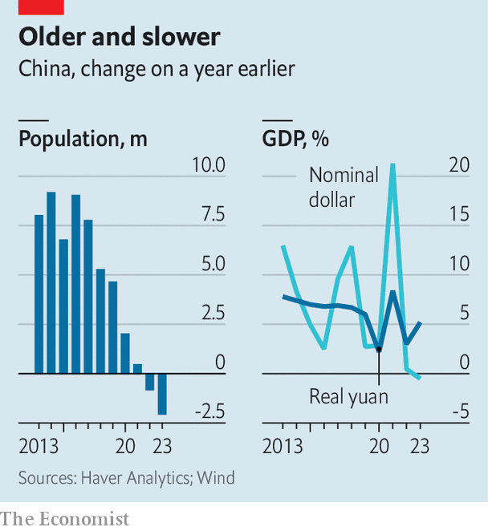

###### Double dip

# China’s population is shrinking and its economy is losing ground 

##### The “peak China” narrative is proving difficult to shift 

 

> Jan 17th 2024 

“HOW SHOULD one look at the Chinese economy?”, asked Li Qiang, the country’s prime minister, at the World Economic Forum in Davos on January 16th. “It is similar to looking at the Alps,” he suggested, an “undulating mountain range” that is best appreciated from afar. Official figures released the next day revealed two notable undulations in China’s economic landscape. The country’s  in 2023 for the second year running. And its GDP shrank in dollar terms.

In his previous job as Communist party chief of Shanghai, Mr Li oversaw a  to quell an outbreak of covid-19. After China abandoned such measures at the end of 2022, many people , although doctors were pressed to attribute their deaths to other causes. One academic model, drawing on Hong Kong’s experience, suggested the national death toll might have been as high as 1.4m between December 2022 and February 2023. ’s modelling estimated that the virus would claim about 1.5m lives if left to spread unencumbered.

The official data released this week showed that deaths from all causes in 2023 rose to 11.1m, up from 10.4m in the previous year. The 0.7m increase is lower than the modelled estimates of the covid death toll. But some of the fatalities included in those estimates would have occurred in the last month of 2022. And some of the elderly and infirm people killed by covid in early 2023 might have died anyway from other frailties before the year was out. The official number is within the wide range of possible outcomes yielded by our model. In China it is relatively easy to fudge the cause of a death. But it is harder to pretend it never happened.

The increase in deaths was mirrored by a decline in births, which fell by over half a million despite China’s reopening. All told, the country’s population dropped by more than 2m last year. And it is greyer as well as smaller: over a fifth of its people are now aged 60 or above. If these 297m elderly Chinese were a country of their own, they would be the fourth-largest in the world.

Despite its shrinking and ageing population, China struggles to employ its younger workers. After the unemployment rate among the urban young exceeded 21% in June, China abruptly stopped releasing figures for it. This week the National Bureau of Statistics (NBS) began publishing a revised measure which excludes students who may be looking for work. By this new metric, youth unemployment in China’s cities was 14.9% in December.

It is hard to know how much of an improvement that represents, because the NBS statisticians did not show what the past figures would have looked like under the new method. Excluding those students who were looking for work might have made a big difference. In April last year an official disclosed that almost 39% of China’s unemployed young people had yet to graduate. Removing them from the labour force, and hence dropping them from the unemployment count, would have reduced the youth unemployment rate for March 2023 from 19.6% to 13%. (The rate would, however, have been higher than 13% if employed students were also subtracted from the labour force.)

In another departure from statistical norms, Mr Li revealed China’s 2023 growth figure in his speech at Davos, a day before its scheduled release. The economy grew by 5.2% in real terms, comfortably meeting the government’s official target of about 5%. Consumption (private and public) contributed over 82% of that growth, its highest share since 1999, offsetting some of the enduring weakness in the country’s property market. 

 


All this looks good from afar. But zoom in, rather than appreciating the view from a distance, and the landscape looks more treacherous. Prices across China’s economy are falling on average. The drops are concentrated in food and fuel but not confined to them. The price of vehicles, for example, declined by 4% in 2023. The GDP deflator, a broad measure of prices, fell in 2023 for only the fifth time in 40 years. As a consequence, China’s nominal GDP, which makes no adjustment for changing prices, grew by only 4.6% in 2023.

To fight this deflationary pressure, China’s central bank eased monetary policy last year even as America’s Federal Reserve continued to raise interest rates sharply. China’s wobbly growth, its regulatory crackdowns and its geopolitical rivalry with America also spooked the kind of cosmopolitan investors who congregate in Davos. One result is that the yuan weakened against the dollar in 2023. Indeed China’s GDP, converted into dollars at market exchange rates, fell in 2023, even as America’s GDP may have grown by 6% or so last year in nominal terms. 

Exchange rates, like mountain ranges, tend to undulate. And the dollar may not always be so strong. But economists have nonetheless begun to wonder whether China’s recent setbacks are harbingers of something more fundamental holding the country back. According to some forecasts, China’s GDP might stop rising relative to America’s in the next decade or so, and lose ground thereafter. There is much talk of “peak China”. Mr Li’s big speech was an opportunity to shift this perception a little. But in the Alpine village of Davos, mountainous metaphors are hard to avoid. ■


