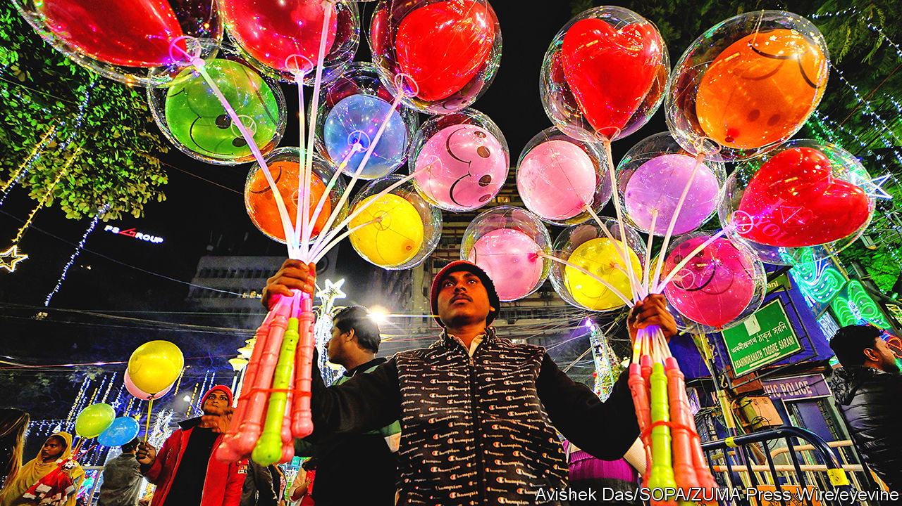
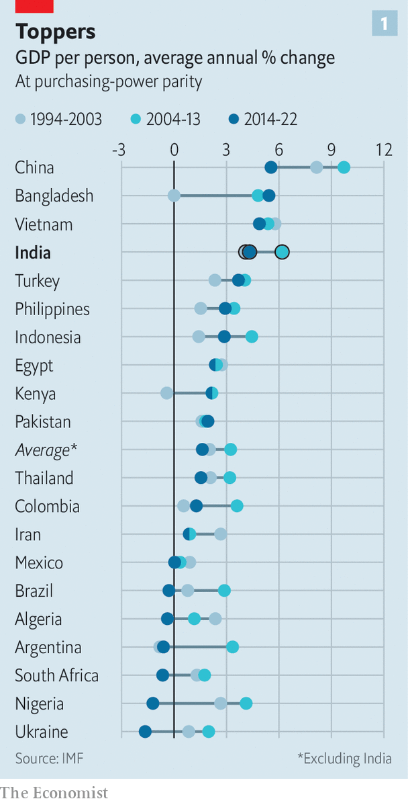
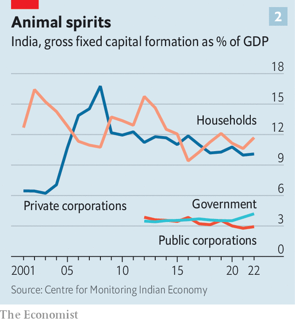

###### Of money and Modi

# How strong is India’s economy under Narendra Modi? 

##### It has neither boomed nor slumped. But growth may be taking off 

 

> Jan 15th 2024 

In the second week of 2024 business leaders descended on Gujarat, the home state of Narendra Modi, India’s prime minister. The occasion was the Vibrant Gujarat Global Summit, one of many gabfests at which India has courted global investors. “At a time when the world is surrounded by many uncertainties, India has emerged as a new ray of hope,” boasted Mr Modi. 

He is right. Though global growth is expected to slow from 2.6% last year to 2.4% in 2024, India is booming. Its economy grew by 7.6% in the 12 months to the third quarter of 2023, beating nearly every forecast. Most economists expect annual growth of 6% or more for the rest of this decade. Investors are seized by optimism.

The timing is good for Mr Modi. In April some 900m Indians will be eligible to vote in the largest election in world history. A big reason Mr Modi, in office since 2014, is likely to win a third term is that many Indians think him a more competent manager of the world’s fifth-largest economy than any other candidate. Are they right?

To assess Mr Modi’s record has analysed India’s economic performance and the success of his biggest reforms. In many respects the picture is muddy—and not helped by sparse, poorly kept official data. Growth has outpaced that of most emerging economies, but India’s labour market remains weak and private-sector investment has disappointed. But that may be changing. Aided by Mr Modi’s reforms, India may be on the cusp of an investment boom.

The headline growth figures reveal surprisingly little. India’s GDP per person, after adjusting for purchasing power, has grown at an average pace of 4.3% per year during Mr Modi’s decade in power. That is lower than the 6.2% achieved under Manmohan Singh, his predecessor, who also served for ten years.

 


But this slowdown was not Mr Modi’s doing: much of it is down to the bad hand he inherited. In the 2010s an infrastructure boom went sour. India faced what Arvind Subramanian, later a government adviser, has called a twin balance-sheet crisis, which struck both banks and infrastructure firms. They were left loaded with bad debt, crimping investment for years afterwards. Mr Modi also took office amid slowing global growth, caused by the financial crisis of 2007-09. Then came the covid-19 pandemic. All told, average growth among 20 other large lower- and middle-income economies fell from 3.2% during Mr Singh’s tenure to 1.6% during Mr Modi’s. Compared with this group, India has continued to outperform (see chart 1). 

Against such a turbulent backdrop, it is better to assess Mr Modi’s record by considering his stated economic objectives: to formalise the economy, improve the ease of doing business and boost manufacturing. On the first two, he has made progress. On the third, his results have been poor.

India’s economy has certainly become more formal under Mr Modi, albeit at a high cost. The idea has been to draw activity out of the shadow economy, which is dominated by small and inefficient firms that do not pay tax, and into the formal sphere of large, productive companies. 

Mr Modi’s most controversial policy on this front has been demonetisation. In 2016 he banned the use of two large-value banknotes, accounting for 86% of rupees in circulation—surprising many even in government. The stated aim was to render worthless the ill-gotten gains of the corrupt. But almost all the cash made its way into the banking system, suggesting that crooks had already gone cashless or laundered their money. Instead, the informal economy was crushed. Household investment and credit plunged, and growth was probably hurt. In private, even Mr Modi’s supporters in business do not mince words. “It was a disaster,” says one boss.

Demonetisation may have accelerated India’s digitisation nonetheless. The country’s digital public infrastructure now includes a universal identity scheme, a national payments system and a personal-data management system for things like tax documents. It was conceived by Mr Singh’s government, but much of it has been built under Mr Modi, who has shown the capacity of the Indian state to get big projects done. Most retail payments in cities are now digital, and most welfare transfers seamless, because Mr Modi gave almost all households bank accounts. 

Those reforms have helped Mr Modi ameliorate the poverty resulting from low job-creation. Fearing that stubbornly low employment would stop living standards for the poorest from improving, the government now doles out welfare payments worth 3% of GDP per year. Hundreds of government programmes send money directly to the bank accounts of the poor. 

It is a big improvement on the old system, in which most welfare was distributed physically and, owing to corruption, often failed to reach its intended recipients. The poverty rate (the proportion of people living on less than $2.15 a day) fell from 19% in 2015 to 12% in 2021.

Digitisation has probably also drawn more economic activity into the formal sector. So has Mr Modi’s other signature economic policy: a national goods and services tax (GST), passed in 2017, which knits together a patchwork of state levies. The combination of homogenous payments and tax systems has brought India closer to a national single market than ever.

That has made doing business easier—Mr Modi’s second objective. GST has been a “game-changer”, says B. Santhanam, the regional boss of Saint-Gobain, a French manufacturer with big investments in India. “The prime minister gets it,” adds another manufacturing executive, of the need to cut red tape. The government has also put serious money into physical infrastructure, such as roads and bridges. Public investment rose from 3.5% of GDP in 2019 to nearly 4.5% in 2022 and 2023.

The results are now materialising. Mr Subramanian recently wrote that, as a share of GDP, in 2023 net revenues from the new tax regime exceeded those of the old system. This happened even as tax rates on many items fell. That more money is coming in despite lower rates suggests that the economy really is formalising.

Yet Mr Modi is not satisfied with merely formalising the economy. His third objective has been to industrialise it. In 2020 the government launched a subsidy scheme worth $26bn (1% of GDP) for products made in India. In 2021 it pledged $10bn for semiconductor companies to build plants domestically. One boss notes that Mr Modi personally takes the trouble to convince executives to invest, often in industries where they face little competition.

Some incentives could help new industries find their feet and show foreign bosses that India is open for business. In September Foxconn, Apple’s main supplier, said it would double its investments in India over the coming year. It currently makes some 10% of its iPhones there. Also in 2023 Micron, a chipmaker, began the construction of a $2.75bn plant in Gujarat that is expected to create 5,000 jobs directly and 15,000 indirectly. 

So far, however, these projects are too small to be economically significant. The value of manufactured exports as a share of GDP has stagnated at 5% over the past decade, and manufacturing’s share of the economy has fallen from about 18% under the previous government to 16%. And industrial policy is expensive. The government will bear 70% of the cost of the Micron plant—meaning it will pay nearly $100,000 per job. Tariffs are ticking up, on average, raising the cost of foreign inputs. 

 


So what matters more: Mr Modi’s failures or his successes? As well as economic growth, it is worth looking at private-sector investment. It has been sluggish during Mr Modi’s time in office (see chart 2). But a boom may be coming. A recent report by Axis Bank, one of India’s largest lenders, argues that the private-investment cycle is likely to turn, thanks to healthy bank and corporate balance-sheets. Announcements of new investment projects by private corporations soared past $200bn in 2023, according to the Centre for Monitoring Indian Economy, a think-tank. That is the highest in a decade, and roughly double the value for 2019, in real terms. 

Although higher interest rates have sapped foreign direct investment in the past year, firms’ reported intentions to invest in India remain strong, as they seek to “de-risk” their exposure to China. There is some chance, then, that Mr Modi’s reforms will kick growth up a gear. If so, he will have earned his reputation as a successful economic manager. 

The consequences of Mr Modi’s policies will take years to be felt in full. Just as an investment boom could vindicate his approach, his strategy of using welfare payments as a substitute for job creation could prove unsustainable. A failure to build local governments’ capacity to provide basic public services, such as education, may hinder growth. Subhash Chandra Garg, a former finance secretary under Mr Modi, worries that the government is too keen on “subsidies” and “freebies”, and that its “commitment to real reforms is no longer that strong.” And yet for all that, many Indians will go to the polls feeling cautiously optimistic about the economic changes that their prime minister has wrought. ■


