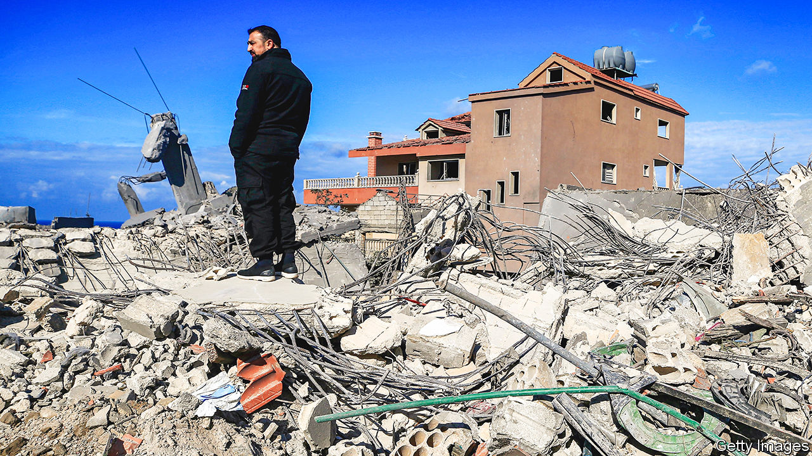
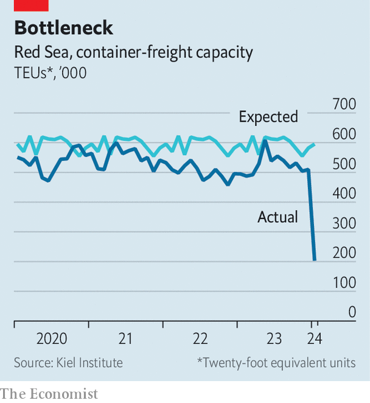

###### The fallout

# The Middle East faces economic chaos 

##### Escalating conflict threatens to tip several countries over the brink 

 

> Jan 18th 2024 

Just over 100 days after Hamas’s brutal attack on Israel started a war in Gaza, the conflict is still escalating. On January 11th America and Britain started attacking Houthi strongholds in Yemen, after months of Houthi missile strikes on ships in the Red Sea. Five days later Israel fired its biggest targeted barrage yet into Lebanon. Its target is Hizbullah, a militant group backed by Iran.

A full-blown regional war has so far been avoided, largely because neither Iran nor America wants one. Yet the conflict’s economic consequences are already vast. Trade routes are blocked, disrupting global shipping and devastating local economies. The Middle East’s most productive industries are being battered. And in Lebanon and the West Bank, growing hardship threatens to spark even more violence.


Start with trade. Before Hamas’s attack, a fifth of the average Middle Eastern country’s total exports—from Israeli tech to oil from the Gulf—were sent somewhere else in the region. Geopolitical enemies were increasingly trading with each other. Now, the routes that transported more than half of all goods are blocked. Intra-regional trade has collapsed. At the same time, the cost of shipping goods out of the Middle East has risen. That will send many exporters, operating on razor-thin margins, out of business in the months to come.

 


The Red Sea used to handle 10% of all goods moving around the world. But since the Houthis began launching missiles, its shipping volumes have dropped to just 30% of normal levels (see chart). On January 16th Shell, an oil and gas giant, became the latest multinational to say it would avoid the Sea.

For some of the countries bordering the Red Sea, Houthi missile strikes have far worse consequences. Eritrea’s economy is propped up by fishing, farming and mining exports, all of which travel by sea owing to tense relations with its neighbours. For crisis-stricken Sudan, the Red Sea is the sole point of entry for aid, almost none of which has reached the 24.8m people in need of it since the attacks began.

Further disruption could visit financial ruin on Egypt, one of the region’s biggest countries. For its population of 110m, the Red Sea is a vital source of dollars. Its government earned $9bn in the year to June from tolls on the Suez Canal, which links the Mediterranean to the Red Sea. Without the toll revenue, Egypt’s central bank would have run out of foreign exchange reserves, which stood at $16bn (or two months-worth of imports) at the start of 2023. The government would also have faced a yawning hole in its budget, which already relies on cash injections from Gulf states and the IMF.

Both crises may materialise in 2024. Egypt’s year-to-date income from the Suez is 40% less that it was this time last year. That puts it at real risk of running out of dollars, which would push its government into default and its budget into disarray.

Conflict has also hit the Middle East’s most promising industries. Before October 7th Israel’s tech sector was its brightest bright spot, contributing a fifth of the country’s GDP. Now it is struggling. Investors are pulling funding, customers are cancelling orders and much of its workforce has been called up to fight.

Jordan, meanwhile, is suffering from forgone tourism, which would normally constitute 15% of its GDP. Its struggles are emblematic of those across the region: even Gulf states have seen tourist numbers dip. In the weeks after Hamas’s attacks, international arrivals to Jordan fell by 54%. The government has turned to Western lenders to fill the hole in its finances. On January 11th the IMF made available new bail-out money, two months before Jordan’s existing programme was due to end. Additional support had been agreed a few weeks after the war in Gaza began.

Yet the most dangerous economic consequence of the war may be the hardship inflicted on populations in Lebanon and the West Bank, two powder kegs that could easily explode into more violence. As Israel and Hizbullah trade air strikes, they are destroying southern Lebanon. More than 50,000 people have already been displaced (as well as 96,000 in northern Israel). Repairs will be expensive, but there is no cash left for them: Lebanon has had a shell government since it defaulted in 2019. In recent months its economic freefall has accelerated as foreign tourists and banks, which together make up 70% of its GDP, have deserted the country on the advice of their governments.

Things are no better in the West Bank. Of its 3.1m residents, 200,000 are factory workers who used to commute to Israel every day. They are out of work after Israel revoked their permits. Meanwhile, 160,000 civil servants have not been paid since the war began. The West Bank’s government now refuses to accept its tax revenues from Israel (which collects them) after Israel withheld funds that would usually be sent to Gaza. Public services are shutting down, and missed mortgage payments from civil servants risk triggering a banking crisis.

The Middle East has long been full of economies on the brink. Israel’s war with Hamas may now tip them over. To make ends meet, their governments have built houses of cards, balancing bail-outs from Gulf states, handouts from America and expensive short-term loans. The risk of it all tumbling down is worryingly high.

The rest of the world economy has so far faced few costs from the conflict. Oil prices have remained relatively calm, except for a spike in early January, and the effects on global growth and inflation are likely to be minimal. But if much of the Middle East slides into a debt crisis, all that could change, and fast. It would hit populations that are young, urban and increasingly unemployed. That is a recipe for even more extreme politics in a large group of strategically important, chronically volatile countries. The consequences would reverberate across the world. ■


