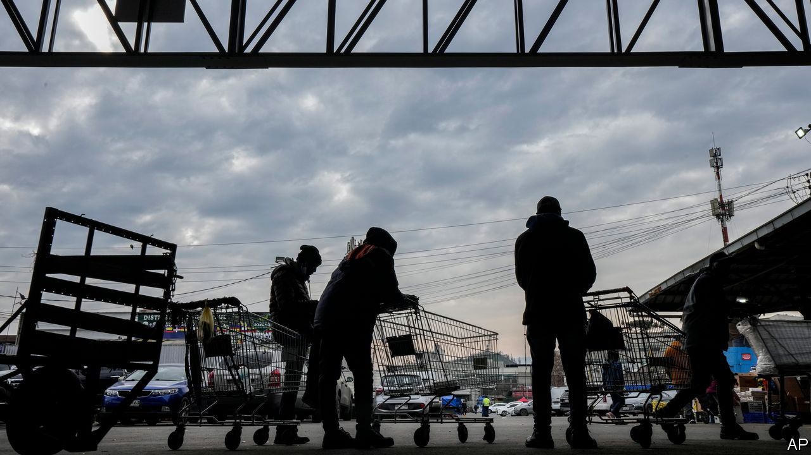

###### Global monetary policy

# The countries which raised rates first are now cutting them 

##### Farewell to Hikelandia 

 

> Jan 18th 2024 

Over the past two years has studied the economic fortunes of Hikelandia. This group of eight countries—Brazil, Chile, Hungary, New Zealand, Norway, Peru, Poland and South Korea—started to tighten monetary policy in 2021, many months ahead of the Federal Reserve and the European Central Bank (ECB). They also raised rates far more aggressively. Yet for much of 2022 and 2023 Hikelandia’s central bankers had little to show for their hawkish determination. Inflation just kept on climbing.

 


Now, though, that has decisively changed. Hikelandian inflation is still far too high, but it is falling fast (see chart). So fast, in fact, that the club’s central bankers are now getting ahead of the rest of the world in a new way: by cutting interest rates. Policymakers in Hikelandia have reduced borrowing costs by about a percentage point on average from the peak last year. Chile’s central bank has reduced its policy rate by three percentage points. Neither the Fed nor the ECB, meanwhile, has moved. Lower interest rates seem to be helping Hikelandia’s growth. A year ago economic output across the club was declining sharply. Now it is rising.

Not everywhere in Hikelandia is enjoying sharply lower inflation. In Norway “core” prices, a measure that excludes those of food and energy, are still rising by 6% year on year. That is only a bit below a recent peak of 7%. The core-inflation slowdown in Peru is also modest. But elsewhere, price growth is easing fast. Core inflation in Hungary has fallen by an astonishing 15 percentage points since the beginning of last year, when huge rises in energy prices had raised the cost of producing practically everything.

Other data show inflation becoming less entrenched. In late 2022 prices for every category of good and service in Poland’s inflation basket had risen by more than 2% year-on-year. By late 2023, only 90% of them had. The fall in “inflation breadth” in South Korea is even more impressive. Wage gains are moderating, limiting further increases in companies’ costs. In Chile in November nominal wages were 8.2% higher than a year previously, compared with well over 10% for much of 2022. Annual wage growth in New Zealand has fallen from about 5.5% to 5%. People across Hikelandia are no longer Googling “inflation” anything like as much as they were.

Hikelandia’s central bankers are still keen to stress their inflation-fighting credentials. Hungary’s central bank boasts of its “careful approach to monetary policy”, pointing out that real interest rates are still restrictive. On January 9th Poland’s central bank declined to cut rates; South Korean policymakers reached the same decision on January 11th. But tumbling inflation is undoubtedly good news. And if Hikelandia’s hawkish central bankers are now cutting rates, others may soon follow. ■


