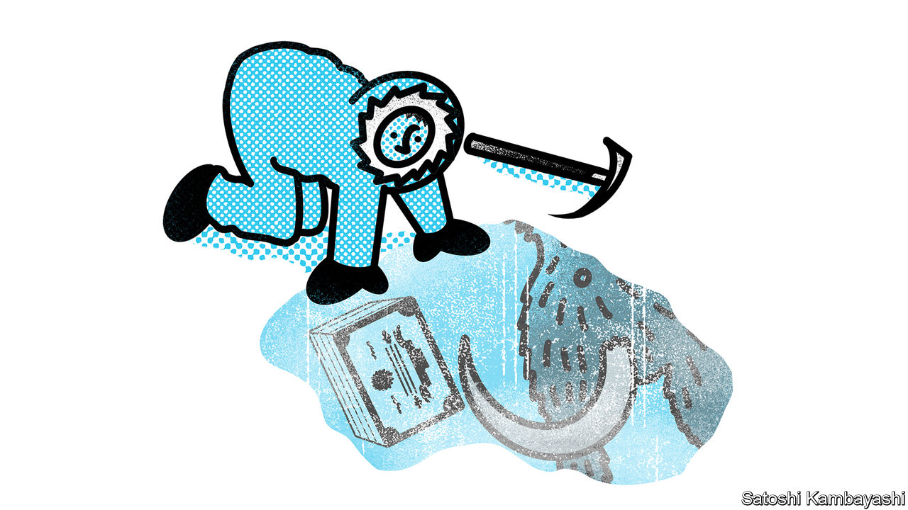

###### Buttonwood

# Wall Street is praying firms will start going public again 

##### The IPO market is on its longest cold streak since 1980 

 

> Jan 18th 2024 

Can you feel the chill? It is bone-deep, now. In 2021 capital markets were searing hot. On average, at least one new firm went public every working day. But financial districts today are icy. For two long years private companies have spurned public markets, as rising interest rates dashed lofty valuations and stock prices vacillated.

All this has been bad news for Wall Street. In 2021 America’s five largest investment banks together earned an average of $13bn per quarter through their dealmaking and initial-public-offering (IPO) desks. Over the next two years they managed barely half of that. 

Could conditions soon thaw? Company bosses like to make their debut in a roaring bull market, when investors are cheery and liable to overpay. With markets now back near all time highs, that seems to be the case. And executives are encouraged by narrow credit spreads—the difference between the rates companies borrow at and risk-free rates on treasury bonds—which indicate investors do not expect financial trouble.

A strong economy helps, too, because it boosts demand for capital. So do high real interest rates, since they make the capital provided by an IPO more attractive. Given the resilience of the American economy, a Federal Reserve policy rate of 5.5% and underlying inflation around 3%, both conditions are in place. 

Sure enough, there is some evidence of activity picking up. Total investment-banking revenues were better than expected in the fourth quarter of 2023, climbing by 15% compared with the previous three months. On earnings calls bank bosses sounded cautiously optimistic about 2024. There are rumours that all kinds of firms, from SKIMS, a pants purveyor founded by Kim Kardashian, to Stripe, a payments giant, are considering making their debut.

Still, executives are easily put off by volatility—and it is hard to describe recent stockmarket moves as anything other than unpredictable. Given that a month or so often elapses between filing for an IPO and actually going public, a steady march higher is far preferable to a rollercoaster ride. Such circumstances tend to mean that those who can wait, do. In even moderately difficult times firms often put off ipos altogether, rather than accept a lower price, and a stockpile of those waiting to go public builds up.

It still feels as if the economic mood could spin on a dime. This could hurt newly public firms. Shares in Cava, a fast-casual salad seller, doubled in price when it went public in June. Other firms got excited and started chewing over their options. In August Instacart, another firm which specialises in flogging vegetables to the idle, and Arm, a British chipmaker, filed to go public. Yet by the time they made it to market in late September, interest-rate expectations were climbing and share prices were falling. Instacart was valued at $39bn in 2021. It went public with a market capitalisation of $10bn, and is now worth just $7bn.

So when might the IPO winter truly give way to spring? In an attempt to answer this, Gregory Brown and William Volckmann of the University of North Carolina have built a mathematical model. It takes in variables including stockmarket returns, credit spreads and real interest rates, and uses these to try to predict ipo volumes.

Their first find is that today’s market really is extraordinarily chilly. They define the ipo market as “cold” when the average of the number of ipos over the last three months is lower than it was three-quarters of the time between 1975 and 2020 (an average of 5.3 or fewer ipos per month). On that measure, this is the longest cold spell for American ipos since 1980. It is also much cooler than the model would anticipate. It says some 20 firms a month should have been going public by the end of 2023. Yet only one firm went public in December.

Messrs Brown and Volckman suspect the market is suffering from a hangover. Far more firms went public in 2021 than their model implied should have done. The stockpile, in other words, was depleted. So despite the recent pause, followed by improved conditions, there are still not many firms ready to list.

A true thaw, then, would take more than a few quarters of rising markets and economic resilience. It needs not only heat, but time as well. That is time in which unexpected developments—such as interest rates resuming their upward climb—could easily spook bosses all over again. So perhaps it is unwise to predict a heatwave. But some green shoots may eventually poke through the ice.■


