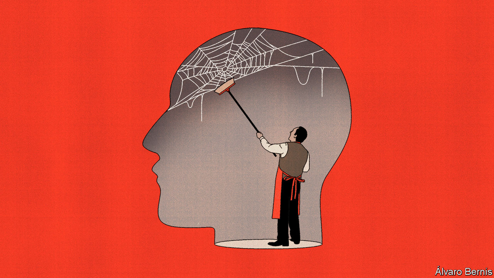

###### Free exchange

# What economists have learnt from the post-pandemic business cycle 

##### The curious and furious recovery has brought some old ideas back to the fore 

 

> Jan 17th 2024 

Science advances one funeral at a time, to paraphrase Max Planck. The Nobel prize-winning physicist was arguing that new ideas in his field would only catch on once the advocates of older ones died off. With a little adaptation he could have been describing the dismal science, too: economics advances one crisis at a time. The Depression provided fertile soil in which John Maynard Keynes’s theories could grow; the Great Inflation of the 1970s spread Milton Friedman’s ; the global financial crisis of 2007-09 spurred interest in credit and banking.

Sure enough, the recovery from the covid-19 pandemic has given economists another chance to learn from their mistakes. Papers presented at the recent conference of the American Economic Association (AEA) offer clues as to the theories that might eventually become the received wisdom of the next generation.

One such paper takes a harder look at the Phillips curve, which describes a theoretical trade-off between unemployment and inflation. When unemployment is low, the logic goes, inflation should be higher, as competition for workers exerts upward pressure on wages. In turn, consumer prices rise. Yet during the 2010s the curve appeared to have vanished. Unemployment kept falling but inflation stayed quiescent. Then, after the pandemic, the relationship suddenly seemed to re-exert itself: inflation rose as swiftly as unemployment fell.

At the AEA conference, Gauti Eggertsson of Brown University suggested that adding a kink to the (previously smooth) Phillips curve might rescue the concept. The idea is that, at a certain point—as the last available worker is employed—the relationship between inflation and unemployment suddenly becomes non-linear. “As you hire all the people you hit the maximum level of employment…there is only one way to go,” he told the conference. Beyond that point, inflation no longer rises smoothly as unemployment falls, but instead shoots up.

Mr Eggertsson’s kink could explain both inflation’s absence in the 2010s and its sudden resurgence in 2021. To understand how inflation has recently faded without a rise in unemployment, he suggests examining how a tight labour market interacts with supply disruptions. A scarcity of materials and components exacerbates labour shortages. Without extra workers available, businesses cannot ramp up production or use labour as a substitute for other inputs. As supply shortages eased, this process went into reverse. And so the inflationary effect of a tight labour market abated without leading to a rise in unemployment.

Part of the confusion over the Phillips curve, suggested another paper presented by Stephanie Schmitt-Grohé, of Columbia University, arose because the Great Inflation looms too large in economists’ minds. Friedman’s work emphasised the role of inflation expectations during that episode. Workers and businesses lost faith in central bankers’ willingness to fight rising prices. Then came a vicious cycle in which soaring inflation fuelled expectations of future price rises, which then became self-fulfilling.

But the experience of the 1970s was far from typical, suggests Ms Schmitt-Grohé. Peering further back, she points to frequent instances of American inflation suddenly rising, then falling just as suddenly. One such episode took place amid the Spanish flu pandemic, starting in 1918. That year annual inflation rocketed to 17%. But by 1921 it had turned to deflation, with prices falling by 11%. Consider data from the whole 20th century, and not just its second half, and the fading of the most recent bout of inflation is much less surprising. Ms Schmitt-Grohé suggests that the shocks now hitting the economy—such as climate change, conflicts and a pandemic—mean a return to the greater volatility of earlier ages.

Meanwhile, others are trying to refine models for the overall economy. These have traditionally represented production as taking place in a single sector—employing workers, renting capital and producing output—that is hit by shocks to demand and supply. Iván Werning, of the Massachusetts Institute of Technology, suggests instead considering a set of different sectors, each hit by such shocks in its own way. The challenge for monetary policy is then to control inflation without inhibiting the necessary reallocation of labour between sectors.

Mr Werning’s model is a good fit for the post-pandemic economy. It adjusted not just to a shift in demand from services to goods, but to supply-chain disruption, energy shocks and employees in some sectors working from home. As such, inflation moved through the economy in waves, starting in select goods then spreading out. That is not to say that monetary and fiscal stimulus did not also contribute to rising prices, says Mr Werning. It is more that the rejigging of the economy acted like a supply shock, raising inflation for any given level of aggregate demand. 

New ideas in old books

Many of these ideas are not exactly new. Mr Eggertsson, for instance, said that the experience of the past few years led him back to an “old Keynesian fairytale”, and that his version of the Phillips curve is similar to the original. Mr Werning points to a speech by James Tobin, a Keynesian economist, in 1972. Like Mr Werning, Tobin suggested that inflationary pressure can arise from sectors growing and shrinking at different rates. Combine that with a non-linear Phillips curve, Tobin argued, and you can envisage inflation taking off even without a hot labour market.

That crises spur a search through the archives is itself nothing new. To make sense of the Depression, Keynes looked to Thomas Malthus, a 19th-century economist. Friedman’s take on the causes of the Great Inflation owes much to the quantity theory of money, which was first mentioned in ancient Chinese texts and popularised in Europe by Nicholas Copernicus, a 16th-century astronomer. Science may indeed proceed one funeral at a time. Economics, however, has resurrections. ■


