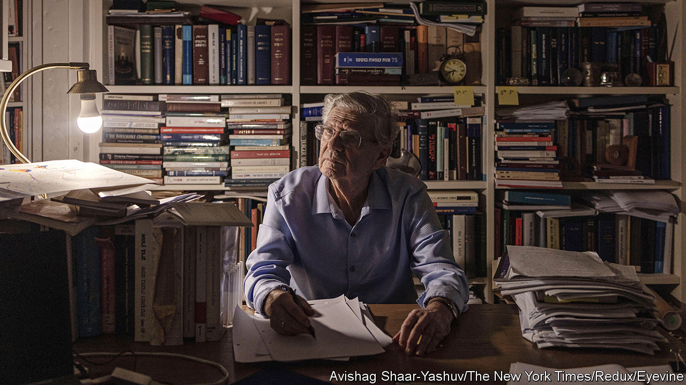

###### On the bench

# Israel’s judge in The Hague is its government’s bogeyman 

##### Aharon Barak led the controversial “constitutional revolution” 

 

> Jan 17th 2024 

EVEN IN RETIREMENT Aharon Barak, a former president of , remains a controversial figure. Binyamin Netanyahu’s  spent most of 2023 attempting to dismantle his constitutional legacy. Yet when asked to appoint a judge to join the panel of the International Court of Justice (ICJ) hearing South Africa’s claim that  in its war in Gaza, it chose Mr Barak, Israel’s most renowned jurist.

Mr Barak, who is 87, has earned acclaim and condemnation for spearheading what he called Israel’s “constitutional revolution”. In a series of landmark rulings he broadened the court’s powers to accept petitions from public bodies and individuals, intervene in government decisions and cancel legislation. 

His supporters see him as the man who built the ramparts protecting Israel’s fragile democracy from a rising tide of populist nationalism and religious fundamentalism. To his detractors he is a “judicial dictator” whose rulings have usurped the will of the people and imposed liberal values that they claim contradict traditional Jewish ones. Mr Netanyahu’s coalition came to power promising to roll back Mr Barak’s precedents, weaken the courts and gain control over the appointment of new judges.

On January 1st the supreme court, following in Mr Barak’s footsteps, struck down a law passed five months earlier that had all but abolished the court’s ability to use the “reasonableness standard” to hold the government to account. Mr Netanyahu’s decision a week later to appoint Mr Barak to the ICJ ruffled feathers in his Likud party: one parliamentarian accused the prime minister of “showing contempt for his voters”. 

For once, Mr Netanyahu had done the right thing in defying his hard-right supporters. Mr Barak is Israel’s foremost legal scholar and a Holocaust survivor. Who better to defend Israel from charges under the Genocide Convention, drawn up in 1948 to prevent another Holocaust from occurring? ■

