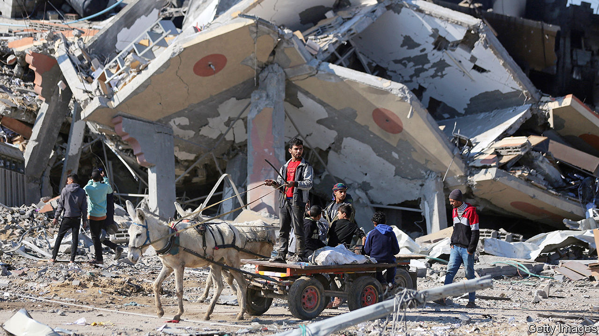

###### Israel in the dock

# The genocide case Israel faces is more about politics than the law 

##### But there are still grave doubts over its adherence to the laws of war 

 

> Jan 17th 2024 

SINCE ITS creation in 1946 the International Court of Justice (ICJ) has heard an average of fewer than three cases a year. Many are obscure, such as a dispute over pulp mills in Uruguay. The trial that began on January 11th, though, was one of the highest drama, when it heard arguments from South Africa that Israel was committing  in Gaza.

 were elated by the sight of Israel in the dock after decades of impunity for its conduct in the occupied territories. Crowds gathered to watch it broadcast in squares in Ramallah, the de facto capital of the West Bank.


A full trial would take years to conclude. In the meantime South Africa has asked the court for “provisional measures”, one of which is that it orders Israel to stop fighting in . The burden of proof for an injunction is low: “South Africa just needs to show that its claims are plausible,” says Adil Haque of Rutgers Law School. Judges must now decide whether to demand that Israel end its longest and deadliest war against the Palestinians since 1948.

As a political gambit, South Africa’s case is already a success. Yet as a legal strategy it is risky. Some of Israel’s actions in Gaza since October 7th could plausibly be described as war crimes. But in seeking to label them genocide, a uniquely horrific crime, it risks making the debate about the label rather than the actions themselves. 

In politics, genocide has become a byword for the worst human suffering imaginable. But legally it is a tightly defined concept, and hard to prove. This is because it entails not just particular acts, such as killing civilians or causing them “serious bodily or mental harm”, it also requires that they be done with the “intent to destroy, in whole or in part, a national, ethnical, racial or religious group, as such”. 

To prove intent, South Africa cited Israeli ministers, lawmakers, army officers and soldiers: the Knesset member who spoke of “erasing the Gaza Strip from the face of the earth”; the troops who later chanted “may Gaza be erased”. It sought to show that these statements were followed by rank-and-file soldiers. Israel argued that these were “random quotes that are not in conformity with government policy”. 

Parts of South Africa’s presentation were sloppy: its lawyers referred to a speech in which Mr Netanyahu invoked the biblical story of Amalek, a nation that persecuted the Israelites, yet in seeking to explain how the allusion was genocidal they cited the wrong biblical passage. Their filing then quoted Yoav Gallant, the Israeli defence minister, saying on October 10th that “Gaza won’t return to what it was before. We will eliminate everything.” That sounds genocidal. But in Mr Gallant’s actual comments there is an additional sentence in the middle: “Hamas will no longer be.” The correct quote, and the rest of the clip, make clear that he is referring to Hamas, not to Palestinians.

Still, it is impossible to deny that some prominent Israelis have said things that could incite genocide, which is also an offence under the UN convention, to which Israel is a signatory. Though they have suffered no legal or political consequences for doing so, it would be hard to prove that their incitement amounts to state intent.

A second issue is proving Israel has killed Palestinians because of their nationality. South Africa’s lawyers claim that Israel’s use of 2,000lb (907kg) bombs, the largest in its arsenal, in densely populated places like Jabalia, in northern Gaza, is evidence of genocide. Using such large bombs could be a war crime, unless Israel can show it had no other way to strike a vital military target. But it is not a genocidal act unless South Africa can prove that Israel dropped those bombs specifically to kill lots of Palestinians. Thus far, it has failed to do so. The same goes for the restrictions Israel has imposed on aid to Gaza. “Israel could argue that it used starvation as a weapon of war to make people suffer,” says Mr Haque. “That would be a war crime, but it’s not genocide.”

To call these arguments distasteful would be an understatement. The South African filing describes a litany of horrors committed against Palestinians in Gaza. Whichever way the ICJ rules, they will still be horrors. By pressing the charge of genocide, South Africa has created a situation in which a ruling in Israel’s favour could be seen as absolution for its conduct.

Yet even if it is absolved of genocide, Israel should still be scrutinised for other possible violations. Start with two of the core principles of international law: distinction and proportionality. The former requires armies to distinguish between civilian and military targets. The latter demands they not inflict excessive harm on civilians in relation to military utility. With northern Gaza now a wasteland, and thousands of civilians dead, it is hard to trust that Israel has adhered to those principles. Israeli officials concede that in this war the army has approved strikes that are both deadlier for civilians and achieve smaller military gains than in previous conflicts in Gaza. Some Western officials think Israel has crossed a legal line with its new calculus of proportionality.

Other questions of law deserve scrutiny as well. One is the destruction of Gaza’s medical facilities. There is strong evidence that Hamas has used hospitals for military purposes, which is itself a war crime. Under international law, hospitals can lose their protection if used for “acts harmful to the enemy”. But they do not become valid targets indefinitely. That Hamas militants might have used Shifa hospital in October does not necessarily justify an Israeli raid there in November. In many cases Israel has not offered compelling proof that its attacks on hospitals were justified.

Another question is over the appalling humanitarian conditions in Gaza, where the UN says there is a risk of imminent famine. Israel told the ICJ that it has not limited deliveries of food to Gaza, which is true in theory but not in practice. It has largely barred such deliveries via its own territory, which is how most supplies entered Gaza before the war, and it imposes long and unpredictable inspections on aid entering from Egypt.

Investigating such cases, however, will not be the job of the ICJ. That task would fall to the International Criminal Court (ICC), the other big court in The Hague, which claims jurisdiction over both the Hamas attacks in Israel on October 7th and the war in Gaza that followed because Palestine is a signatory to its founding treaty. But such investigations will be sluggish.

For now, that leaves the genocide case at the ICJ and the question of whether to impose any of the provisional measures requested by South Africa. Because the ICJ settles disputes between UN member-states, and Hamas is not one, judges are in the uncomfortable position of being asked to order Israel to implement a unilateral ceasefire with no corresponding obligation on Hamas to halt its genocidal attacks.

Even if it were to issue such an order, it would have no means to enforce its judgments, which governments sometimes ignore. Israel has made clear that it will do just that. “We will continue this war until the end,” Mr Netanyahu has said. “No one will stop us, not even The Hague.” 

Still, a ruling against Israel could have far-reaching consequences. It would certainly make the politics of supporting Israel’s war more complicated for its allies. There could also be legal implications. In America the so-called “Leahy law” bars the government from providing military aid to foreign forces that commit human-rights abuses. If the ICJ were to find that Israel is “plausibly” committing genocide, some Democrats would no doubt try to invoke this law. It is unlikely that such a view would find majority support in a country that is both supportive of Israel and hostile to international courts. But President Joe Biden’s administration could still find itself in the uncomfortable position of appearing to much of the world to be excusing a crime it has long sought to end. ■

cide.

ding them.

