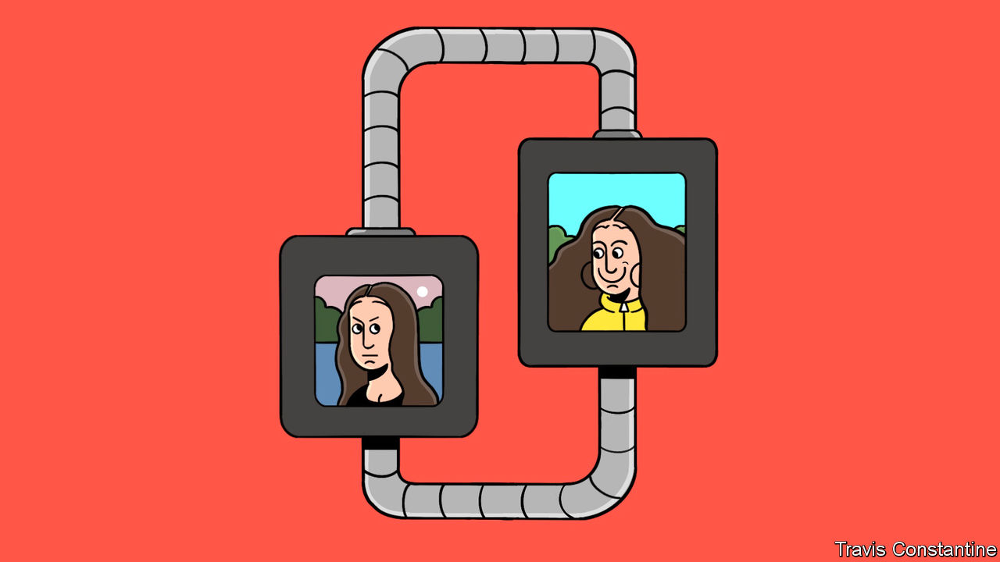

###### Pics and it didn’t happen

# AI-generated content is raising the value of trust 

##### Who did the posting will soon matter more than what was posted 

 

> Jan 18th 2024 

It is now possible to generate  with little more than the click of a mouse. This can be fun: a TikTok account on which—among other things—an artificial Tom Cruise wearing a purple robe sings “Tiny Dancer” to (the real) Paris Hilton holding a toy dog has attracted 5.1m followers. It is also a profound change in societies that have long regarded images, video and audio as close to ironclad proof that something is real. Phone scammers now need just ten seconds of audio to mimic the voices of loved ones in distress; rogue AI-generated Tom Hankses and Taylor Swifts endorse dodgy products online, and .

The fundamental problem is an old one. From the printing press to the internet, new technologies have often made it easier to spread untruths or impersonate the trustworthy. Typically, humans have used shortcuts to sniff out foul play: one too many spelling mistakes suggests an email might be a phishing attack, for example. Most recently, ai-generated images of people have often been betrayed by their strangely rendered hands; fake video and audio can sometimes be out of sync. Implausible content now immediately raises suspicion among those who know what AI is capable of doing.


The trouble is that the fakes are rapidly getting harder to spot. ai is improving all the time, as computing power and training data become more abundant. Could ai-powered fake-detection software, built into web browsers, identify computer-generated content? Sadly not. As we  this week, the arms race between generation and detection favours the forger. Eventually ai models will probably be able to produce pixel-perfect counterfeits—digital clones of what a genuine recording of an event would have looked like, had it happened. Even the best detection system would have no crack to find and no ledge to grasp. Models run by regulated companies can be forced to include a watermark, but that would not affect scammers wielding open-source models, which fraudsters can tweak and run at home on their laptops.

Dystopian possibilities abound. It will be difficult, for example, to avoid a world in which any photograph of a person can be made pornographic by someone using an open-source model in their basement, then used for blackmail—a tactic the fbi has already warned about. Perhaps anyone will be able to produce a video of a president or prime minister announcing a nuclear first strike, momentarily setting the world on edge. Fraudsters impersonating relatives will prosper.

Yet societies will also adapt to the fakers. People will learn that images, audio or video of something do not prove that it happened, any more than a drawing of it does (the era of open-source intelligence, in which information can be reliably crowdsourced, may be short-lived). Online content will no longer verify itself, so who posted something will become as important as what was posted. Assuming trustworthy sources can continue to identify themselves securely—via urls, email addresses and social-media platforms—reputation and provenance will become more important than ever.

It may sound strange, but this was true for most of history. The era of trusted, mass-produced content was the exception. The fact that people may soon struggle to spot the invisible hand of ai does not mean the marketplace of ideas is doomed. In time, the fakes that thrive will mostly be the funny ones. ■

