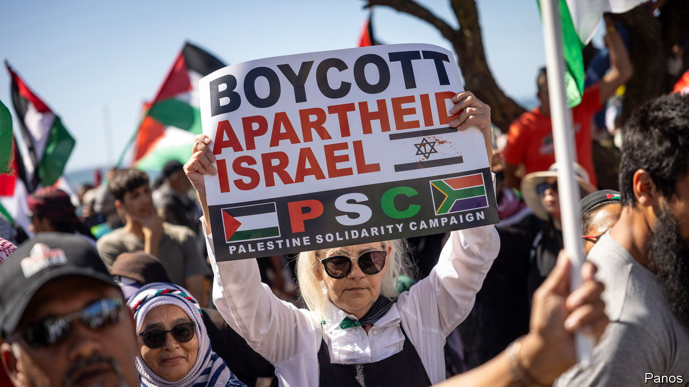

###### Show trial

# Charging Israel with genocide makes a mockery of the ICJ 

##### And it diverts attention from the real humanitarian crisis in Gaza 

 

> Jan 18th 2024 

GENOCIDE IS A uniquely horrific . Not because it is the bloodiest: Stalin and Mao killed many more people in gulags and famines than the nearly 6m Jews murdered by the Nazis. But the Holocaust was seen as so monstrous that the UN adopted the Genocide Convention, promising never again to allow an attempt to wipe out a group of people, or part of one, simply because of their nationality, race, religion or ethnicity.

That promise has been repeatedly broken—in ,  and , to name a few. Each new case brought before the International Court of Justice (ICJ) in The Hague ought to give the world a chance to make good on its word and help strengthen the taboo against genocide by clarifying the obligations of countries to prevent and punish it. Alas, South Africa’s claim that Israel is committing genocide against the Palestinians, heard by the ICJ this week, cheapens the term. It risks weakening the taboo and body of law aimed at preventing it. It obscures the real worry that Israel’s destructive campaign is breaking the laws of war; and the fact that permanent occupation is wrong.

With its case, South Africa is  of the court. Genocide requires that Israel is killing people in Gaza simply for being Palestinian. In fact it is targeting Hamas fighters in response to a deadly attack on its territory. Some far-right Israeli politicians have used hateful language, but they are not articulating government policy. South Africa has called on the ICJ to impose a unilateral ceasefire on Israel, which would leave it unable to defend itself against Hamas, a terrorist group whose founding charter calls for the killing of Jews. By trying to hold Israel solely responsible for the death of Palestinians, it is vindicating Hamas’s tactic of fighting from schools and hospitals in the knowledge that the death of civilians killed in the crossfire will inflame global public opinion. 

The ICJ is unlikely to offer a final ruling for years. South Africa’s case is so flimsy that it would be shocking if its final arguments convince the judges that Israel had committed genocide. But in the next few weeks they must rule on whether South Africa has a “plausible” claim in order to decide whether to impose “provisional measures”. This is a lower bar and such a provisional ruling would be widely seen as a finding that Israel was indeed guilty of genocide, even if the court were later to rule it was not. Israel would claim it is being treated unfairly, and it would be right. Instead of restraining Israel in the war, such a provisional ruling might even embolden it to dismiss all international criticism; Israel would feel it is damned, no matter what it does. 

It would be even more absurd for the court to order Israel—but not Hamas, over which it has no jurisdiction—to cease military operations in Gaza. Israel is still under attack. It would refuse to give up its right to self-defence, as enshrined in the UN Charter. Besides, the only way of enforcing such a ruling would be through the UN Security Council, which America would veto. 

South Africa is setting a terrible precedent. Its case is more of a political act than a legal one, long on theatre and short on principle. After all, earlier this month South Africa rolled out the red carpet for Sudanese . One consequence is that the next time one country accuses another of genocide, the charges will be easier to brush off, regardless of their merits.

Those appalled by the suffering in Gaza may argue that genocide was the only charge that could be brought, because the ICJ has no jurisdiction over other war crimes. Yet the focus on an implausible crime diverts attention from the possibility that Israel is breaching the laws of war. These require Israel to distinguish between civilians and combatants and to minimise civilian casualties by being proportionate in the use of force. 

The death toll of women and children raises grave doubts over whether Israel is meeting these obligations. It may also be failing to meet its duty under the Geneva Convention to provide medicine and food to civilians in the areas it occupies. As Gaza nears famine, its people do not need grandstanding, they need food. Israel’s leaders need to realise that if they block supplies, they will be held accountable by the court of public opinion—the only court available. ■

