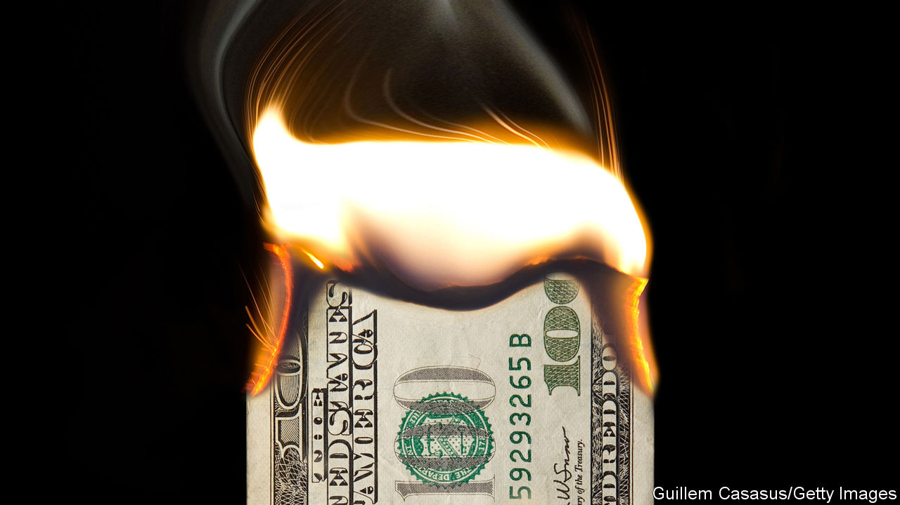

###### Chaos—or opportunity?

# Donald Trump is winning. Business, beware 

##### What a second term would mean for American business and the economy 

 

> Jan 18th 2024 

WHEN DONALD TRUMP slunk out of the White House in 2021, executives at large American companies sighed with relief. Now that he has  by a margin of 30 points, they are digesting the reality that this time next year Mr Trump could be behind the Resolute desk once again.  has spent the past few weeks talking to these . Some are deeply alarmed by the prospect of Trump 2. But others quietly welcome the chaos trade.

People who run large organisations have to be optimistic. They must find opportunities when others are panicking. CEOs had an uneasy relationship with President Trump, many distancing themselves from his most outrageous pronouncements and tut-tutting about protectionism, even as they enjoyed his more conventional policies. Republicans in Congress may have talked about being the pro-worker party, but in practice they cut business taxes. It was hard for corporate America to be miserable amid a soaring stockmarket.

If Mr Trump is indeed elected again, those running big firms plan to keep their heads down (“don’t be Bud Light” is a frequent refrain, after the beer brand fell victim to the culture wars). They would avoid being dragged onto Mr Trump’s business councils, dodge presidential photo-ops and get on with making money. True, if Mr Trump did a deal with Russia that ended the war and sold out Ukraine, that would be bad for Western civilisation. But it would reduce energy bills.

What’s more, Trump enthusiasts in the C-suite have plenty of grumbles about Joe Biden. Mention Lina Khan, who oversees the Federal Trade Commission (the antitrust police), or Gary Gensler, who leads the Securities and Exchange Commission (the Wall Street police), and they inhale sharply. Mr Biden wants to raise taxes on companies. His administration also wants to go ahead with the Basel III “Endgame” regulations, which oblige big banks to hold perhaps 20% more capital on their balance-sheets, sedating animal spirits and damaging profitability.

Yet this bullish case for Mr Trump’s economic management is complacent. It fails to recognise how Trumponomics—a mix of deficit-funded tax cuts and tariffs—would work differently today. And it ignores the ways in which Mr Trump’s most chaotic tendencies could threaten America, including its companies. 

In his first term the economy did better than many economists (including ours) expected. That was in part because Trumponomics turned out to be more moderate than the campaign had promised. The economy was also running further below capacity than thought, making it possible to cut taxes without stoking inflation. Strong overall growth and low inflation masked the damage done by Mr Trump’s protectionism.

There is no evidence that Mr Trump has updated his approach: he is still a tax-cuts-and-debt guy. But the economic conditions have changed. For the past two years the Federal Reserve has been trying to bring down inflation. Though it has nearly succeeded, the labour market remains tight. Today 2.8m more 25- to 54-year-olds are in work than would be if the employment rates of January 2017 had persisted. Then there were 1.3 unemployed workers for every job opening; today there are only 0.7. As a result the economy is more prone to overheating. 

The budget is in worse shape, too. In 2016 the annual deficit was 3.2% of GDP and debt was 76% of GDP. The forecasts for 2024 are 5.8% and 100%, respectively. Should Mr Trump once again pursue tax cuts, the Fed will have to hike up interest rates to offset the stimulus, making it costlier for businesses to raise capital and for the government to service its growing debt pile. 

These are the conditions under which Latin American populists bully their central banks to keep rates low, a practice Mr Trump dabbled in last time. The Fed is supposed to be independent, but Mr Trump will have a chance to nominate a stooge as chair in May 2026 and a pliant Senate could indulge him. The risk of more inflation would surge, perhaps exacerbated by more tariffs, which would also slow growth.

On top of that big macroeconomic risk are many others. Firms would not relish further trade restrictions, but some members of Mr Trump’s circle have floated a 60% tariff on imports from China. Lots of companies like the federal government’s support for renewable energy (which Mr Trump calls the Green New Scam). He has promised the biggest deportation scheme in American history to reduce the number of illegal immigrants in the country. As well as causing misery, this would be a shock to that tight labour market.

As ever, saying what Mr Trump would actually do is very hard: he has few fixed beliefs, is a chaotic boss and can reverse position several times a day. In a town hall in Iowa he said he would be too busy in his second term to seek retribution against his political enemies. That was a few hours after his own campaign sent out an email with the subject line: “I am your retribution!” He could recognise Taiwan’s independence, prompting a meltdown in Beijing and a blockade of the island. Or he could walk away from Taiwan in exchange for China buying more stuff from America. Businesses often say that what they fear most is uncertainty. With Mr Trump that is guaranteed.

This unpredictability could make a second Trump term very much worse than the first. His administration would lack establishment types like Gary Cohn, once of Goldman Sachs, to shuffle the president’s in-tray and hide the madder ideas from him. More moments like January 6th are possible, as is a full-on revenge presidency. The idea that in this scenario business leaders could keep a low profile and focus on EBITDA is fanciful. Employees, customers and the press would demand to know where bosses stood and what they proposed to do. The administration might in turn take exception to every whiff of criticism.

In the long run, the idea that corporate profits can be insulated from societal upheaval is a fantasy. If Mr Trump is broadly corrupting of American politics, and businesses are seen to profit from his rule, that poses a big risk to them in the future. In Latin America, when big businesses have become associated with autocrats the result was usually that capitalism was discredited and the appeal of socialism rose. That seems unthinkable in America. But so, until recently, did a second Trump term. ■


