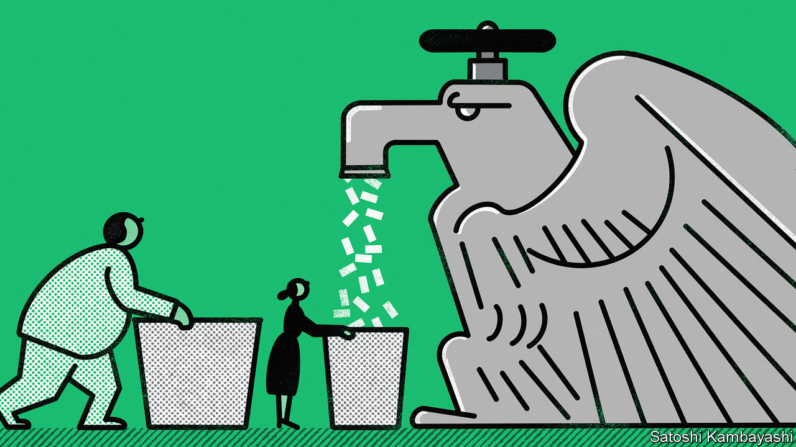
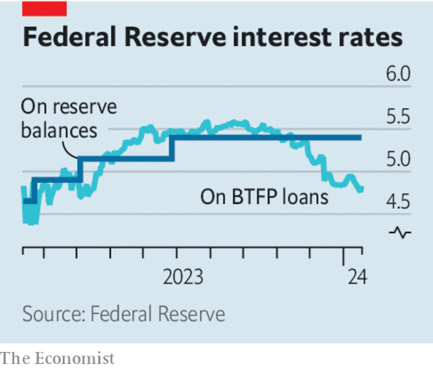

###### Bagehot weeps

# How America accidentally made a free-money machine for banks 

##### The Federal Reserve should switch it off 

 

> Jan 18th 2024 

Higher interest rates have brought America’s bankers both . Less than a year ago rising rates caused  (SVB) and then  to fail, the largest bank collapses since 2008. Yet on January 12th JPMorgan Chase reported its seventh consecutive quarter of record net-interest income. One reason the crisis did not spread in 2023 is that the Federal Reserve contained it with a new—and generous—loan programme. Unfortunately, that has come at a cost that the Fed should have foreseen. Thanks to another turn in the interest-rate outlook, its intervention has mutated into a free-money machine for any bank brazen enough to exploit it.

The bank term funding programme (BTFP) offers banks loans secured against the face value of Treasury bonds. The idea was to stop wobbly banks having to sell Treasuries to raise cash if depositors fled. At SVB, a fire sale induced by a bank run crystallised losses, because higher rates had reduced the prices of long-term bonds far below their face value. But the btfp lends the face value, rather than the market value, of the securities against which its loans are secured and, sure enough, its generosity succeeded in shoring up the system and stopping what could have become a severe crisis. 

 


Today, however, the btfp is itself causing trouble. The interest rate that banks must pay to borrow reflects, with a small premium, the one-year interest rate set in financial markets. That is in turn based on predictions of the average Fed policy rate over the next year. Because investors are betting the central bank will cut rates significantly, the cost of borrowing today is only 4.8%. Yet because those rate cuts have not yet happened, the Fed still pays banks 5.4% on their cash balances.

In other words, banks can draw loans just to make a spread of 0.6 percentage points, risk-free, at the expense of the central bank. Should the expected rate cuts take place, the banks need not suffer a negative interest margin, because they are free to repay the loans early, a valuable option the Fed, in effect, gave away for nothing. Borrowers’ identity will eventually be made public, so the only constraint on them is the risk to their reputations—but some may consider such shameless opportunism a virtue.

Naturally, the use of the BTFP has shot up. Since the start of November outstanding balances have risen from $109bn to $147bn. It is not certain this is all arbitrage, but over the same period bonds have risen in value, shrinking the problem the BTFP was designed to fix. This strongly suggests that the motive for the new borrowing is opportunism rather than necessity. And because the Fed is owned by taxpayers, the free money the banks are hoovering up comes at the taxpayers’ expense.

What should the Fed do? In the heat of the crisis it rashly promised to keep the BTFP open until March 2024. It has since strongly hinted that the facility will cease making new loans then. Shutting the btfp early could undermine the credibility of the Fed’s promises. But it should immediately amend the interest rate on new loans, either to track its policy rate or to appropriately price the prepayment option. Either fix would remove the scope for arbitrage.

In the next crisis the Fed should design its interventions more carefully. A central-banking rule named after Walter Bagehot, a 19th-century editor of , prescribes that central banks should lend freely to solvent institutions that are threatened by bank runs, against good collateral and at a penalty rate of interest. By lending at generous rates, with a reverse-, and to banks that might be insolvent on a mark-to-market basis, the Fed has arguably violated all three of Bagehot’s conditions. The crisis in 2023 was ugly, but so was the fix. ■

