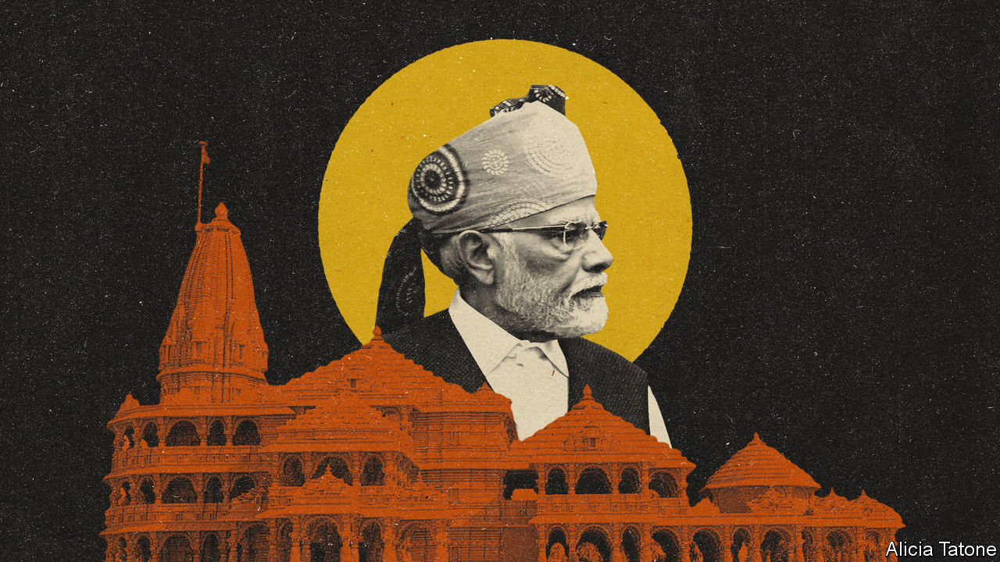

###### Hindu nationalism

# Narendra Modi’s illiberalism may imperil India’s economic progress 

##### Fulfilling his great-power dream requires restraint, not abandon 

 

> Jan 18th 2024 

“Politics and religion cannot be mixed,” ruled India’s Supreme Court in 1994 in what was then considered a decisive elucidation of the country’s secular constitution. Tell that to the millions who on January 22nd will watch Narendra Modi preside over the consecration of a controversial $220m Hindu temple, in a ceremony that marks the informal launch of his campaign for a third term as prime minister in . To the alarm of India’s 200m Muslims, and many secular-minded Indians, it will mark a high point of a  to dominate India.

Even as Mr Modi appears at the temple in Ayodhya in northern India, the other pillar of his mission continues apace: India’s . The country is the planet’s fastest-growing major economy and now its fifth-biggest. Global investors toast its infrastructure boom and growing technological sophistication. Mr Modi wants to be India’s most consequential leader since Jawaharlal Nehru. His vision of national greatness is about wealth as well as religion. The danger is that a hubristic Hindu chauvinism undermines his economic ambitions. 

To understand the strange symbolism of Ayodhya you have to travel back in time. Mr Modi’s once-fringe party, the Bharatiya Janata Party (BJP), built its name by campaigning over the status of a mosque there from 1990. It organised a rally of Hindu activists in 1992 that led to its destruction, sparking Hindu-Muslim riots across South Asia. 

The lavish Hindu temple that Mr Modi is about to open is built on the site of that destroyed mosque. For many Hindus this represents the righting of an ancient wrong: the location is also the mythical birthplace of the Hindu god Ram. Previous BJP leaders, such as Atal Bihari Vajpayee, downplayed the party’s Hindu-first ideology, known as Hindutva, to win mainstream support. After ten years in power, Mr Modi, who was implicated in deadly anti-Muslim riots in 2002 when he ran Gujarat state (he was later absolved by the courts), no longer seems so restrained.

The BJP’s radicals have been . There have been mob attacks on Muslims. Several BJP-run states have passed anti-conversion laws. Mr Modi has exacerbated Islamophobia by, among other things, promoting a citizenship law that discriminates against Muslims. His strongman style of rule has also featured harassment and attacks on the pillars of India’s old liberal order, including the press, charities, think-tanks, some courts and many opposition politicians.

Were Mr Modi and the BJP to win a third term—as seems almost certain—many worry that the Hindutva project would go further. BJP activists are agitating to replace mosques with temples at hundreds of other sites. Mr Modi wants to scrap constitutional provisions for Muslim family law. A possible redrawing of parliamentary districts could see power accrue to the populous Hindi-speaking and BJP-supporting north, at the expense of the richer industrialised south. Mr Modi, aged 73, could rule as a strongman for a further decade or more.

The whiplash-inducing reality is that this religious and political struggle is occurring alongside enormous . Growth has exceeded 7% in recent quarters. The country now has vastly improved transport infrastructure, huge and deep equity markets, stronger banks, massive currency reserves, a less complex tax system and less corruption. India is at last becoming a single market, letting firms exploit economies of scale and promising faster business investment. While manufacturing has yet to take off, industry is starting to couple with global supply chains, from internet routers to electric two-wheelers. The giant technology-services sector hopes to make a fortune as companies around the world seek help in adopting artificial intelligence. 

The economic record is still far from perfect. The rate of formal job creation is much too low—one reason Mr Modi has built up digital welfare-schemes for the poor, augmenting his image among ordinary Hindus as a leader who cares about the downtrodden. India does too little to develop human capital and its education system is terrible. Some powerful firms have too much influence. Yet it is a foundation worth building on.

The question is whether the religious agenda and rapid economic development are compatible. The answer is yes, but only up to a point. In the past ten years many of Mr Modi’s economic accomplishments have existed alongside his religious agenda. The BJP’s parliamentary strength and Mr Modi’s popularity have made it possible to push through difficult reforms, including a national sales tax. The government’s unity and clout have given investors confidence that policy is stable, even though civil liberties have been eroded.

Yet if Mr Modi in his third term were to lurch further towards Hindutva and autocratic rule, the economic calculus would change. Take the north-south divide. If India continues to grow fast, the industrialised, wealthy and technologically advanced south is likely to pull further ahead, drawing labour from the north. But Hindutva holds little appeal in the south, and by pushing it further while concentrating more power in his own hands, Mr Modi could exacerbate already rising tensions over internal migrants, tax revenues and representation. 

Or consider economic stability, which depends on the management of the economy by internationally credible technocrats, not BJP ideologues. You can overdo how much store companies put by the rule of law—they invested in China for decades. But if decision-making becomes authoritarian and erratic as Mr Modi grows old and isolated, and if institutions are weakened, firms will grow warier of deploying huge sums of capital.

As he stands at the ceremony at Ayodhya before admirers and acolytes—the leaders of India’s new, brash, nationalistic elite—does Mr Modi see this danger? He has in the past: before he was prime minister he tried to rebrand himself from a Hindu zealot into a pragmatic manager of his successful home state of Gujarat. With a third term looming, he should realise that, to fulfil his dream of making India a great power, the balancing-act must continue. It requires restraint, not abandon. If Mr Modi fails, the hopes of 1.4bn people and the prospects for the brightest spot in the world economy will be dashed. ■


