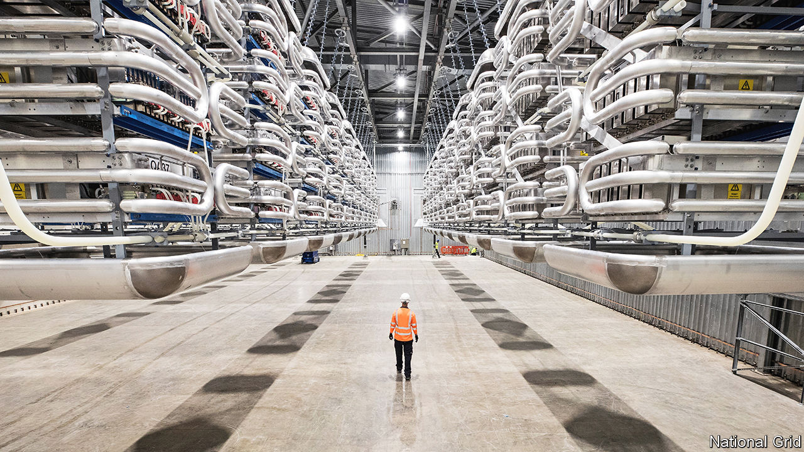
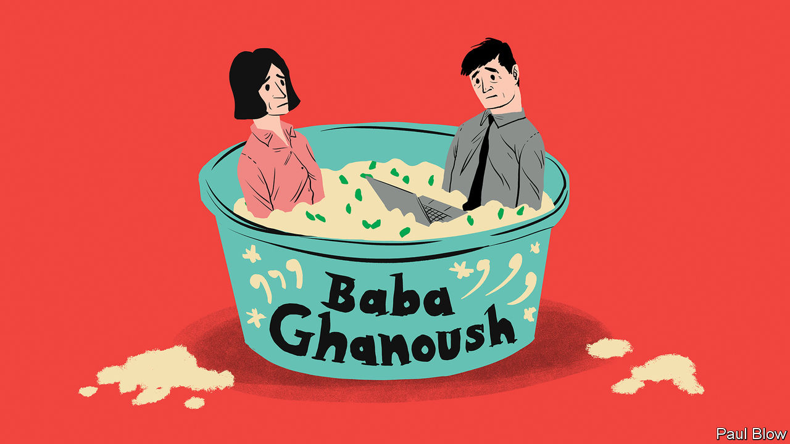

###### On Joe Biden, migrants, green data, electrifying heat, wine, meeting rooms

# Letters to the editor 

##### A selection of correspondence 

 

> Jan 18th 2024 


Go, Joe, go!

You criticised the lack of alternatives in the Democratic Party to Joe Biden (“”, January 6th). In defence of the president, his administration has focused on policies that chime with ordinary Americans, such as lowering everyday expenses for families, achieving historic levels of employment, revitalising manufacturing, rescuing the economy during the pandemic and rebuilding infrastructure. He has expanded benefits for veterans, enacted laws to reduce gun violence, protected marriage rights, confirmed diverse federal judges, supported Ukraine against Russian aggression, executed counter-terrorism missions, provided student-debt relief, advanced racial justice, tackled climate change and improved health care. 

We Democratic voters are a varied and splintered group who never really see eye to eye. We barely coalesced around Mr Biden in 2020, until we did. Mr Biden didn’t win a primary in 2020 until African-American voters backed him in South Carolina, a victory he rode all the way to the general election. 

Don’t mistake our whining and complaints for anything more than just that; it is part of our democratic process. Yes, Mr Biden is much older than we would prefer, and a little unsteady on his feet, but so too was Franklin Roosevelt and look at what he accomplished. Mr Biden’s mind is as sharp as ever. The gaffes and stumbles are just part of who he is. He isn’t done yet. He is just getting started and we would be wise not to count him out. His critics will be eating crow yet again come November.

Nigel Sonariwo

Founder and CEO

Nth-Communications


Kamala Harris should indeed reconsider seeking a second term as vice-president. Voters lack confidence in her, a big danger to Mr Biden’s electability. Selecting someone like Evan Bayh, Tom Daschle or Susan Rice for vice-president would completely change the campaign narrative, providing a universally respected commander-in-chief in waiting. Ms Harris could become secretary of state or UN ambassador. 

Thomas O’Brien


You underestimate the Democrats. They shrewdly outplayed the Republicans in 2020 and 2022 and there is a decent chance they will do so again in 2024, potentially holding onto the White House and Senate and even winning the House. Donald Trump is the key. Mr Biden does not need to energise his base. Mr Trump will do that for him.

Mark Evers


 


Measuring migrant numbers

“” (December 23rd) was a thought-provoking piece on an important issue. However, the statistic you cited on international migrants didn’t capture the true growth of this population. In 1960 3.1% of people lived outside their country of birth, you said, and today it is 3.6%, a figure that has “barely changed”. That may be true, but the global population has grown more rapidly from 1960 to the present day. So for context, in 1960, there were approximately 75m international migrants and in 2021 there were 281m, an increase of 275%. This is an alternative measure that may help us appreciate the scale of the migration issue more comprehensively.

Chia-Hui Lin


 


Awash with green data

It would help if each individual who is trying to assess what his or her responsibility is to stop climate change had better access to unbiased information (“”, December 23rd). It is the biggest problem facing a DIY climate warrior. For instance, trying to determine whether to trade in a three-year old petrol car for an electric one raises so many issues. How efficient is the petrol car compared with the average? How much carbon will building and delivering a new electric one use? What will be the carbon footprint of the electricity powering the new car? 

Many people who want to switch to green fall back on fuzzy, unverified data that is usually supplied by one of the competing technology groups. Just try finding figures comparing, say, the carbon footprint of a central-heating system using locally produced gas compared with LNG or with a heat pump using energy that relies on coal for a fifth of its generation. 

Many superficially attractive solutions do more harm than good. A truly objective, regularly updated database would be a great help, providing the numbers on climate change and cost implications for various materials and technologies. Green organisations could easily produce this and it would have a far greater practical impact than flying to global conferences on, er, climate change.

David Scott


 


How to electrify heat

It is not just wind turbines and solar panels that must be plugged into Britain’s electricity grid (“”, January 6th). Electrifying heat is a critical step towards decarbonising our economy. But this will put even more pressure on the grid as electrifying heat demands power. To reduce grid reliance, we should be looking to decentralised heat networks. By 2030, the overall European market share of heat networks is expected to reach 30% and meet half of Europe’s heat demand by 2050. However, in Britain we lag behind in our approach to decentralised heat networks. This is exemplified by Scotland, which has the lowest share of heat supplied by renewable sources in Europe, and yet 53% of its total energy consumption is for heat.

A decentralised network, with onsite renewables, will ease pressure on our overburdened grid and help support our pathway to net zero. Britain must invest in new technologies and a smart network to redistribute power for heating when the grid is at its greatest demand.

Josh Bullard

Divisional director of smart energy and sustainability

Hydrock


What is in a glass of plonk?

The special on “” (December 23rd) was an excellent read over a glass of Douro. But as well as the grape varieties and terroir, yeast is also critical for wine. Wine yeasts are fungi best known for their ability to convert sugars to alcohol. Yet they do much more by producing glycerol, organic acids and a wide range of aroma compounds that are all essential to wine. New yeast varieties are under development and will be an important factor shaping the geography and practices of winemaking under changing climates. After all, as Sheldon pointed out in the “Big Bang Theory”, wine is nothing but grape juice pre-digested by a fungus.

Professor Kiran Patil

University of Cambridge

 


The salsa room

Max Flannel, ’s agony uncle, clearly missed the mark in his advice to someone who complained about office meeting rooms being named after different types of savoury dips (, December 23rd). I would have simply told the writer to develop a sense of hummus.

I. J. Shapiro


