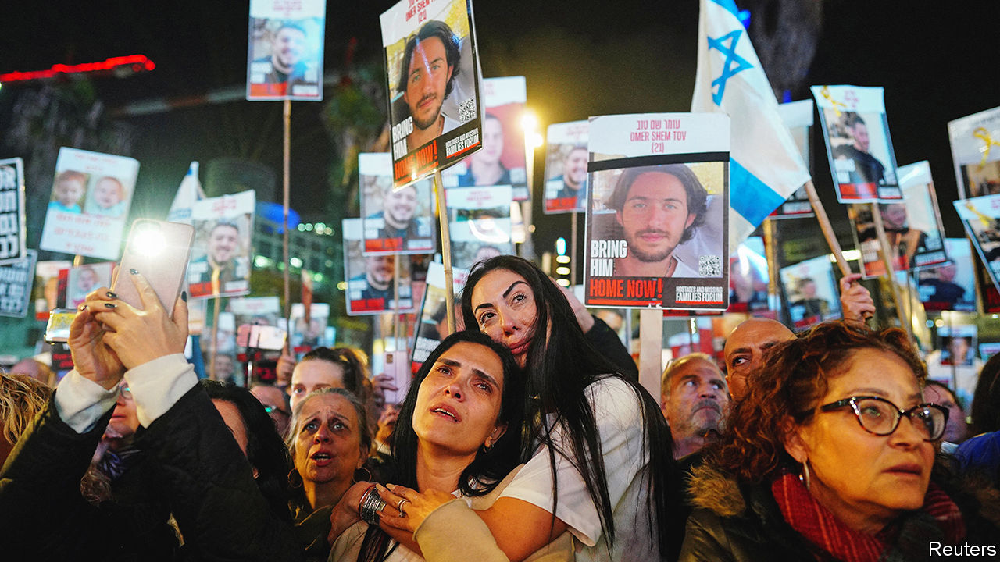

###### How Israel has changed

# After it ends, the war in Gaza will still continue to shape Israel 

##### Its defence posture and economy will feel the effects for years 

 

> Jan 18th 2024 

Israel’s generals are calling 2024 a “year of warfare”. That is quite a prediction, given the bloodshed of 2023. They believe it will take many months to dismantle Hamas’s military capabilities. For now, Israel’s focus remains on its immediate battles in Gaza and the fate of the more than 130 hostages still held there. But it is increasingly obvious that even after the fighting ends, the impact of this war will be felt for years on Israel’s military strategy and by extension on its economy.

This is Israel’s worst war in half a century in terms of casualties and its most prolonged since the conflict in 1948-49 which the country calls its War of Independence. Economists refer to the years between the Yom Kippur war in 1973 and Israel’s invasion of Lebanon in 1982 as its “lost decade”. Defence spending soared, as did the deficit and inflation while foreign investors stayed away. Israel escaped financial meltdown only by enacting a drastic economic stabilisation plan in 1985. Though there are huge differences between Israel’s economy now and then, from its world-leading tech sector to its ample foreign reserves, some Israelis worry that a protracted war could be a long-term drag on growth.


Before October 7th the imf had expected Israel’s gdp to grow by 3.1% in 2023 and 3% in 2024, more than double the rich-country average. The deficit for 2023 was projected at a mere 0.9% of GDP. Public debt, which stood at 61% of gdp at the end of 2022, had fallen by ten points since the pandemic. But the war is slowing growth and leading to a wider deficit. The Bank of Israel expects GDP to expand by 2% this year. Others are more pessimistic: the oecd forecasts 1.5% and s&amp;p, a ratings agency, just 0.5%.

The deficit, meanwhile, has blown out to 4.2% of gdp—Israel’s highest since 2012 (apart from 2020, during the pandemic). The shortfall came from war spending of 17bn shekels ($4.5bn, or 1% of gdp) in December alone, as well an 8% slump in tax revenue in 2023. An amended budget for 2024 adds 55bn shekels in defence spending (3% of gdp), imposes cuts on many civilian ministries and predicts a budget deficit of 6.6% of gdp. 

Though much of this increased spending is directly related to the current war, Israel is unlikely to return to its pre-war economy when the fighting in Gaza eventually ends. To begin with, it seems to be reversing a multi-year trend of reducing the size of its ground forces. Before the attack by Hamas in October, Israel had spent billions on its missile defences and a sophisticated border fence, hoping technology could substitute for soldiers. These defences failed to stop the terrorists crossing the border. “We relied on technology and thought we would never again manoeuvre in large formations,” says one veteran general. “That was wrong.” 

In response, Israel called up more than 300,000 reservists, strangling the economy. The labour ministry estimated in November that 18% of Israel’s workers could not do their jobs. That included reservists as well as the more than 100,000 people displaced from their homes. Their absence is affecting vital sectors. Many of Israel’s tech entrepreneurs and engineers are now in uniform. Start-Up Nation Policy Institute, an Israeli think-tank, found that Israeli startups raised just $1.3bn in the fourth quarter of 2023, down 46% from the previous year and the lowest since 2017. 

Though thousands of reservists are now being sent home—many more will be released by the end of January—Israel aims to keep twice as many soldiers guarding its borders as before the war. Previously about 130,000 reservists were on “active service”, meaning they spent at least 20 days on duty over three years. Now the army will be calling up nearly three times as many of them. That will not be cheap, because it pays the civilian salaries and the benefits of those it has called up. 

In order to fund this, the government would have to increase defence spending by about 1% of gdp in the long term. Doing so would require tax increases or spending cuts elsewhere. It will also need the money to buy tanks and gear to equip an expanded force, which includes a newly formed tank battalion and border-security brigade. It will also have to replenish its depleted stockpiles of munitions. 

Many of those stripping off their uniforms are getting only a brief reprieve and have already been handed the dates of their next call-up in just a few months. But their return to civilian life could well be politically consequential. After a bloody war in 1973 and two others in Lebanon—in 1982 and 2006—reservists coming back from the fighting led protests that ultimately brought down the governments of the day. 

Israel was dragged into this war after nine months of civil unrest over efforts by the right-wing government led by Binyamin Netanyahu to weaken the courts and control the appointment of judges. This turmoil is one reason why investment in the tech sector was lacklustre before October 7th. Yet since then the protests that had rocked Israel’s major cities were put on hold as the country united. Many of those involved turned the movement into a campaign to distribute aid to the displaced. 

Most of the leaders of the protests against the legal reforms are wary of damaging that unity by restarting the demonstrations before there is a ceasefire. But anger is building: over three-quarters of Israelis say they want the prime minister to go, once the war is over. The protests that have resumed against him are still small, but if returning reservists join them in large numbers, that could mark the beginning of his end. 

Whoever replaces Mr Netanyahu, a generation of young working Israelis will have to pay for this war, out of their pockets and in months of reserve duty, for years to come. That will shape how they see their country—and build its future. ■

