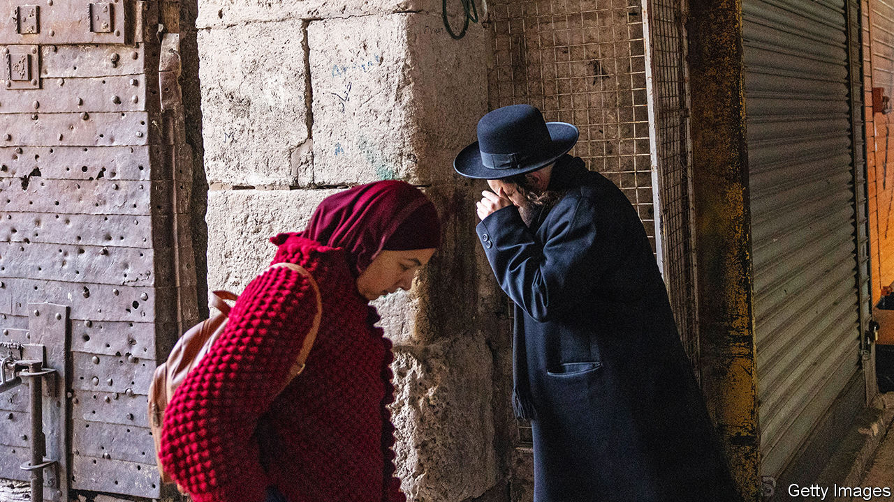

###### How Israel’s Arabs see themselves

# Even as war rages in Gaza, Israel’s Arabs are feeling more Israeli 

##### That is partly because of their shared horror of Hamas and the threat it poses 

 

> Jan 18th 2024 


“O people in the Negev, in the Galilee and the Triangle, set the ground ablaze under the feet of the invading occupiers through killing, burning, destruction and roadblocks.” The command came from Muhammad Deif, Hamas’s military chief, as he unleashed the horrors of October 7th. It was aimed at Israel’s Arabs, who make up a fifth of its population. They have not answered his call. “We all agree that civilians should be outside the theatre of battle,” says Muhammad Barakeh, the head of the High Follow-Up Committee, an umbrella group of Arab factions in Israel.

The contrast with previous bouts of fighting is striking. When missiles flew from Gaza in 2021, violent clashes between Arab and Jewish Israelis erupted across Israel’s mixed cities. This time the response has been a studied silence. Palestinians in Israel “don’t want to be part of the war”, says Muhammad Darawshe of Givat Haviva, Israel’s oldest centre promoting Jewish and Arab co-existence.


Many Jewish Israelis think this is because their Arab compatriots are afraid, particularly of the police. In 2021 Itamar Ben-Gvir, a far-right Jewish politician, urged Jewish mobs to take up arms and shoot Palestinian stone-throwers. Today Mr Ben-Gvir is the minister for national security, in charge of the police. Since October 7th forces have detained or interrogated some 200 Israeli Palestinians, many women, many for minor offences, such as endorsing social-media posts expressing sympathy with Gaza’s dead. Mr Ben-Gvir’s supporters have sent prominent Palestinian Israelis death threats. Rallies demanding a ceasefire have been banned. Some such gatherings have been forcibly dispersed.

But after decades torn between their state and their people, opinion polls suggest Israel’s Palestinians are siding firmly with the state. In a survey this month by Givat Haviva, over half of Arab respondents attributed the calm to their desire for peace and a shared destiny with mainstream Israel. Another survey published last month showed two-thirds of Israeli Palestinians saying they identified with their state, up from half before the war.

This desire for integration is counterintuitive. The Palestinian death toll has been higher than in any other war in the long conflict. The yearning has several causes. One is the shared horror at Hamas and the threat it poses. On October 7th the Islamists abducted Israeli Arabs and Jews alike, including a veiled Muslim girl. (An embarrassed Hamas later released her.) Its attack and rockets have killed some 20 Palestinians in Israel. “Hamas threatens Arabs as well as Jews,” says Makbula Nassar, an Israeli Palestinian journalist.

The war in Gaza is also eroding workplace barriers. Hundreds of thousands of Jewish reservists have gone to fight, so Israeli firms have recruited Palestinians from Israel and occupied East Jerusalem in their place. Israeli Palestinian attendance was high when universities reopened earlier this month. Some campuses plastered their walls with appeals for co-existence. And although Mr Ben Gvir and his cohorts spew hate, at a conference in Tel Aviv on January 9th Benny Gantz, the defence minister, insisted that the slogan emblazoned on main roads across Israel, “Together we will win”, included the country’s Arabs. And Moshe Arbel, the ultra-Orthodox interior minister, overruled the decision of Bezalel Smotrich, the far-right finance minister, to cut Arab municipalities’ funding.

Still, communal divisions run deep. In the survey 44% of Jewish Israelis said they would stop their children from playing with Arabs. (13% of Arabs said the same of Jewish children.) Over 40% thought Arabs should receive less state funding than Jews. And 62% opposed Arab parties being part of Israel’s governments. Among Arab Israelis, Arabic’s downgrading as an official language in 2017 still rankles. So does the lower funding for Arab public services.

That Israel’s Arabs feel closer to the state does not mean that they no longer feel Palestinian.“We won’t forget our identity,” says Reem Younis, a female entrepreneur from Nazareth, Israel’s largest Arab town. “Why can’t I feel pain for Palestinians as well as Jews?” ■

