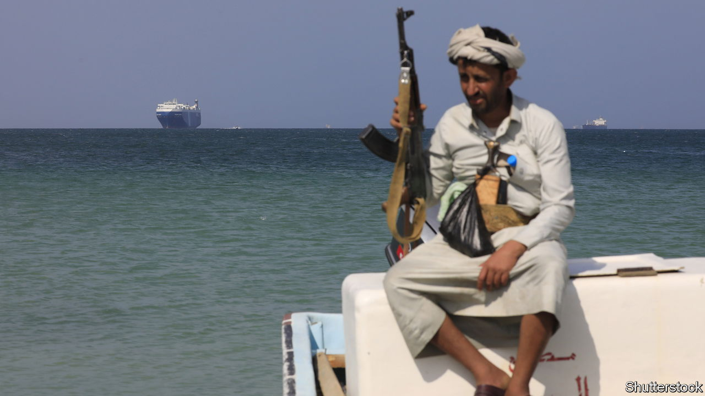

###### Sea change

# Joe Biden puts the Houthis back on America’s baddies list 

##### A president who wanted to end the war in Yemen now has his own conflict there 

 

> Jan 18th 2024 

IT IS enough to cause whiplash. Three years ago America removed the Houthis from its list of foreign terrorist groups over the objections of Saudi Arabia, which was fighting a war against the Shia rebel group in Yemen. Now it is putting the Houthis back under broad sanctions and bombing them—while the Saudis are trying to make peace with the group.

On January 17th the Biden administration labelled the Houthis, who are backed by Iran, a “specially designated global terrorist” group. That comes after two months of Houthi attacks on commercial shipping in the Red Sea and the Gulf of Aden, and days after America and Britain began bombing Houthi targets in Yemen.

Neither the strikes nor the sanctions are likely to stop the Houthis’ piracy, which they say is in solidarity with Gaza. They initially said they would target only vessels with links to Israel (in practice, some of their attacks have been random). The first round of Anglo-American strikes on January 12th struck some 60 targets across the country. “This was intended as limited, single action and we hope the Houthis will now step back and end their destabilising attacks,” Rishi Sunak, the British prime minister, told Parliament on January 15th.

That was wishful thinking. Since the British and American strikes the Houthis have hit a Greek-owned vessel sailing to Israel and an American-owned ship (neither sustained much damage). The group also fired a missile at a tanker carrying Russian oil, but missed. On January 16th Shell became the latest energy giant to suspend shipments through the Red Sea.

American officials believe they only destroyed a fraction of the Houthis’ anti-ship missiles and drones. They have carried out further strikes since the initial barrage including one targeting a radar station and another aimed at four anti-ship missiles that were being readied for use.

Sanctions are another tool, albeit a weak one. The Trump administration put the Houthis on America’s foreign-terrorist list in January 2021. Mr Biden reversed that decision a month later, amid warnings that the designation would complicate delivery of food to Houthi-controlled areas already on the brink of famine.

Sanctions will not stop the Houthis from stealing aid, smuggling oil and imposing taxes on Yemenis, their main sources of revenue. Nor will they prevent Iran from delivering weapons. Two American Navy SEALs went missing off the coast of Somalia on January 11th while trying to seize a shipment of Iranian-made missile parts allegedly being smuggled to Yemen, in defiance of a un arms embargo.

Those shipments will continue: Iran finds it useful to have a proxy that can shut a vital waterway. In recent days it has taken the unusual step of lashing out directly. On January 17th Iran launched a missile attack in western Pakistan. It said it was targeting Jaish al-Adl, Sunni militants blacklisted by Iran as terrorists. This came after it hit targets in Iraq and Syria. Pakistan retaliated with strikes inside Iran. Broadly, though, the Islamic Republic prefers to stoke regional chaos from a distance.

In private, American officials acknowledge that their strikes are unlikely to be a deterrent. They can impose a cost on the Houthis and perhaps degrade their ability to continue the campaign. But as long as the Houthis control large bits of Yemen and receive weapons from Iran, their ability to threaten shipping will remain. ■


