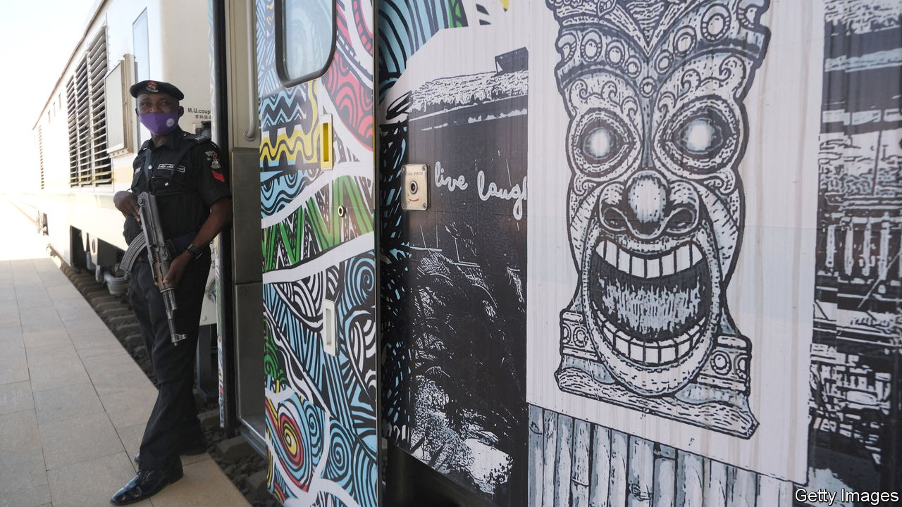
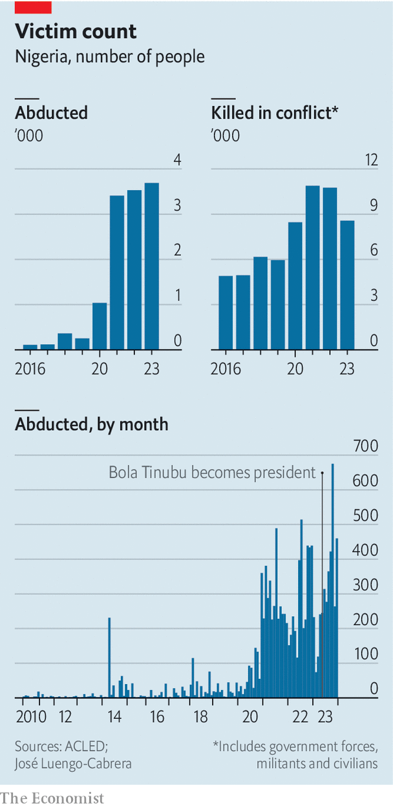

###### Insecurity in Nigeria

# Kidnappers are wreaking havoc in Nigeria 

##### Yet President Tinubu’s security plan is worryingly like his predecessor’s 

 

> Jan 18th 2024 

How much politicians in Nigeria care about national insecurity has long been correlated with how close it gets to their mansions in Abuja, the capital. On its outskirts on January 2nd a father and his six daughters were kidnapped, prompting a rare outcry on high. A crowdfunding effort to pay the ransom was even backed by a former minister. But the kidnappers instead killed one of the girls and demanded more cash. The wife of President Bola Tinubu publicly lamented a “devastating loss”. Yet such horrors are still appallingly frequent—and largely ignored by politicians. In one incident last week in the south-east 45 people were kidnapped and are still missing, yet few leaders spoke out.

The deadliest zone is the north-east, where jihadists linked to Islamic State attack the army and villages. The north-west, too, is riddled with gangs that routinely kidnap for ransom. A decades-long conflict between mostly Muslim herders and largely Christian farmers rumbles on in the country’s centre, where on Christmas Eve gunmen mowed down at least 160 people. Separatist violence still smoulders in the south-east.

 


At his inauguration last May Mr Tinubu declared security his “top priority”. Yet more than 3,600 people were kidnapped in 2023, the most ever, according to ACLED, a global monitor of conflict. The snatching rose sharply after Mr Tinubu took office. And almost 9,000 Nigerians were killed in conflict last year (see chart). 

The government stresses that, in its most recent budget, spending on defence and the police took the biggest share, about 12% in all. Defence got a fifth more than it did last year. Yet inflation is running at 29%, so in real terms the defence budget has actually fallen.

The government tends to splurge on fancy weapons systems that fail to tackle the roots of the problem, which is poverty, poor education and anger at army atrocities. The latest budget includes funds for six T-129 Turkish attack helicopters on top of the 12 costly Bell choppers bought last year from America for $1bn, not to mention 12 Super Tucano attack aircraft. Buying strike drones has become so popular that the army actually runs its own fleet alongside that of the air force. 

But drones are not much good at guarding schools from kidnappings, and heavy weaponry risks disaster. A drone recently killed at least 85 civilians at a festival in Kaduna state—not the first such cock-up. The army promised to “fine-tune” its operations, but more radical change is needed. The police, well equipped but able to use better human intelligence, should lead on domestic security, not the army, which has been deployed in all 36 of Nigeria’s states. 

Another huge problem is graft in security spending. “Defence is a really prime part of the budget where you can take large quantities of money out without people being any the wiser,” says Matthew Page of Chatham House, a think-tank in London. Much of the budget, he says, is still about rewarding those who paid to get Mr Tinubu elected. Sometimes the army fails to receive its budget allocation. 

This is worsened by a system known as “security votes”, whereby parts of defence spending are deemed too sensitive to require public oversight. The practice, which accounts for perhaps $700m a year, increased sharply under the last president and may well jump more under Mr Tinubu. The defence budget has nearly tripled since 2019. But thanks to inflation, wasteful purchases and corruption, Nigerians do not seem safer. General Christopher Musa, chief of the defence staff, appears to understand the roots of the insecurity. “Military effort alone is incapable of restoring enduring peace,” he says, adding that the army helped build hundreds of schools under his command in the north-east. 

Yet many politicians seem keener to spend on themselves, rather than create the conditions for peace or fill the country’s fiscal hole. Even if Mr Tinubu resists the temptation to reinstate the petrol subsidy that he largely removed last year, debt servicing alone in 2024 may gobble up 61% of revenue.

In November the national assembly approved new SUVs for all 460 lawmakers, at a reported cost of $150,000-plus per car. In two months the government has budgeted $31m to improve accommodation for the president and vice-president—in a country of around 220m people where more than 80m are reckoned to live on less than $2 .15 a day and many fear being kidnapped. ■

