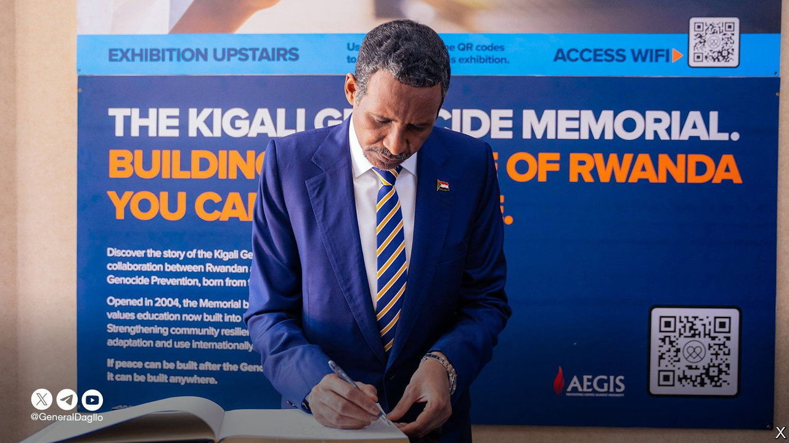
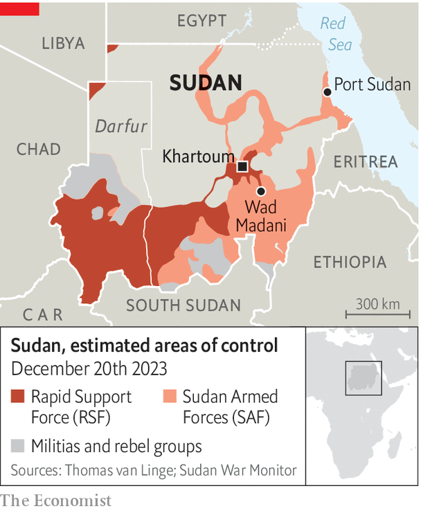

###### Solving Sudan

# Why diplomacy over Sudan, Africa’s enduring nightmare, is stuck 

##### A notorious warlord is winning the public-relations war as well as the real one 

 

> Jan 17th 2024 

It is hard to imagine a greater irony than a man who stands accused of genocide being welcomed on an official tour of a memorial to that most heinous of crimes. But on January 6th that is precisely what happened, when Sudan’s most infamous warlord, Muhammad Hamdan Dagalo (better known as Hemedti), visited the genocide memorial in Kigali that commemorates the Rwanda catastrophe of 1994. Sudan, he said barefaced, “must learn from Rwanda”.

Mr Dagalo’s paramilitary body, the Rapid Support Forces (RSF), is waging a war to the death against Sudan’s regular army, the Sudanese Armed Forces (SAF), for control of the state. Since the fighting erupted last April, more than 7m Sudanese have been forced from their homes; 1.4m of them have fled to neighbouring countries. Khartoum, the capital,, while parts of the countryside are on the brink of famine.

Neither side is angelic; the SAF has bombed civilians and persecutes peace activists. But only the RSF faces credible allegations of genocide. Along with allied Arab militias, it is conducting  against black Africans in Darfur, a region in the west, so bloody that many fear  there two decades ago.

 


This makes the welcome Mr Dagalo has been getting in capitals across Africa all the more galling for many ordinary Sudanese. He has recently enjoyed a string of official receptions that more befit a head of state than a genocidal warlord. Beginning on December 27th in Uganda, he has since waltzed through Ethiopia, Djibouti, Kenya and South Africa, before his controversial visit to Rwanda. 

In Nairobi he was greeted on a red carpet with a hug from William Ruto, Kenya’s president, who commended him for his efforts to end the war. In a post on X, previously Twitter, which was later deleted, the office of South Africa’s president, Cyril Ramaphosa, referred to his guest as “His Excellency President Mohamed Dagalo of Sudan”. Since then, the Intergovernmental Authority on Development (better known as IGAD), an eight-country east African regional bloc, has asked him to attend a summit on January 18th, prompting his rival, General Abdel Fattah al-Burhan, who commands the regular army and is Sudan’s de facto president, to withdraw from negotiations in protest. 

Diplomatic recognition granted to Mr Dagalo by African leaders may partly reflect a pragmatic adjustment to reality. “Hemedti is winning,” says Entisar Abdelsadig of Search for Common Ground, an NGO based in Washington and Brussels. In December, his forces , one of Sudan’s biggest cities, which had been presumed to be a stronghold of the national army. Since then they have threatened to push east towards Port Sudan, where General Burhan’s government has been based since it was forced out of Khartoum in August. IGAD has tried to arrange a ceasefire, which means its members may reckon they must receive Mr Dagalo so as to retain the bloc’s neutrality as a mediator.

But “it’s not just that [African leaders] met with Hemedti—it’s they met him,” says Kholood Khair of Confluence Advisory, a Sudanese think-tank. For instance, Uganda’s President Yoweri Museveni studiously maintains social-distancing protocols because of covid-19 yet had himself photographed mask-free shaking hands with Mr Dagalo. Perhaps Mr Museveni has not forgiven Sudan’s regular army for once backing the Lord’s Resistance Army, a rebel group that terrorised northern Uganda from 1987 to 2006. Like several other east African leaders, Mr Museveni may view the RSF as having “less baggage” than the SAF, Ms Khair notes. General Burhan can count on only Egypt and South Sudan as reliable allies in the region. 

Mr Dagalo’s key advantage on the battlefield is the backing of the United Arab Emirates (UAE), which is said to have been providing him with weapons, armoured vehicles and drones. The UAE’s support may help explain the success of his recent diplomatic forays. Many African countries are keen to strengthen ties with the UAE, which is flush with petrodollars and  across the region. Mr Dagalo, who owns UAE-linked gold mines in Darfur and has been criss-crossing the continent on a Dubai-registered jet, is a member of an emerging bloc led by the UAE. This includes Ethiopia, Chad and the . The Emiratis are also believed to have pushed several Sudanese opposition politicians, including Abdalla Hamdok, the former prime minister, into signing an agreement with Mr Dagalo in Addis Ababa, Ethiopia’s capital, on January 2nd. 

This is the stuff of nightmares for the SAf, which has threatened to “investigate” those who hobnobbed with Mr Dagalo in Addis Ababa. Meanwhile the SAF is said to have been receiving arms, including drones, from Iran. Though denouncing others for treating the RSF commander as his equal, the SAF general nonetheless says he too is ready to meet Mr Dagalo in person, but insists that the RSF must withdraw from Khartoum and other cities as a precondition for negotiations. Mr Dagalo, for his part, scents outright victory. And so the war goes on. ■


