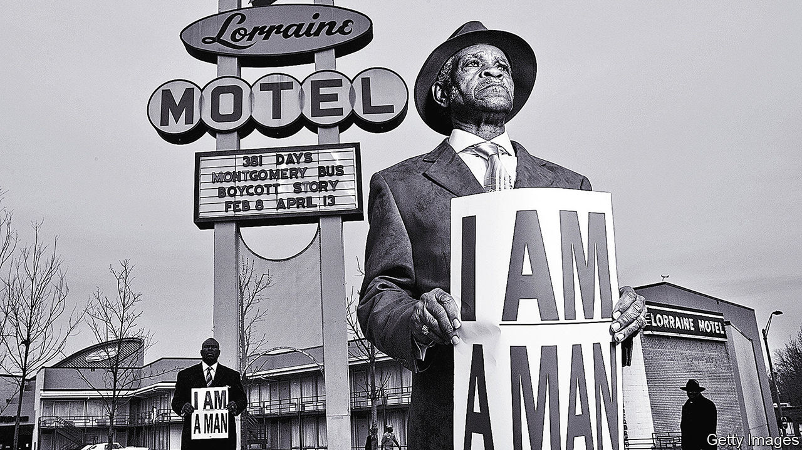

###### From boys to men

# Elmore Nickleberry pinned his hopes to Martin Luther King 

##### One of the last striking sanitation workers of Memphis died on December 30th, aged 92 

 

> Jan 18th 2024 

That evening of April 3rd 1968, round Mason Temple in Memphis, Tennessee, a mighty storm was blowing. The tin roof banged in the rain, and the rafters blew against each other. Yet the vast hall was packed, because people had come to hear another mighty voice, Martin Luther King’s, thundering out among them. Somewhere in that crowd was Elmore Nickleberry, wiry and neat, listening hard. What he heard was a great man who could change things, where hundreds of black Memphians could not. 

Mr Nickleberry was one of 1,300 sanitation workers in the city who had gone on strike at the start of February. It was sparked off by the dreadful accident that had happened to two colleagues, Echol Cole and Robert Walker, nice fellas, in a storm much like this. They were hiding from the rain in the back of the garbage truck when suddenly the compactor got going and crushed them both to death. Because they were only hourly workers, not full employees, the city would not pay proper compensation to their families. This, added to a lot else, prompted the walk-out, which in April was still going on. Mayor Henry Loeb refused to budge or to recognise the union they had formed, an offshoot of the American Federation of State, County and Municipal Employees (AFSCME). Instead, he ordered “my Negroes” to get back to work. 

Work was tough. Every morning during that time Mr Nickleberry would get up at 4am, walk the two miles to the depot, and spend his days humping number-three tubs in and out of people’s backyards. The tubs, loaded with loose waste, were heavy, so he didn’t have much choice but to tote them on his head; they were old and leaky, so maggots and foul stuff ran down his face. They were given no overshoes, uniforms or rain-suits, and could not use the depot’s bathroom or the shower, being black men. By the end of the day he stank so bad that he couldn’t ride the bus, but walked home, where his wife Peggy would make him take off his clothes in the back yard, put on a housecoat and take a shower before he did anything. Peggy, as a proud house lady, wasn’t about to welcome some hobo to her kitchen table.

This was not the future he’d imagined for himself. When he was given honourable discharge from the army, where he served in Korea driving a GMC 6x6 truck and rose to corporal, he thought he might get a job at Firestone, the tyre company. He was 21, and eager to work hard. But there weren’t too many jobs in Memphis for black men. Eventually he took to standing outside the gates of the parking lot for sanitation trucks, until a white man inside said “You looking for a job, boy? Come on in.” The next day, he started. 

By 1968 his pay was $1.65 an hour for a nine-hour day. He and Peggy already had three children, and you couldn’t feed a family on that. Fully 40% of the sanitation workers were on welfare and food stamps. So he also became a hustler, as his daddy was, in the good sense of doing any job he could find and could fit into his hours. Sometimes he picked cotton, sometimes chopped wood or pruned trees. (In the elegant white parts of the city, homeowners assumed that he could tidy their gardens as well as collect the trash.) School had been no big thing for him, and he left after sixth grade; he learned instead to be flexible. His father had managed to provide for 17 children, but in that respect at least he didn’t follow him. He stopped at seven. 

The first strike march, down Main Street, was marvellous until the police messed it up, spraying Mace and whupping round with batons, yelling “Get off the sidewalk, boy!” Some people had dogs sicked on them. But it was that word “boy” that irked him more than anything. “Do this boy, over here boy.” He’d tell them, he was no boy. As a sanitation worker he also heard “Hey, garbage man!” as if he was garbage himself. But a clever young black official at AFSCME, Bill Lucy, thought up a slogan for the strikers that said simply, “I am a Man”. By late March they could march silently and in single file, just holding up that message. 

Though they still seemed to be getting nowhere, and the mayor kept digging in, they had been noticed well away from Memphis. The union backed them more strongly, and Dr King decided to make their cause part of his Poor People’s Campaign to elevate and house the poorest. On March 28th Mr Nickleberry was overjoyed to see America’s most inspiring black preacher linking arms at the head of a march on Beale Street, Memphis’s famous home of the blues. But again, when a few black youths on the sidelines broke windows and looted shops, the police pounced with their batons and Mace. A young man got killed by a shotgun, and he himself was clubbed so hard on his arm that he fled down to the strong, reassuring Mississippi river. But Dr King had planned another march for April 8th, and on the 3rd at Mason Temple the sanitation workers with their supporters squeezed in to hear him speak.

Mr Nickleberry never forgot that day. The speech was all about the change black people could make, even when they felt helpless. They could make a difference—he could make a difference—simply by not drinking Coca-Cola and not eating Wonder Bread, both made by companies with unfair hiring policies. The end, though, was the most extraordinary part, where Dr King spoke with a real voice of power: when he talked of letting justice roll down like waters, and said he had been to the mountaintop and seen the promised land. It was as if he knew something was going to happen, because the next day he was shot at the Lorraine Motel.

The world’s eyes turned to Memphis then. Within a month, the shamed city agreed to give Mr Nickleberry and the others a fair amount of what they had been asking for. He got 15 cents more an hour, shoes, a uniform and a depot bathroom he was allowed to use. Even the trucks were new. He kept working there well into his 80s, partly needing the money, but confident that he was respected now. It was Dr King who had achieved this, and he felt tears ever afterwards when he thought of that. Someone had come from out of town to fight for them; thanks to him, the kicked-around “boys” had become men. And more than men: because, with him, they had climbed the mountain and glimpsed the promised land. ■

