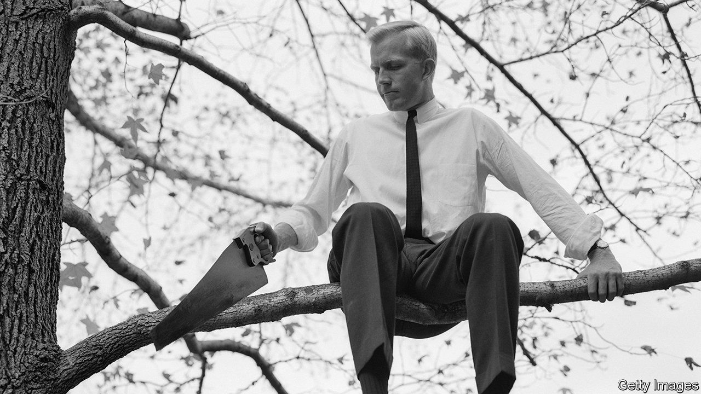

###### A slippery concept

# Common sense is not actually very common 

##### Very few claims meet with universal agreement 

 

> Jan 17th 2024 

IN 1776 THOMAS PAINE, a traitorous Englishman living in the American colonies, published a seditious 47-page pamphlet. Called “Common Sense”, it became a best-seller. It argued that the colonies should seek independence from British rule. Later that year they did exactly that. 

Appeals to common sense are a staple of politics, especially when an insurgent wishes to distinguish himself from a supposedly aloof and out-of-touch elite. But in a paper published in , Mark Whiting and Duncan Watts, a pair of computational social scientists at the University of Pennsylvania, note that the idea has seldom been rigorously studied. 

The two researchers set out to fix that. They started by noting that the standard concept of common sense has a somewhat circular definition: common sense is a set of claims that sensible people agree with, and sensible people are those who possess common sense. 

To get around such philosophical tangles, the researchers turned to Mechanical Turk, a website run by Amazon, a big tech firm, that allows people to post odd jobs. They recruited 2,046 human participants and asked them to rate 50 statements from a corpus of 4,407 claims that might plausibly be seen as commonsensical. 

As common sense might have predicted, the researchers found that plainly worded claims concerning facts about the real world were the most likely to be rated as demonstrating common sense (“triangles have three sides”, for example, which is true by definition, or “avoid close contact with people who are ill”). The more abstract the claims, the less likely participants were to agree that they were common sense (“all human beings are created equal”; “perception is the only source of knowledge”). 

When they split the claims by subject, the researchers found that those concerning technology and science were the most likely to be rated as commonsensical, while matters of history and philosophy were the least likely. A respondent’s age, sex, income and personal politics had little effect on what they thought counted as common sense, although psychological measures of social perceptiveness and the ability to reflect on one’s opinions did. 

Having investigated individual opinions, the researchers looked at how common sense works across big groups. Here, they found much less agreement than might have been expected. Only around 44% of claims in the corpus were rated as commonsensical by at least 75% of respondents. A stricter definition of common sense, in which everyone has to agree with a claim for it to count, cut that number to just 6.6%. Where exactly a sensible cut-off lies is a matter for debate. But truly “common” sense, it seems, is an elusive thing. ■


