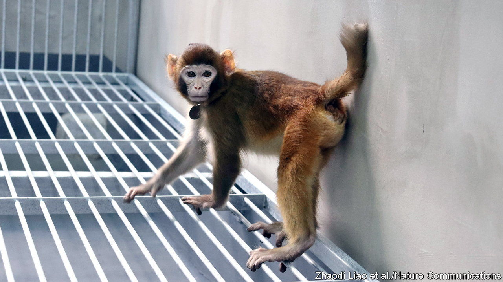

###### Mass production?

# Researchers in China create the first healthy, cloned rhesus monkey 

##### Their new technique could make the routine cloning of primates easier 

 

> Jan 16th 2024 

PRIMATES RESIST cloning. For some, that is a blessing, since it postpones the awkward day when somebody proposes cloning people. For others it is a problem. Medical researchers would find the genetic standardisation which cloning brings useful, especially if it could be applied to the two species of monkey—crab-eating and rhesus macaques—that are the mainstay of non-human-primate research. And if monkeys with clinically interesting genetic modifications could be mass-produced, it would be even better.

That sort of routine cloning is the goal of Sun Qiang, of the Chinese Academy of Science’s Institute for Neuroscience, in Shanghai. In 2018 Dr Sun made headlines by bringing to term and raising two cloned crab-eating macaques. The following year, he and his group performed the same trick with five genetically engineered crab-eaters. Now, they have managed it with a (non-genetically modified) rhesus macaque. As they reported on January 16th, in , they have in their institute a healthy, two-year-old cloned male rhesus. And in creating him, they may have invented a better way of cloning monkeys in bulk.

Cloning, in this context, means taking a cell from the body of an animal, extracting its nucleus, and inserting it into an unfertilised egg from the same species that has had its own nucleus removed to make room. That produces a zygote, which is nurtured through until it becomes a blastocyst, at which point it is implanted into the uterus of a female of the species. If fortune smiles upon the effort, the result, a few months later, will be a healthy baby, genetically identical to the animal that donated the body-cell.

Somatic-cell nuclear transfer, as the trick is officially known, has come on since it gave the world Dolly, a sheep that, in 1996, became the first mammal to be cloned from an adult with this method. But success rates are low. For most species only 1-3% of implants produce a viable new-born. Even for cattle, where the odds are better, they are still only 5-20%. At the moment, the only people making money from cloning are companies that clone pets and horses. If cloning animals is to become a scientifically useful technology, then better ways of doing it will be needed.

One cause of failure is problems with the placenta—the organ by which a fetus is attached to the uterine wall, and through which it feeds. The placenta grows from both maternal cells and cells from a blastocyst’s outer layer, the trophoblast. The embryo proper, meanwhile, develops from the blastocyst’s inner cell mass. Dr Sun therefore experimented with the idea of a second and subsequent transplant—moving the inner cell mass of a cloned blastocyst into a trophoblast created by a non-cloning technique called intracytoplasmic sperm injection (ICSI), which is sometimes used for human in vitro fertilisation.

Dr Sun was encouraged by the discovery that four genes in trophoblast cells from clones had often had their imprinting removed, while blastocysts resulting from ICSI did not. Imprinting is a strange phenomenon, which applies to a handful of mammalian genes, in which a gene’s activity depends on which parent it was inherited from. A lot of imprinted genes are active in the placenta, where they are believed to be a molecular manifestation of the battle of the sexes. Genes bearing the father’s imprint encourage the transfer of more resources from mother to fetus while those bearing the mother’s oppose this. Upset that balance by removing the imprints and placentas will not work properly.

After going down a blind alley involving a variant of somatic-cell nuclear transfer called electrofusion, which results in cells with four sets of chromosomes, rather than the usual two, the researchers simply took the inner cell masses of several cloned blastocysts and injected them into blastocysts created by ICSI that had had their own inner cell masses removed. From 11 implants into seven surrogate mothers, they obtained two pregnancies. One, of twins, failed to come to term. The other gave rise to the now two-year-old. Not yet an industrial process, but not a bad outcome for the first outing of a new technique. ■


