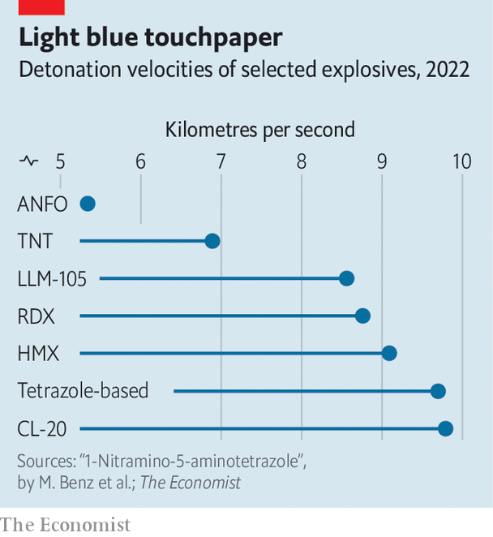

###### More bucks for bigger bangs

# The Pentagon is hurrying to find new explosives 

##### Most of America’s existing ones date from the second world war 

 

> Jan 17th 2024 

America’s wars are high-tech affairs. Many of the bombs and missiles with which it has  in recent days, as part of an effort to protect shipping in the Red Sea, were guided to their targets by lasers or signals from satellites. 

But the business ends of such weapons are looking rather long in the tooth. RDX and HMX are the two most common explosives in American weapons. RDX was invented in 1898. HMX dates from 1941. As Bob Kavetsky, who runs the Energetics Technology Centre (ETC), a research group in Maryland, puts it, America’s explosives have been made with mostly “the same processing, literally, since World War II”. 

Now, alarmed by growing Chinese and Russian investment, things are changing. A study funded by the Office of Naval Research and published in 2021, worried that some Russian and Chinese weapons “overmatch” American ones in range and power. Another, published in 2022 by the Hudson Institute, a think-tank, noted that for every scientific paper on energetics published by American researchers, Chinese ones published nearly seven. Five years ago the budget of the part of the Department of Defence that concerns itself with improving “energetics”—army-speak for explosives, propellants and pyrotechnics—was $20m. In 2023 it was more than $250m.

Bigger bangs, more bucks

In the decades following the development of cheap sensors and microprocessors in the 1970s, better precision, not more firepower, “became almost our singular focus”, says Bill Hix, a former senior leader of the Army Futures Command, a modernisation outfit. Quests to build  and microwave weapons have also steered R&amp;D away from explosives and propellants, as has the fact that, in the decades after the fall of the Soviet Union, America’s military rivals were all technologically far inferior. 

 


Progress did not stall entirely. Take hexanitrohexaazaisowurtzitane, better known as CL-20 after the base at China Lake, in California, where it was first synthesised. It packs at least 10% more power than explosives made with HMX. It also detonates faster, an important factor in an explosive’s performance (see chart). That can produce a larger number of smaller and faster-moving pieces of shrapnel, increasing the number of “hits on target”, says Anthony Di Stasio, head of the Pentagon’s Manufacturing Capability Expansion &amp; Investment Prioritisation directorate. By one reckoning, shaped-charge explosives made with CL-20 have up to 40% more armour-penetrating power than those made with HMX. 

It also shows promise as a propellant. Of the molecule’s 36 atoms, 12 are oxygen. This reduces the amount of oxidiser required compared with other missile fuels, saving space and weight. That could give a range boost of between 5% and 20%, and might allow bigger missiles to be shrunk enough that they would fit inside a stealth aircraft’s internal weapons bays. 

CL-20 was first synthesised in 1987. But limited funding and strict safety rules slowed its development. The Switchblade 300, a kamikaze drone which has been supplied to Ukraine, is the first American munition developed for the explosive. 

The size of the bang is not the only measure of an explosive’s performance. LLM-105 was first produced at Lawrence Livermore National Laboratory in 1995. Part of its appeal lies, paradoxically, in its reluctance to detonate. It can withstand high temperatures without blowing up, making it a candidate for warheads used in hypersonic missiles, which fly and manoeuvre at more than five times the speed of sound. 

LLM-105 can also tolerate heavy knocks and bumps. It is therefore being put into a new generation of “bunker-buster” warheads designed to punch through hard structures before blowing up inside. A munition full of LLM-105 is also less likely to be set off by an enemy attack, even if it is hit by shrapnel or bullets. Mr Di Stasio reckons that the first weapons with LLM-105 could be ready in three years’ time.

The fact that it has taken so long for new explosive compounds to make it to the battlefield underlines how tricky such substances are to develop. Safety precautions, for obvious reasons, are rigorous. Many exotic materials require specialised equipment such as diamond anvil cells, which can create enormous pressures. And enough surprises lurk in the underlying chemistry that luck also plays a significant role, notes John Fischer, ETC’s principal scientist, who likens it to occasionally finding “hidden gems in that brown [chemical] muck you just made”.

It’s called nitroglycerine for a reason

The gems most sought-after are molecules which contain a lot of nitrogen atoms. The amount of energy released by an explosive depends on the difference between the energy locked up in its starting state, and that in the more stable end state reached once all the chemical reactions have finished. Nitrogen atoms like to pair up into a very stable molecule linked by a strong chemical bond. That means that the energy difference between the start and end states of nitrogen-containing compounds can be very large, which makes for a big bang.

Nitrogen makes up a third of the atoms in a molecule of CL-20, for instance. More exotic setups should be possible. Hexazine, for now still theoretical, is a molecule composed of six nitrogen atoms arranged in a ring like that of benzene, a common hydrocarbon. If hexazine proves makeable, says Dr Fischer, its molecular setup means it is “going to be good”. 

Part of Dr Fischer’s job is keeping an eye on advances made in other countries. One paper, published in June by Ru-jing Yu, a chemist at Nanjing University of Science and Technology, and his colleagues, describes a pentazolate salt, a chemical based on a five-atom nitrogen ring. It has a detonation velocity measured at 9,487 metres per second, a bit faster than CL-20. In 2022 a team at Ludwig-Maximilian University of Munich reported an explosive based on tetrazole (a ring with four nitrogen atoms and one carbon) with a detonation speed of 9,697 metres per second. When it comes to specific impulse, a measure of propulsive power, CL-20 appears to be outperformed by a class of substances called furazans.

Better energetics are also being made by packaging explosives in “reactive” materials including aluminium and Teflon, a polymer often usually used in non-stick frying pans. Reactive materials are normally inert, but when subjected to sufficient heat or mechanical stress from a blast, they burn quickly, releasing additional energy. America’s army and navy are testing explosives made with reactive materials that the Pentagon’s Mr Di Stasio says will soon be incorporated into the country’s arsenal. 

Efficiency can be boosted further by using reactive materials with thermobaric weapons, which use a small explosive charge to disperse fuel that is then ignited. Rather than carrying their own oxidisers alongside the fuel, thermobaric weapons (which America began using in the Vietnam war) use the oxygen in the air. The ETC reckons this can lead to weight savings of up to 60%, potentially allowing even small drones to carry powerful bombs. 

Other innovations focus on things besides the bang itself. A group at the Ludwig Maximilian University of Munich, for instance, aims to reduce erosion in gun barrels by designing novel nitrogen-rich propellants. The chemical effects of such propellants can harden gun barrels every time they are fired. And they have lower combustion temperatures than other propellants, which also reduces stress. 

Resodyn Acoustic Mixers, a firm based in Montana, has pioneered a new way to produce energetics. The standard approach is to mix the ingredients with blades. Resodyn’s machines use acoustic vibrations instead. A 420-litre mixer, the biggest model, takes three years to build and costs about $12m. Sales are nevertheless brisk. Safety is one benefit: in conventional mixers, a broken blade or loose ball bearing risks sparking an explosion.

Speed is another. With standard kit, the mixing happens in vortices at blade edges. In an acoustic mixer, it happens everywhere. This can cut the time it takes to mix a polymer-bonded explosive like HMX more than tenfold. Lawrence Farrar, Resodyn’s boss, says acoustic mixing can reduce the amount of (non-explosive) binder chemicals in a standard explosive mix from about 13% to just 7%, leaving more room for the energetics themselves. 

Totting up the benefits of better explosives is hard. But in 2021 the ETC concluded it might be possible to build a 400lb (181kg) state-of-the-art bomb roughly as deadly as an existing 1,000lb munition. And the rate of advance is only likely to accelerate. Few things spur innovation better than competition. Mr Di Stasio reckons that America’s lead over its rivals in deploying better explosives is around two years at most. ■


