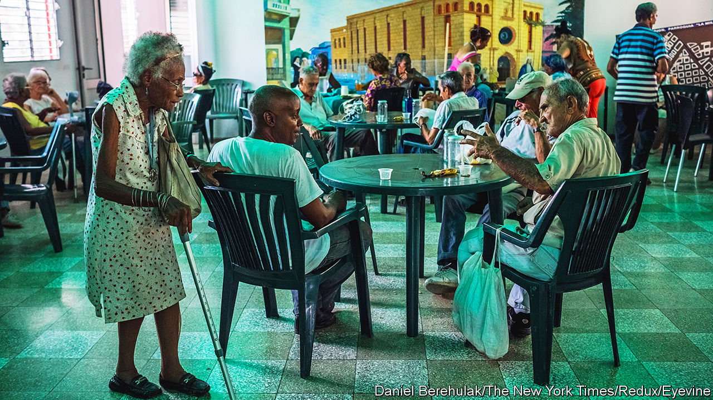

###### Accelerated ageing

# Plunging fertility rates are creating problems for Latin America 

##### Rapidly ageing societies will struggle to afford pensions and health care 

 

> Jan 18th 2024 

Daniela Barros does not want children. Her mother had three by the time she was Ms Barros’s age, but the 31-year-old São Paulo hair stylist decided against it years ago. “It would mean giving up my personal and professional life, as well as changes in my body that I don’t want to go through,” she says.

Her choice is not unusual. Latin America’s fertility rate fell below the 2.1 births per woman required to maintain a stable population in 2016; the region is home to some of the fastest-falling fertility rates in the world. Together with rising life expectancy and high levels of emigration, mostly of working-age people, this is creating a problem for Latin America: the region is getting old very quickly. 

The United States enjoyed a 57-year period over which its population of people older than 65 doubled from 10% to 20%. Latin America is about to embark upon the same transition in just 28 years. This provides little time to adapt to what Simone Cecchini of the UN’s Economic Commission for Latin America and the Caribbean calls a “radical change”. Footing ballooning bills for pensions and health care will be a big challenge. Dealing with the drag on economic growth created by a shrinking workforce will be another. 

Look at pensions. Countries with defined-benefit systems, such as Brazil and Argentina, face rising bills as the number of claimants grows. Brazil’s pension deficit is running at 2.6% of GDP, and is projected to rise to 5.9% by 2060. In places that use defined-contribution systems, such as Mexico and Chile, pensioners often find payouts to be meagre. The region’s legion of informal workers often have no retirement savings at all. Fully 82% of Salvadoreans are neither paying into a pension nor saving independently for old age, according to the country’s central bank.

The response to these problems is often cash handouts for old people. But those are already becoming unaffordable. Almost a quarter of Mexico’s federal budget will be spent on the “well-being pension” in 2024. By 2050 the number of over-65-year-olds potentially in receipt of the handout is expected to double.

Health care for the old is even patchier. Many Latin American countries entirely lack services designed for older people. There are very few public nursing homes in the region. Private ones are expensive. Traditionally families look after each other. But that is becoming harder when more women—the default carers—work or simply don’t want to provide care. Noemí Domínguez Punaro, a university lecturer in Mexico City, moved her 92-year-old mother in with her a few years ago. “The government takes advantage of this expectation,” she says. “Caring limits my life.”

All the extra spending entailed by its ageing population will make the obligations of Latin America’s governments exceed their revenues by some 3.8% by 2065, according to research by Carola Pessino and colleagues at the Inter-American Development Bank; that gap is running at 1.7% in the European Union. After the old are looked after there will be “little to spend on everything else”, says Ms Pessino.

Failure to launch

Countries with high birth rates, like Bolivia, should try to make the most of it. But doing so successfully would be out of character for the region. Latin American countries have mostly failed to take advantage of their expanding working-age populations, largely because they have not managed to get young people into decent jobs. Youth unemployment in Costa Rica, for example, is as high as 27%. Informal labour is much to blame. Dropping out of school to take temporary, informal work is standard. When that work ends, the dropout does not return to school, and is left without the skills required for the formal jobs market. Keeping children in school for longer would pay dividends for the whole region.

Where dependents will soon outnumber workers a different focus is needed. Raising the age at which people stop working is sensible. Brazil began raising its retirement age from the mid-50s in 2019. It estimated that this would save $200bn by 2029, but it will soon need to go higher. Uruguay started raising its pensionable age from 60 last year. Similar reforms in Costa Rica took effect on January 12th.

Latin American countries could help themselves by boosting productivity and becoming more attractive to working-age people, potential immigrants and emigrants alike. There is room for improvement. Latin America’s productivity is the second-lowest of any region in the world after the Middle East. Overhauling education systems which fail to equip young people properly with the skills they need is vital. Attracting migrants seems harder. The region’s sluggish economic growth and soaring murder rates are not alluring.

Women could perhaps prove fertile in a different way, says Ms Amarante. The female labour participation rate in the region is only 51% versus 59% in East Asia and the Pacific. But women can work only if there are decent jobs and a market providing affordable care for the old people and children that are their responsibility at present. Ms Domínguez Punaro has had to go part-time in order to care for her mother. That Latin America’s women have long been able to choose how many children to have has been a great boon. Now they need more and better choices about caring for their family members, too. That might just help Latin America face up to the challenges of rapid ageing.■

