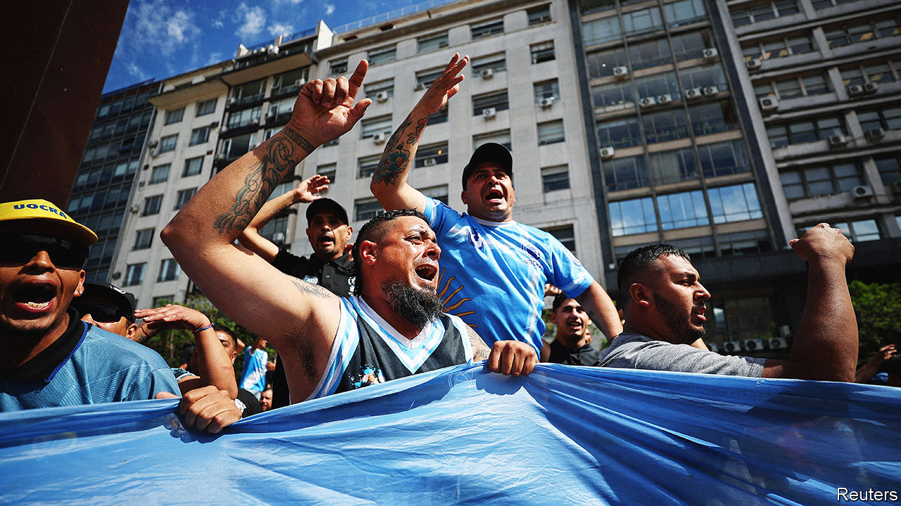
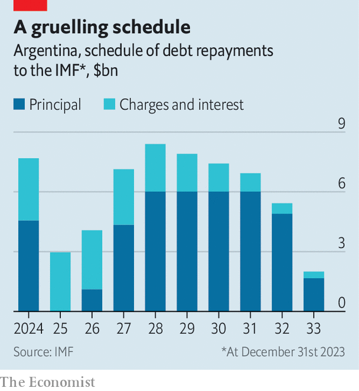

###### Milei vs the caste

# The fightback against Javier Milei’s radical reforms has begun 

##### Argentina’s powerful trade unions are preparing to strike on January 24th 

 

> Jan 14th 2024 

Javier Milei has wasted no time. Forty-eight hours after taking office on December 10th his economy minister, Luis Caputo, a former banker, unveiled measures to . He devalued the peso, pledged to slash subsidies, and eliminated nine of 18 government ministries. One week later Mr Milei decreed that state-owned companies could be privatised, price controls eliminated and labour laws reformed. 

In the midst of Argentina’s worst economic crisis in two decades, this  is intended to push the budget into surplus (before interest payments) by the end of 2024. The IMF, to which Argentina owes $43bn, has noticed. On January 10th it agreed to restart payouts to the Argentine treasury, stating that Mr Milei’s government had “moved quickly and decisively” to “restore macroeconomic stability”. The global elite has noticed, too. Mr Milei’s thundering about defending “the values of the West” was met with enthusiastic applause by the audience at Davos in Switzerland on January 19th.

 


But as well as striving for fiscal rectitude, Mr Milei is doggedly determined to destroy what he calls “the caste”, a network of corrupt politicians, business cronies, media lapdogs and, most important, powerful trade unionists. On December 27th he sent a sprawling “omnibus” bill to Congress, designed to “free the productive forces of the nation from the shackles of the oppressive state”. It would allow him to rule by decree for two years, change Argentina’s electoral system and enforce prison terms of up to six years for those who organise protests that obstruct transport or damage property. All the better to break the caste. One month into Mr Milei’s presidency, the caste has started fighting back.

Lawyers are furious about plans to fast-track divorces through the civil registry without requiring their services. Doctors hate a new requirement for them to preferentially prescribe generic medicines. Arty types are protesting about gutted funds and the closure of the national theatre institute. Fishermen are cross about permit deregulation. Sugar producers are railing against plans to remove import tariffs. Football clubs are manoeuvring to escape plans to turn them into limited companies in order to attract investment from what Mr Milei calls “Arab groups”.

But no one is more affected by Mr Milei’s shock therapy than Argentina’s trade unions, or more enraged by it. His labour reforms would kneecap them by requiring employees to opt in to union membership, rather than having dues taken automatically, as they are at present. This would leave the unions out of pocket. 

They are leading the pushback. The day after Mr Milei vowed to “break the shackles of the oppressive state” the General Confederation of Labour (CGT), Argentina’s largest union group, called a national strike for January 24th. That is record-setting time for an Argentine president to prompt such action. The unions are fighting back through the courts, too. On January 3rd one suspended the chapter on labour reform in the emergency decree, in response to a request filed by the CGT.

Trade unions are central to the system Mr Milei seeks to tear down. They are powerful and enduring, often run like family businesses. The truckers’ syndicate, for example, has had the same boss, Hugo Moyano, for 36 years. His oldest son is installed as the union’s co-chief. A daughter and another son sit on the board, while a different son ran a separate union established for toll workers. He then became a congressman. The family has owned football clubs and runs a political party. They have been investigated for corruption, money-laundering and fraud, but few investigations have ended in charges. The Moyanos, who can freeze the transport of food and petrol around the country, have hitherto seemed untouchable. But Mr Milei seems unfazed. 

Markets were initially buoyant about Mr Milei’s plans. Bond prices hit a two-year high after the emergency decree. But investors are beginning to question the political feasibility of his project. 

Union opposition is not the only hurdle. Mr Caputo wants not just to slash public spending but also to raise annual revenues by 2% of GDP. He would do this by temporarily raising import and export taxes. He plans to boost the central bank’s foreign reserves, which are $7bn in the red, by using a crawling peg to the dollar which devalues the peso by 2% every month.

Contact with the enemy

But Congress has not yet approved the tax rises, and revenues are shrinking. Argentina is in recession. Last year GDP contracted by 2.7%, estimates the World Bank. Mr Milei’s devaluation and the lifting of price controls will fuel inflation and deepen Argentina’s recession, at least in the short term. This combination means that by the time taxes are collected, their worth will have fallen. Econviews, a consultancy in Buenos Aires, estimates that the government could lose 0.8% of GDP in tax collection in 2024. Populist bungs have also hurt revenues. In September, before the presidential election, the Peronist candidate, Sergio Massa—who was also the economy minister at the time—all but abolished income taxes, which accounted for a good chunk of the government’s revenues. Even though he voted for the tax cut, Mr Milei now says he wants to reverse it. He will have to go through Congress to do so.

Many analysts fear that the 2% crawling peg is not enough, as prices rise faster than expected. Annualised inflation surpassed 211% in December—higher than the rate in Venezuela. The peso is once again weakening on the country’s black market, which offers a route around currency controls. If another sharp devaluation looms, prices could rise even more. 

It will also be difficult to pass much of the omnibus bill in its current form. Even with the support of centre-right parties, Mr Milei cannot muster a majority in Congress, which threatens his tax rises too. He is attempting hardball, nonetheless. Congress, Mr Milei says, can either do the right thing and pass his law, or dedicate itself “to destroying the lives of Argentines”.

The mastermind behind much of this slash and burn, Federico Sturzenegger, a former central-bank president who advises Mr Milei, appears to be unflustered. He says the government is only getting started. In an interview with Bloomberg, he said the administration will send another bill to Congress soon to scrap 160 “absurd” regulations. Boldly, he claimed that the only way to change Argentina’s rotten economic structure is “to disarm it” and “drain it of its resources”. That will not sit well with the likes of Mr Moyano, his offspring, and the country’s caste.■

