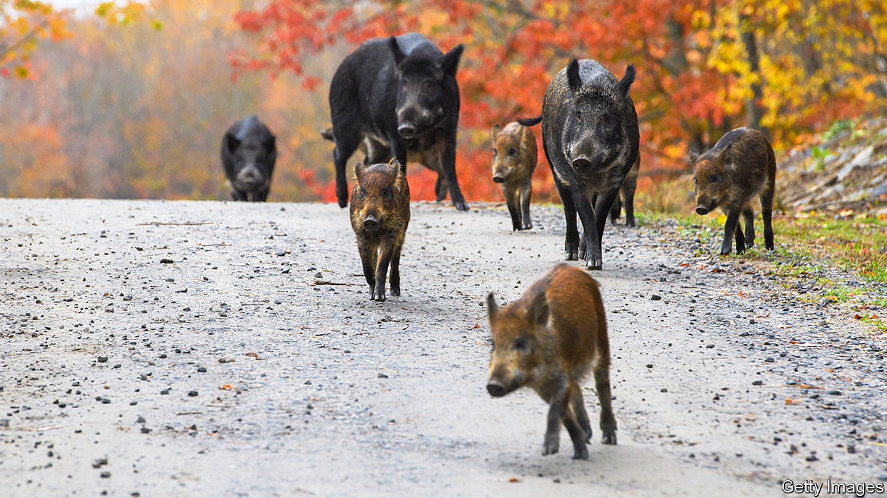

###### Reaping what you sow

# Wild boar hybrids are raising hell on the Canadian prairies 

##### They are well adapted to the cold, with thick fur, long legs, and tusks as sharp as steak knives 

 

> Jan 18th 2024 

It seemed like a good idea at the time. When Canadian pig farmers were told in the 1980s that their animals’ gene pool was thin, they turned to wild boars from Britain for fortification, crossing them with an improved strain of domestic pig. This yielded a longer creature with an extra rib, and more meat per beast. 

Then, in 2001, the boar-meat market plunged. Some farmers, unable to sell their stock, simply released their hybrid pigs into the wild. 

Today those pigs’ descendants roam the Canadian prairie provinces, a horde some 62,000 strong. They reproduce at a clip, and are well adapted to withstand the extreme winters, with thick fur and long legs that let them traipse through the snow. Their tusks are as sharp as steak knives. Their meaty breeding lends them a troublesome bulk now they are feral. One captured boar weighed more than 280kg (600lbs).

They are destructive, opportunistic omnivores who feed by shoving their snout and tusks into the soil in search of grubs and roots. Some Canadian farmers now live in fear of discovering acres of crops ploughed up by a herd of pigs.

“They’re turbocharged superpigs,” says Ryan Brook of the University of Saskatchewan: the animals are both smart and adaptable. They have learned, for instance, to burrow for shelter. “When we have howling winters, these pigs are under a half a metre or a metre of snow and comfortable,” he says.

So far, Canada’s animal-management programmes have proved no match for the hybrid pigs’ fecundity, removing a mere 300 of them in 2023. Mr Brook says that getting rid of even ten times as many would not be enough to keep the superpigs in check. 

In fact, the pigs have multiplied to such an extent that they have now started spilling over the border to the south. Lori Stevermer, a Minnesotan who grew up on a pig farm, married a pig farmer and now sits on the board of the National Pork Producers Council, says the scale of Canada’s superpig problem became clear to her just last year. 

Farmers and pork producers in the northern United States are worried about damage to their crops and the potential for wild pig herds to be a vector for African swine flu. An outbreak could cost the domestic pork industry $7.5bn of its roughly $20bn annual sales, according to a recent study by Iowa State University. 

The United States already has a feral pig problem, but in the warm south. What concerns John Tomecek, chair of the National Wild Pig Task Force in Texas, is that their physiology is actually better suited to cold weather. That makes the new sort of swine coming down out of the prairies into chilly northern states a cause for serious concern. 

“What you’re seeing in Canada,” he says, “is the beginning of a very real, very long-term problem.” ■

