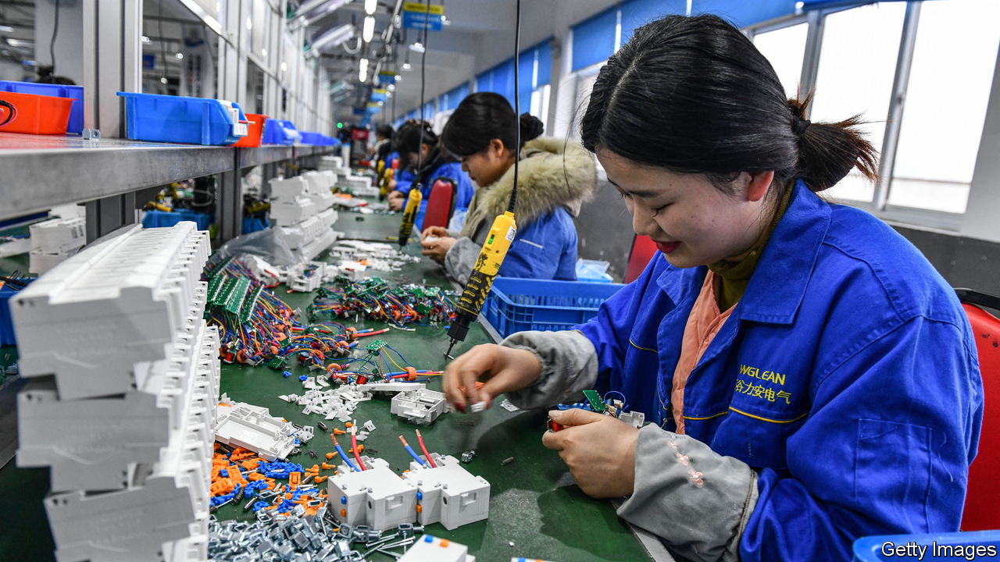
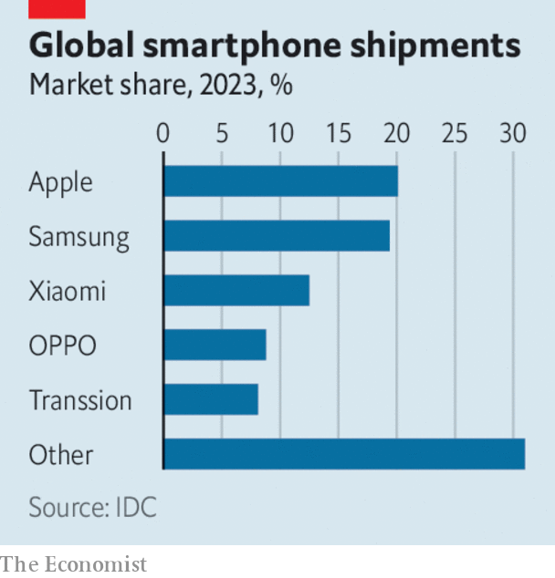

###### The world this week

# Business 

#####  

 

> Jan 18th 2024 

 grew by 5.2% last year, just above the government’s target of 5%. Speaking at Davos, Li Qiang, China’s prime minister, crowed that the government had not had to resort to massive stimulus to achieve an economic rebound. However, the figure is a comparison with the low base of 2022, when GDP expanded by just 3% because of pandemic restrictions. Investors weren’t impressed. Chinese stockmarkets extended their rout from the start of 2024, despite the authorities ordering some institutional investors not to sell shares. China’s population also  in 2023 for the second year, by 2m people to 1.409bn.

  was 0.3% smaller in 2023 than the previous year, as higher prices hit household consumption and trade. The economy may have avoided a recession in the second half of the year, just. An initial estimate showed GDP shrinking by 0.3% in the fourth quarter over the third quarter, but the statistics office now says that in the third quarter the economy merely “stagnated”. 

Britain recorded an unexpected rise in . The annual rate rose to 4% in December, the first increase in ten months. Coming after a surprise increase in America’s inflation rate (to 3.4% in December) and a rise in the euro zone’s (to 2.9%) investors are pushing back their estimates of when central banks will cut interest rates. Christine Lagarde, president of the European Central Bank, hinted this week that the ECB won’t start reducing rates until the middle of the year. 

 reported a mixed bag of earnings. Net profit at Goldman Sachs was $2bn in the fourth quarter, which was better than markets had expected. But its annual profit of $8.5bn was its worst in four years. Morgan Stanley’s 12-month profit of $9.1bn was also its worst since 2019. By contrast, JPMorgan Chase’s net profit of $49.6bn was a record for the bank, which benefited more than its rivals from higher interest rates. Citigroup is slashing at least 20,000 jobs, a tenth of its workforce. It reported a hefty loss for the fourth quarter related in part from its exposure to Russia. 

 struck a deal to buy for $12.5bn. It is the asset manager’s biggest acquisition since 2009, when it bought Barclays Global Investors. GIS owns infrastructure and energy assets, including London’s Gatwick and City airports. 

Flight cancelled

A federal judge blocked  proposed takeover of, finding that the merger of America’s sixth-and seventh-largest carriers would hurt competition. The $3.8bn deal was announced in July 2022 and had been delayed in the courts ever since. 

 and  pushed back the date by which they hope to complete their proposed merger, as talks continue with the Federal Trade Commission and state regulators about combining the two supermarket giants. Meanwhile Washington state asked a judge to halt the deal, arguing that it would lead to higher prices for consumers. 

 sold its 68-year-old onshore-oil business in Nigeria to a consortium of mostly local companies. Like other energy giants that have withdrawn from the Delta region, Shell has grappled with damage to infrastructure, often blamed on communities suffering from damage to their environment. Meanwhile,  confirmed Murray Auchincloss as its new chief executive; he has held the job on an interim basis since the resignation of Bernard Looney last September. 

 


Apple passed Samsung last year to become the world’s biggest seller of  by volume, according to IDC, a market-research firm (Apple has long been the most profitable smartphone-maker). Apple shipped nearly 235m of the devices, 4% more than in 2022 and despite a downturn in the wider market. That compared with Samsung’s 227m, a drop of 14%. Transsion, a Chinese manufacturer, made the top five by selling lots of its phones in Africa. 

Rising stock

The news was a fillip for Apple in a week when Microsoft pipped it to become the . Microsoft is now worth around $2.9trn on the stockmarket, compared with Apple’s $2.8trn. 

The revolution in chipmaking spurred , as , which makes software tools for chip design, agreed to buy , which provides engineering simulation software to a variety of industries, for $35bn. 

An annual survey of global chief executives by PwC found that a quarter of them expect to cut their workforce by at least 5% this year because of . Those cuts are already starting to materialise, with Google reportedly laying off hundreds in advertising and Amazon making hundreds of redundancies in its streaming business, both because of AI.

