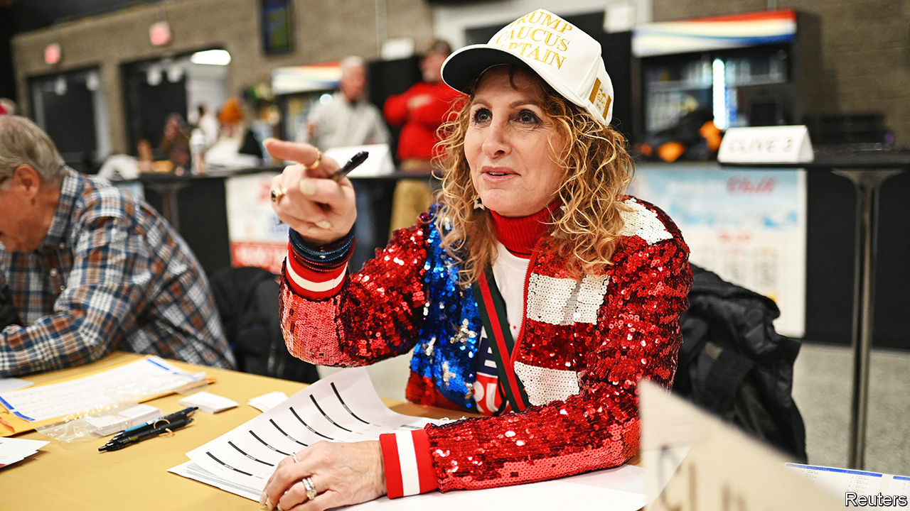
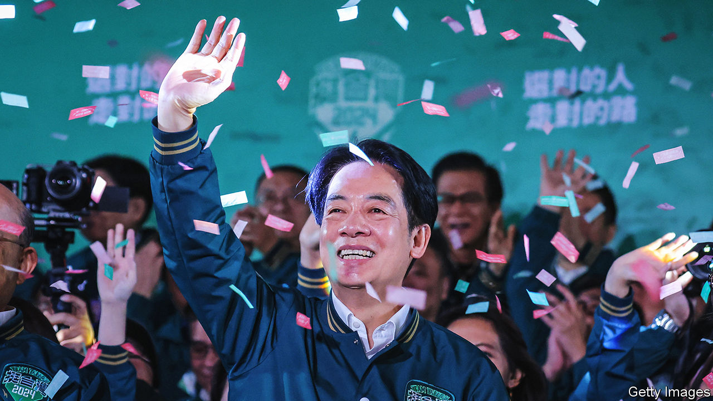

###### The world this week

# Politics 

#####  

 

> Jan 18th 2024 

Donald Trump stormed to victory in the , the first contest in the Republican race to choose the party’s presidential nominee for November’s election. Mr Trump took 51% of the vote, underlining his dominance in the race (in 2016, when Mr Trump started his first presidential campaign, he came second with 24%). Ron DeSantis and Nikki Haley were far behind, taking 21% and 19% of the caucus vote respectively. Some 65% of caucus-goers thought Mr Trump would be fit for the presidency even if he were convicted of a crime. 

The day after the caucuses Mr Trump’s  came to the fore again as a trial began in Manhattan to determine how much he should pay in damages for defaming E. Jean Carroll, a writer. Ms Carroll won a civil trial last May that found Mr Trump liable of sexually abusing her and of defamation. 

 marked 100 days since the  attacks of October 7th. At a big commemorative event in Tel Aviv many carried pictures of the more than 130 hostages still being held in Gaza. Meanwhile, under a deal brokered by France and Qatar, Israel and Hamas agreed that medicines would be given to the hostages while more humanitarian aid would be delivered to Gaza where conditions are increasingly dire. Intense fighting continued in southern Gaza, especially around Khan Younis where Israel believes Hamas’s leaders are holed up. Jordan said Israeli air strikes had damaged its military field hospital there.

Israel offered its defence against South Africa’s  at the International Court of Justice that the war in Gaza amounted to a  against the Palestinians. Israel argued that South Africa had ignored the events of October 7th and that Israel had a right to defend itself. Its lawyers blamed Hamas for the high civilian death toll.

America and Britain bombed dozens of  in Yemen in response to almost two months of attacks on commercial vessels in the . The Iranian-backed group continued its campaign, however, firing on several ships, which just prompted more American strikes against the militants. The American government put the Houthis back on a list of terrorist groups.

Tensions increased between  and  after Iran launched a missile attack in western Pakistan targeting Jaish al-Adl, Sunni militants whom it considers to be terrorists. Pakistan then fired missiles into eastern Iran, hitting what it said were “terrorist hideouts”. Each country has accused the other in recent years of harbouring militants in the border region. Iran also hit targets in Iraq and Syria. 

Russia and , whose democratically elected leader was overthrown last year by a soldiers’ junta, agreed to enhance military co-operation.

Azali Assoumani, who came to power in 1999 in a coup, won election to a fourth five-year term as president of the , an archipelago in the Indian Ocean. His opponents cried foul.

Britain’s home secretary, James Cleverly, asked Parliament to proscribe the  Hizb ut-Tahrir group under the Terrorism Act 2000. Anybody belonging to the group, or showing support for it, could face up to 14 years in prison. Mr Cleverly said that Hizb ut-Tahrir’s praise of the October 7th attack by Hamas on Israel constitutes “promoting and encouraging terrorism”.

Rishi Sunak,  prime minister,  from rebels in his own Conservative Party to a new law clearing the way for a controversial plan to deport illegal migrants to Rwanda. Three Tories resigned from their posts because they think the legislation is too weak. 

Donald Tusk,  new reformist prime minister, and politicians from the previous right-wing Law and Justice (PiS) government continued to row. The Constitutional Tribunal blocked Mr Tusk’s attempt to remove the head of the public prosecutor’s office, after Andrzej Duda, the country’s president, said the dismissal did not have his consent. Mr Duda is from the PiS. A meeting between Mr Tusk and Mr Duda to smooth things over ended in acrimony. And the former deputy foreign minister was arrested over a visa scandal.

Keep on truckin’

 suspended their blockade of three border crossings into Ukraine, after reaching a deal with the Polish government over driver permits. Ukraine said the blockade had hurt its economy and its war effort. 

 shot down a  military spy plane over the Sea of Azov and damaged another Russian aircraft used for airborne command. The planes were being used to co-ordinate Russia’s ground operations. The spy plane could track more than 300 targets simultaneously. 

 


 was elected president of , giving a third term in office to the independence-minded Democratic Progressive Party. He will be inaugurated in May. Mr Lai has been an even more outspoken proponent of Taiwan’s national sovereignty than the incumbent president, Tsai Ing-wen, though in his victory speech he emphasised his aim of avoiding confrontation by talking to China. The DPP lost its parliamentary majority, however. 

The election in Taiwan angered China. It warned the  “not to play with fire” and summoned the Filipino ambassador after the country’s president, Ferdinand Marcos junior, congratulated Mr Lai. China said that this was “a serious violation of the One China principle”. The Pacific nation of ditched its diplomatic links with Taiwan in order to forge closer ties with mainland China, leaving Taiwan with just 12 countries that formally recognise it.

The new government of the  said it had asked  to withdraw the 80 or so troops it has stationed there by March 15th. Last year the Indian Ocean archipelago elected a new president, Mohamed Muizzu, who is strengthening ties with China and reducing his country’s long-standing reliance on India. The Indian foreign ministry did not give a timeline for any withdrawal.

 dictator, Kim Jong Un,  from his country’s formal desire for unification with South Korea, ordering the closure of all state offices that had been working towards that goal. Mr Kim said his people should no longer think of South Koreans as “fellow countrymen”. Meanwhile North Korea’s foreign minister visited Russia for talks. North Korea is supplying Russia with weapons for its war on Ukraine.

One of the ethnic rebel groups fighting the junta in  said it had captured the port town of Paletwa, a big trading hub that lies close to the border with India and Bangladesh. The Arakan Army has been fighting Burmese troops for several years. Along with other insurgents, it stepped up its operations after the army seized power in a coup in February 2021. 

The presidential zeal

Bernardo Arévalo was sworn in as  president. Since his landslide election victory last August, sections of Guatemala’s political elite have done their utmost to stop the anti-corruption Mr Arévalo from taking office. His swearing-in ceremony was delayed by nine hours amid more shenanigans from his opponents in Congress, underlining the huge battle he faces fighting corruption. 

In  the prosecutor who was leading an investigation into the recent storming of a television station by an armed gang was assassinated, according to the country’s attorney-general. César Suárez was shot dead in the city of Guayaquil, the centre of most of the violence that has rocked the new government. 

The pace of deforestation in Brazil’s  fell by 50% in 2023 over the previous year, according to the government. Satellite data showed that 5,153 square kilometres (1,990 square miles) were bulldozed, the smallest area since 2018. Deforestation soared under the presidency of Jair Bolsonaro. 

