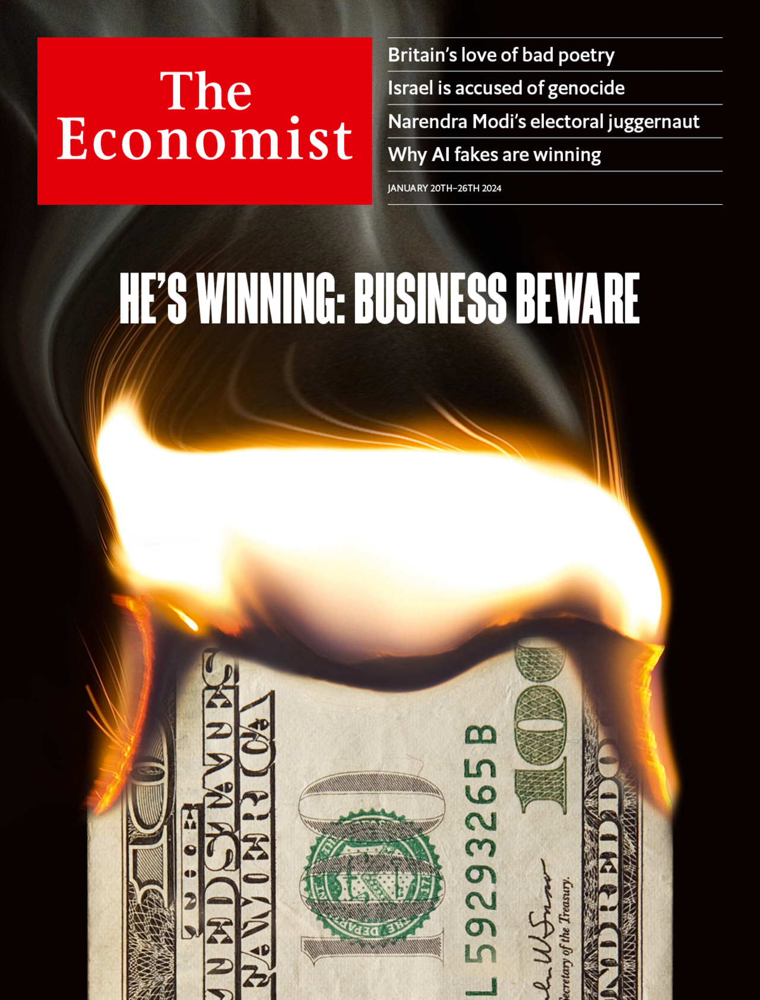
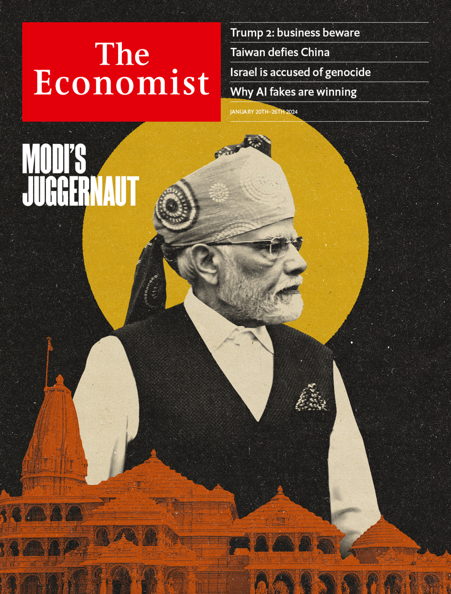

###### The Economist

# This week’s covers 

##### How we saw the world 

> Jan 18th 2024 

Our TWO covers this week look, respectively, at what a second Trump presidency would mean for big business in America, and India’s unstoppable prime minister, Narendra Modi.

People who run large organisations are optimistic by necessity. They are paid to find opportunities when others are panicking. Although bosses had an uneasy relationship with the first Trump administration, they enjoyed his more conventional policies. It was hard for corporate America to be miserable amid a soaring stockmarket.

Our cover argues that Trump 2 would be different. In today’s debt-fuelled, high-employment economy, the deficit-funded tax cuts and tariffs that define Trumponomics would be harmful. What’s more, Mr Trump’s most chaotic tendencies could threaten American business.

The case is simply put. In January 2013 America had 1.3 unemployed workers for every job opening; today it has only 0.7. In 2016 the annual federal deficit was 3.2% of GDP and debt was 76% of GDP. The forecasts for 2024 are 5.8% and 100%, respectively. As a result, America is much more prone to inflation. The threat to the economy is exacerbated by the tariff increases promised by Mr Trump’s team—especially if they follow through on their idea of imposing a punitive 60% rate on imports from China.

That makes for scary reading. But not as scary as our first idea for the cover, which was inspired by “The Texas Chainsaw Massacre”, a horror film from 1974. That design was hyperbole, of course. And yet Mr Trump so successfully goads his critics into overreacting that our attempt at irony risks being misinterpreted as genuine horror. 

Our other worry about a second Trump term is chaos. His administration would lack establishment types like Gary Cohn, once of Goldman Sachs, who during Trump 1 shuffled the president’s in-tray to hide the madder ideas from him. More moments like January 6th would be possible, as would a full-on revenge presidency. Amid so much civil strife, business leaders could struggle to stay out of the fray. 

We thought about illustrating this by having Donnie Kong run rampant in New York. This cover had a certain manic energy and no doubt the man himself would be thrilled at being portrayed as the alpha-double-plus of alpha males. 

One way or another, Mr Trump is going to feature on our cover a lot in 2024. That inclines us to use his image sparingly. We liked another design, in which his vast silhouette is projected onto an office building being washed down by a team of window cleaners. It is a first cousin to a cover last November, when we looked at the consequences of Trump 2 for foreign policy. 

This was fresher. Some worried that a burning Benjamin suggested we were writing about the economy rather than business. But the title could make our focus clear. In any case, as our US editor pointed out, this design is a homage to Trumpy tycoons who torch $100 bills to light their cigars. 

The greater problem was that not all of us immediately saw the flame licking the top of the banknote as a representation of Mr Trump’s wispy combover. We tried charring parts of the note to create a face, but that destroyed the elegance of the original.

Better to use the words. We were writing days after the Iowa caucus, in which Mr Trump trampled his opponents, taking 51% of the vote and 98 of the state’s 99 counties. Simply adding “He’s winning” nudges readers to ask who “he” is and causes the most recognisable hairdo in world politics to leap out. 

 


 


 


Our second cover was on India. On January 22nd millions will watch Mr Modi preside over the consecration of a controversial $220m Hindu temple in Ayodhya, in northern India. The ceremony will also be the informal launch of his campaign for a third term as prime minister in elections to be held by May. To the alarm of India’s 200m Muslims, and many secular-minded Indians, it will mark a high point of a decades-long Hindu-nationalist project to dominate India.

Even as Mr Modi appears in Ayodhya, the other part of his mission continues apace: India’s extraordinary modernisation. The country is the planet’s fastest-growing major economy and now its fifth-biggest. Global investors toast its infrastructure boom and growing technological sophistication. 

Our first design set out to bring together the mix of economic development and Hindu exceptionalism that inform Mr Modi’s vision for India as a world power. We liked the idea of featuring the temple itself, built on the site of a mosque that was destroyed in riots in 1992. One possibility was a collage set against the saffron of the ruling Bharatiya Janata Party (BJP). More charming was an artist’s mock-up of the finished building with a Modi-moon gazing benignantly down at it.

The question for our cover leader was whether Mr Modi’s religious agenda and India’s rapid economic development are compatible. The answer is yes, but only up to a point. In the past ten years the BJP’s parliamentary strength and Mr Modi’s popularity have made it possible to push through difficult reforms, including a national sales tax. Yet if Mr Modi in his third term were to lurch further towards Hindu-first ideology and autocratic rule, the economic calculus would change. 

We sought to get at that ambiguity with the design for our cover. The sparing use of colour set against black-and-white photography brings to mind Indian graphic design from earlier decades. Our cover does not absolve Mr Modi of the need to choose between nationalism and economic prosperity. He wants to be India’s most consequential leader since Jawaharlal Nehru. His vision of national greatness is about wealth as well as religion. It would be a disaster for India’s 1.4bn people if his hubristic Hindu chauvinism weighed on their growing prosperity. 

 


 

