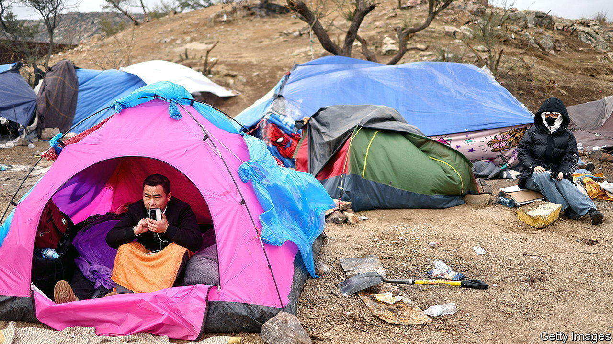
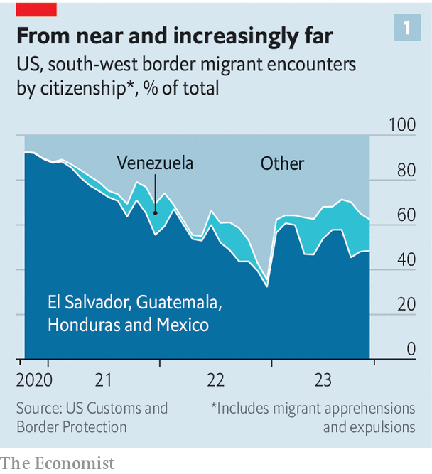
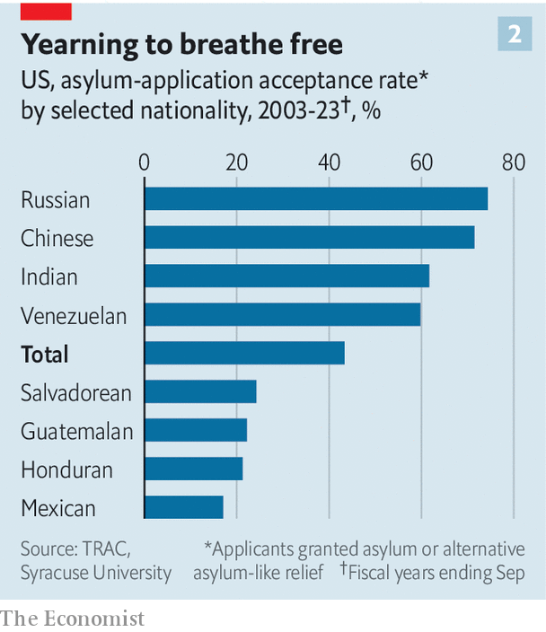

###### Over the wall

# America’s southern border has become a global crossroads 

##### More migrants are arriving from China, India and Russia. Why? 

 

> Jan 18th 2024 

SOME MIGRANTS huddled in tents provided by local volunteers. Others slept on the desert floor, facing fire pits burning rubbish. The camp, which in 2023 sprang up outside Jacumba Hot Springs, a town in San Diego County, California, was encircled by mountains, highways and the border wall. When Border Patrol agents came to take people for processing, they had to resort to nonverbal communication. “Sit if you have a passport.” “Step forward if you are travelling with children.” If the migrants were from Mexico and Central America, as most used to be, Spanish would suffice. Yet among those who had just walked across from Mexico were people from China, India and Turkey. 

 


Last year seems to have set records for the number of migrants apprehended at the southern border, and Republicans in Congress are demanding reforms to America’s asylum system in return for aid to Ukraine. A deal has proved elusive. Slightly more under the radar, the diversity of the Jacumba camp reflects a big change in who is crossing over. In fiscal year 2023, for the first time, migrants from places beyond Mexico, El Salvador, Guatemala and Honduras made up more than half of all those apprehended at the border (see chart 1). Venezuelans are the largest part of this group. But last year 43,000 Russians, 42,000 Indians and 24,000 Chinese also made the crossing—up from 4,100, 2,600 and 450, respectively, in 2021. America’s northern border has proved porous, too. In total some 40,000 Indian and Chinese migrants came south from Canada last year. 

Migrants take different paths to the southern border, depending on where they come from. An analysis by Idean Salehyan and Gil Guerra of the Niskanen Centre, a think-tank in Wasington, DC, suggests that most Chinese fly to Ecuador, to which they have visa-free travel, before making the long and dangerous trek through Panama’s Darién Gap. Panamanian data confirm that the number of Chinese migrants crossing the jungle rose steadily in 2023. In October, El Salvador began to tax African and Indian travellers at the country’s main airport. Turkish migrants in Jacumba had flown to Tijuana and then walked into California. 

Certain nationalities tend to cluster in specific border sectors. Chinese and Russians often cross near San Diego and Indians near Tucson, Arizona. Migration flows are constantly evolving, says Ariel Ruiz Soto, of the Migration Policy Institute, a think-tank. He likens the border to a balloon. If you squeeze one side (say, enforcement increases in San Diego), the air will flow to another (migrants will head to Tucson or El Paso.) Social media and messaging apps have helped spread information. TikTok and YouTube are filled with videos teaching migrants about routes. “Once families know that their friend or cousin has made it,” says Mr Ruiz Soto, “they’re much more likely to take a chance.”

Smuggling networks have evolved to serve the increased demand. Notices painted on walls and printed on fliers all over the Indian states of Punjab and Gujarat promise help with moving to America, Australia, Britain and Canada: visa services, college admissions, job opportunities. A charter plane bound for Nicaragua and filled with Indian migrants was recently grounded in France while officials conducted a human-trafficking investigation. The Turks in Jacumba admitted they had paid a  to show them the way to a hole in the border wall.  are also diversifying their enterprises by getting into the people-smuggling business. 

Why the surge? A number of trends converged in 2023 to diversify irregular migration to America. War and instability pushed people to leave their countries. The Jewish Family Service of San Diego, which runs a migrant shelter, helped more Russians than any group besides Mexicans in the nearly two years since Russia invaded Ukraine. The end of China’s lengthy and repressive  allowed Chinese to travel internationally again. 

Several Republican politicians have suggested that China is sending spies to infiltrate America. It is not lunacy to be wary of potential agents working for Chinese security services. Last year the Department of Justice charged two Chinese men living in New York City with operating an illegal police station “to monitor and intimidate dissidents”. Yet Mr Salehyan argues that there is no evidence that asylum-seekers, who willingly give themselves up to Border Patrol, have sabotage in mind. 

 


Roughly 70% of asylum applications from Chinese migrants between 2003 and 2023 were granted, suggesting that their reasons for leaving China were mostly credible (see chart 2). In fact, Ecuadorian data show that a disproportionately high share of Chinese migrants are coming from Hong Kong, where , and Xinjiang, where . Rather than plotting to undermine America, plenty seem to be seeking freedom. 

But many, probably most, migrants have a financial incentive to come. Several at the camp in Jacumba said they were fed up waiting years for a visa, and hoped to earn more money in America than back home. As of December, more than 300,000 people who had submitted immigrant visa applications were waiting for an interview. Delays are largely the result of the pandemic, which shut down consulates and decimated their staff. More important, there are not nearly enough visas for the number of people who want to come. Yet expanding legal pathways has not, so far, been part of Congress’s spasmodic negotiations.

This increasingly global migration to America’s borderlands says something about the enduring power of the idea that America is a land of opportunity. For many migrants in Jacumba there is no other place that they would risk everything—their money, their safety—to get to. When asked why he didn’t try to move somewhere closer to Turkey, Selim Gok, a 20-year-old student, responded matter-of-factly: “Because I speak English.”■


