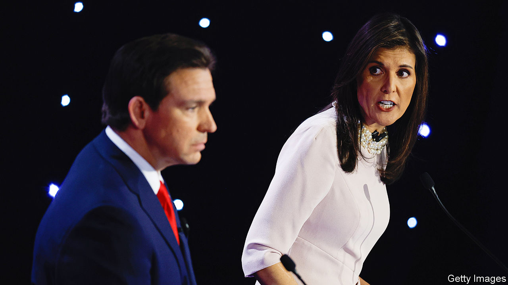

###### Hope springs ephemeral

# How did the Iowa result change the Republican primary? 

##### The notion that another Republican could overtake Trump looks far-fetched 

 

> Jan 18th 2024 

Donald Trump dominated public-opinion polling before the Republican presidential primary in 2023. Yet his rivals could reasonably argue that the party faithful still had not cast any votes, and the actual results might reveal a greater appetite for an alternative than surveys suggested. Mr Trump’s decisive victory in the Iowa caucus on January 15th seems to have put an end to that hopeful theory.

Some Republicans had predicted record attendance at Iowa’s caucuses this year, but turnout fell by around 40% from the peak in 2016. No doubt many voters opted to stay at home given the sub-zero temperatures and Mr Trump’s apparent invincibility. But TV networks also began calling the race for the former president less than an hour after the caucuses began; some caucus-goers were even told that he had won before they had a chance to vote.


Naming a victor while others are still voting was bad democratic hygiene but unlikely to sway the eventual outcome. Mr Trump won 51% of the vote and half of Iowa’s 40 delegates to the Republican National Convention. Ron DeSantis, the governor of Florida, took second place with 21% and nine delegates. Nikki Haley, a former South Carolina governor, fell to third with 19% and eight delegates. Vivek Ramaswamy, a bloviating biotech entrepreneur, finished fourth and dropped out. The first-time candidate, whose speeches were frequently ominous, kept it weird until the very end: “There’s no path for me to be the next president absent things that we don’t want to see happen in this country.”

The only hope for Mr DeSantis and Ms Haley is that a candidate needs 1,215 delegates to become the nominee, and nearly 2,400 are still up for grabs. Both runners-up agree that a head-to-head slog with Mr Trump over the next several months is the only path to victory. The problem is that neither is willing to back down in order to let the other become the former president’s sole challenger.

“I can safely say, tonight Iowa made this Republican primary a two-person race,” a smiling Ms Haley declared after finishing third. Betsy Ankney, her campaign manager, argued in a memo published after the results came in that “the race now moves to less Trump-friendly territory. And the field of candidates is effectively down to two, with only Trump and Nikki Haley having substantial support in both New Hampshire and South Carolina.”

Ms Haley, endorsed by New Hampshire’s Republican governor, is betting that a  on January 23rd would provide momentum ahead of the South Carolina contest a month later. But if she pulls off an unlikely upset, it will be thanks to support from moderate Republicans, independents and strategically minded Democrats who loathe Mr Trump. That coalition might win a state of 1.4m but isn’t fit for purpose in a national Republican primary. 

A Haley win in New Hampshire is a long shot. A polling average from FiveThirtyEight, a data-journalism website, shows Mr Trump with 44.4% in New Hampshire compared with Ms Haley’s 31.4%. Chris Christie, a former New Jersey governor and Mr Trump’s most direct critic, stood at third place before dropping out. He disparaged Ms Haley ahead of his exit and declined to endorse a candidate. Mr DeSantis fares even worse in New Hampshire polling than Mr Ramaswamy did in Iowa.

The DeSantis campaign exudes confidence nevertheless. “While it may take a few more weeks to fully get there, this will be a two-person soon enough,” says Andrew Romeo, communications director for Mr DeSantis. “Despite spending $24m in false negative ads against Ron DeSantis, Nikki Haley couldn’t buy herself the kill shot she so desperately wanted [in Iowa], and now she will be out of this race after failing to win her home state on February 24.” That state is South Carolina, where Mr Trump has nearly 55% of likely primary-goers, according to FiveThirtyEight. Ms Haley trails him by 30 points, while Mr DeSantis is at about 12%.

Ms Haley may think a third-place finish in Iowa was enough to make this a two-person race, and Mr DeSantis that a third-place finish in South Carolina will do the trick for him. Both camps seem to confuse barely surviving with building momentum. Nor is it clear whether they will have the financial wherewithal to sustain an expensive multi-state campaign.

The coming contests in New Hampshire and South Carolina could inject some life into the Haley campaign. Perhaps Mr DeSantis will raise the cash needed to hang on. But Mr Trump’s lead in national polling—around 55 points above Mr DeSantis and Ms Haley, according to ’s tracker—means that there wouldn’t be much of a race even if one of the remaining candidates dropped out. Mr Trump’s ongoing legal travails have only helped cement his bond with Republican primary voters.

Mr Trump’s campaign called for an end to primary debates and for a focus on beating Joe Biden months ago. The candidate probably won’t gain an insurmountable lead until March 5th, “Super Tuesday”, when more than a third of delegates will be up for grabs. But on the night of the caucuses he clearly had his eyes on November. He called his Republican opponents “very smart people, very capable people” and declared: “We’re going to come together. It’s going to happen soon.” ■


