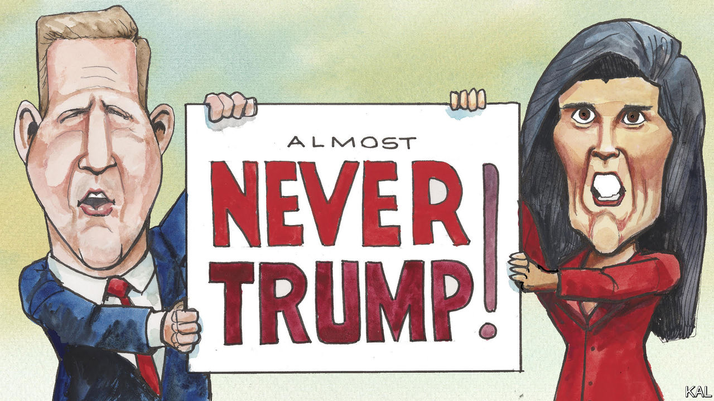

###### Lexington

# It’s not the Trump Party quite yet 

##### Chris Sununu and Nikki Haley claim, against the odds, that their brand of conservatism is the Republican future 

 

> Jan 18th 2024 

Slender, high-spirited and young, at least by the sagging standards of American politics, Nikki Haley, the former governor of South Carolina, and Chris Sununu, the current governor of New Hampshire, make a dynamic team as they barnstorm his state in advance of its primary on January 23rd. “What better place to meet the next president of the United States than in a candy shop,” boomed Mr Sununu, grinning, as he introduced Ms Haley recently to a gaggle of constituents in Chutters sweet store in Littleton, in the White Mountains. Smiling as brightly as her ally, she reeled off a list of policy objectives before warning that America could not hope to move forward with either Joe Biden or Donald Trump as president. “You can’t do it if you’ve got two 80-year-olds as the choice of where we’re gonna go,” she said.

That is the essence of her argument as Ms Haley tries, after Mr Trump’s thumping victory in the , to block his march back to the Republican nomination. Ms Haley came in a close third there to Ron DeSantis, the governor of Florida, but both were out of hailing range of Mr Trump. The next day, her campaign began running a new advertisement in New Hampshire saying that Mr Trump and Mr Biden were America’s most , “consumed by chaos, negativity and grievances of the past”.


Yet the paradox of Ms Haley’s candidacy is that although she looks like the party’s future she, more than Mr Trump, can sound like its past. While Mr Trump continues to revise Republicanism, Ms Haley wants to return the party to its pre-Trump principles, to when it at least made a more substantial pretence of caring about cutting debt, reforming entitlement programmes and containing Russia, not to mention being polite and not getting indicted. 

Though Mr Trump may have stolen Ronald Reagan’s campaign slogan (“Let’s make America great again”), he has otherwise shown little deference to the values Reagan laid down. In a sign of how Mr Trump has upended the party, and of his lingering anxiety about Ms Haley, he is running an ad in New Hampshire attacking her as wanting to cut Social Security, traditionally the kind of thing Democrats say Republicans are out to do.

There is a whiff of nostalgia in the very way Ms Haley is campaigning, not just in her commitment to retail politics but in the company she keeps. In 1988 another Governor Sununu—John, this Sununu’s father—rescued George H.W. Bush after he came in third in Iowa, delivering a victory that propelled him to the White House. “We’re copying a few pages out of that playbook,” Mr Sununu acknowledges, after snagging a chocolate bar from one of Chutters’s giant jars. “But only in that it’s tried and true.” 

He argues that his state’s politics still depend on activating networks in towns such as Littleton, and that if Ms Haley, whom he endorsed last month, beats Mr Trump in New Hampshire, and then in her home state of South Carolina, “everything would flip upside down on him very, very quickly.” That is a very long shot but somehow, borne along on Mr Sununu’s stream of enthusiastic patter, it starts to sound more than barely plausible.

Mr Sununu, who is 49, has been elected to four consecutive two-year terms, most recently by more than 15 points, in a state whose two senators and two representatives are all Democrats. In his party he is a relative moderate on social issues, including abortion rights, but he boasts of being the most fiscally conservative governor in the country. He has little patience with the argument that Mr Trump has fundamentally changed the Republican Party, insisting he has merely hijacked it. 

Mr Sununu thinks the anger of Americans over the failures of “elitists in Washington”, rather than any policies, led them to support Mr Trump in 2016 as a disrupter, and now as a victim. “He provides no leadership, no guidance, no basis in the Republican fundamentals of being fiscally conservative or limited government, or any of that,” Mr Sununu says. “His unique skill is making people feel like he’s sharing their troubles and chaos, right?” But Mr Trump is “using their anger for his own personal benefit. He’s not going to help them, at all. He didn’t before.” He fears a Republican wipeout at other levels of government if Mr Trump is re-elected.

He predicts that once Mr Trump leaves the scene—after a Haley victory, or further down the road—the old dynamics in the party will reassert themselves, “with no one individual trying to redefine where the party goes”. 

Courage about conviction

This may sound wishful, or even delusional, particularly in light of Mr Trump’s showing in Iowa. But the picture remains more complicated than that. Less than 15% of registered Republicans turned out, and of them almost half preferred a different candidate from Mr Trump, a quasi-incumbent. More broadly, Republican governors—not just in New Hampshire but in states like Georgia, Ohio and even Iowa—are succeeding not as Trump acolytes, but with more conventionally conservative and pragmatic Republican politics. Congressional Republicans, particularly in the House, are falling in line behind Mr Trump, but Mr Sununu insists that is only because they need him to raise campaign money. He thinks they will also revert to previous form when “they won’t have this emperor, this, you know, this dictator, if you will”.

Maybe. For all his criticism of Mr Trump, Mr Sununu, a fierce opponent of Mr Biden, has also said he would support Mr Trump if he becomes the Republican nominee, even if he is convicted of a felony. Mr Sununu insists he was engaging in a “hypothetical” for “shock value”, to persuade Republicans they should not rely on the courts. “If you think Trump is a threat to democracy, then get up and participate in the democratic process and vote him out,” he says. “It happens in the primary.” But if it does not happen in the primary, conservatives such as Mr Sununu will have to ask themselves a hard question: whether they will really save their party by helping Mr Trump burn it down. ■


