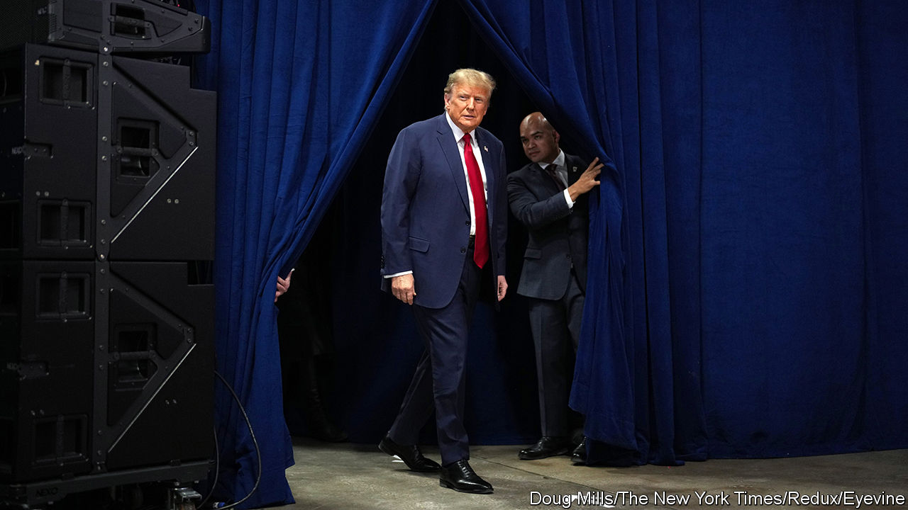
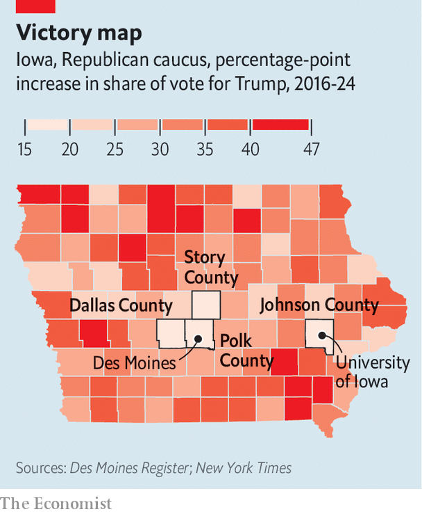

###### Iowa’s hidden hints

# Where Donald Trump still looks vulnerable 

##### His relative weakness among college-educated and suburban voters persists 

 

> Jan 18th 2024 

Donald trump  loves to crow about his big crowds and smashing victories, even when he has to stretch the truth. His  in the Iowa Republican caucuses required no exaggeration. He enjoyed the largest margin of victory for any contested Republican caucus in the state’s history. Among Republicans he may be better understood as an incumbent president seeking re-election than as the insurgent outsider he performs at rallies. But Mr  of the party faithful is no guarantee of success in November. What can the results of the earliest caucus reveal about his prospects for a general election still ten months away?

Those who endeavour to draw sweeping conclusions from quirky, low-turnout contests like the Iowa caucuses do so at their peril. Iowa (with its whiter-than-average population) and caucuses (which draw more engaged and older voters) tend not to reflect the American electorate. This year, only some 15% of registered Republicans in Iowa showed up to vote. Despite these caveats, the very first contest on the long road to election day can offer a glimpse into Mr Trump’s 2024 coalition. While the former president showed strength across all demographic segments, the results suggest he remains comparatively weaker among the college-educated and suburban voters who probably cost him the election in 2020. 


In 2016 Mr Trump came in second in the Iowa caucuses, winning 37 of 99 counties. This year he won 98, losing only Johnson County, which is home to the University of Iowa, by one vote. Entrance polls, which survey voters before they enter their caucus site, indicate why. According to one such poll, AP VoteCast, 31% of college graduates said they would vote for Mr Trump, just barely edging out Ms Haley and Mr DeSantis, who polled at 30% each. Mr Trump’s divided primary opposition masked his weakness with this segment.

Entrance polls, like their better-known sibling the exit poll, are notoriously noisy and unreliable as samples of wider populations. But ’s county-level analysis of Mr Trump’s vote share shows a similar pattern. Across the ten most educated counties in Iowa Mr Trump won 42% of the vote, compared with 66% across the ten least educated ones. And this analysis also points to a weakness among suburban voters. Mr Trump received an estimated 43% of the suburban vote in contrast to 60% of the rural vote. 

 


Mr Trump lost in 2020 in part because of gains Democrats made among college-educated and suburban voters. According to data from Catalist, a political-data firm that helps Democrats, whereas college-educated white voters were split between Hillary Clinton and Mr Trump in 2016, in 2020 he lost those voters by nine points. His share of suburban white voters fell similarly. The Iowa caucuses suggest he may still have a problem with these groups. On January 15th Mr Trump failed to crack 40% of the vote in only four counties: Dallas, Johnson, Polk and Story, counties that are disproportionately educated and suburban (see map). 

Mr Trump may overcome this vulnerability by attracting yet more non-college voters away from the Democrats. The political logic of his nativist populism is to do just that. And it seems likely that many voters like the suburban Iowans who caucused for Ms Haley or Mr DeSantis will make their way to Mr Trump’s camp come November. But despite broad support overall among Republicans, his narrower margins among some key parts of the electorate could also presage struggles in the general election. Mr Trump may be building a winning coalition for November, but its makeup is not stable. ■

