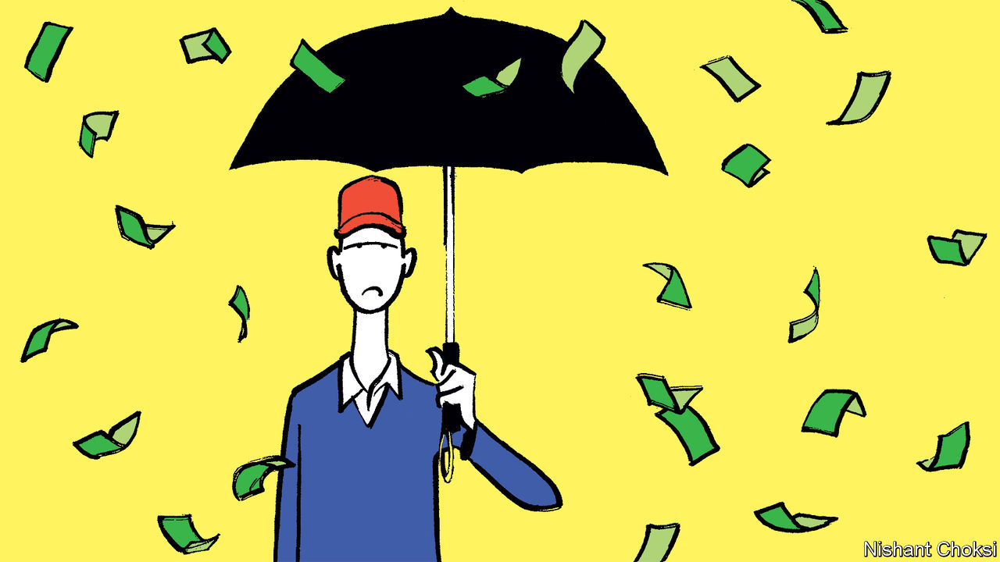
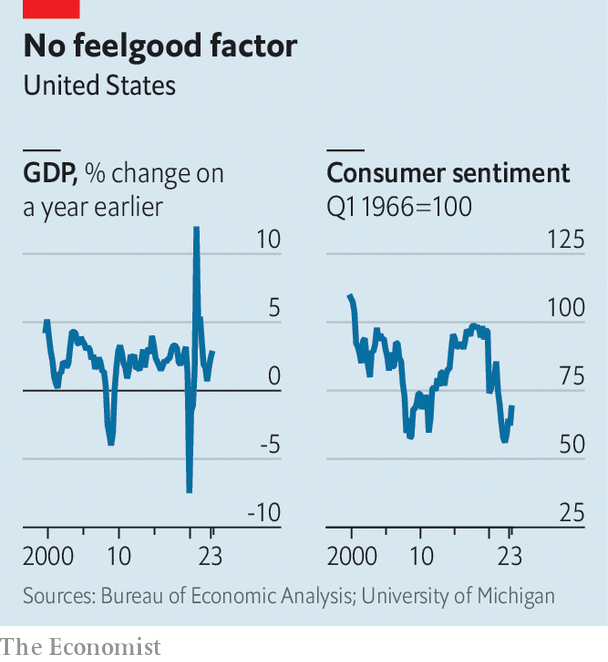

###### The mood thing

# Why are Americans so gloomy about their great economy? 

##### Inflation, partisanship and the pandemic have made them glummer than the numbers suggest they should feel 

 

> Jan 14th 2024 

“The vibes are off” is a phrase that does not usually appear in rigorous economic analysis but has cropped up again and again in serious discussions about America over the past year. From an array of hard data, there is reason to think that people ought to be quite satisfied about the state of the economy: , petrol prices are down, ,  and the . But survey after survey suggests that Americans are in fact quite unhappy. They think that the economy is in bad shape and that President Joe Biden is mismanaging it. What gives?

Start with the evidence of gloom. The figure watched most closely by economists for an idea of what people are feeling is a consumer-sentiment index from the University of Michigan. For the past two years it has bounced around at levels last seen during the global financial crisis of 2007-09. Even with an improvement in December, it is still 30% below its recent peak on the eve of the covid-19 crisis in early 2020. 

 


Many other surveys are equally downcast. Every week since 2009 /YouGov poll has asked some 1,500 Americans to assess the economy: nearly half now think it is getting worse, up from about one-third in the decade before covid. Questions focused on Mr Biden’s record yield even less enthusiasm: two-thirds of respondents to a Gallup poll in November disapproved of his handling of the economy. And all this despite America outgrowing its large, developed peers over the past few years.

The fact that so many Americans are so dejected about such a  has spawned a cottage industry of theories. A first batch argues that they have every right to feel glum: some of the figures which matter most to their pocketbooks are just not that rosy. Inflation has eroded their wages. Controlling for consumer prices (one common measure of inflation), average earnings for private-sector workers are basically stuck at the same level as in February 2020, right before covid struck. 

.

More recent baselines are even less flattering. Although few Americans would want to go back to a world of covid shutdowns, many did receive big benefits from the government’s spending spree at the time. After-tax personal income is about 15% lower now than in March 2021, when it was propped up by the massive stimulus package passed by Democrats soon after Mr Biden took office. Another unflattering comparison with the recent past: the aggressive interest-rate rises needed to tame inflation have made loans for houses and cars much more expensive. Housing affordability hit its lowest in decades last year, serving as an easy target for critics of Mr Biden. The Republican National Committee says Bidenomics is “pricing out millions of people from the American Dream”.

However, as the Biden administration is only too keen to point out, there are many things to like about the current economy. The supposed stagnation in private-sector wages is in fact a statistical illusion caused by upward bias in the consumer-price index. Use a better alternative—the personal-consumption expenditures index targeted by the Federal Reserve—and real wages are roughly on their pre-pandemic trend. At 3.7% the unemployment rate is just a touch above a five-decade low. Wage growth has been especially strong for low-income Americans. The S&amp;P 500, an index of America’s leading stocks, has been flirting with record highs. 

To judge from the range of indicators—good and bad—Americans do appear to be unduly pessimistic. Ryan Cummings and Neale Mahoney, two economists who previously served in the Biden White House, created a simple model to predict the level of the consumer-sentiment index, drawing on inflation, unemployment and consumption data as well as stockmarket performance. Their conclusion was that the index has been about 20% lower than where the data suggest it ought to be. Other models have found a similar discrepancy.

This suggests a second category of explanation: that opinion polling and sentiment surveys may have a negative bias. Profound partisan hostility is undoubtedly one factor. In their study Messrs Cummings and Mahoney calculated that Republican antipathy towards a Democrat-controlled White House may account for about 30% of the sentiment gap today. 

Another element may be the tone of news coverage. Ben Harris and Aaron Sojourner of the Brookings Institution, a think-tank, studied the relationship between economic data and an index of economic news sentiment. Since 2021 the news-sentiment index has, like the consumer-sentiment index, been notably worse than what would be expected from the data. And that may be only scratching the surface. The news-sentiment index, created by the Federal Reserve’s branch in San Francisco, is based on economic articles in major American newspapers. Throw in the vitriol that tends to go viral on social-media platforms, and the negative bias might be even more pronounced.

A final explanation is that there may simply be a long lag between the post-pandemic recovery and feelings about the economy. It has been a topsy-turvy period. The extreme uncertainty of the covid years—job losses, school closures, bankruptcies and illness—took a toll on people. Many are still upset by the bruising battle with inflation. Although inflation has moderated, prices are nearly 20% higher than when Mr Biden took office. The sticker-shock takes some getting used to. Messrs Cummings and Mahoney estimate that a 10% inflation surge reduces consumer sentiment by 35 index points in the year it occurs, 16 points in the next year and eight points the year after that.

If a similar timeline is now in play, Americans have probably gone about halfway towards accepting their new higher-priced reality. It also helps that real-income growth has accelerated over the past year, letting them recover some of their lost purchasing power. The consumer-sentiment index has been volatile, but it did clearly bottom out in mid-2022—right around the peak in inflation—and it did also post a solid rise in December, even if it remains low by historical standards. 

“Our theory of the case is that if we can continue to maintain a tight labour market while easing inflation and delivering real wage gains, that recipe should show up in improved sentiment. And we think we’re starting to see that,” says Jared Bernstein, chair of the White House Council of Economic Advisers. The vibes, in other words, may be picking up. ■


