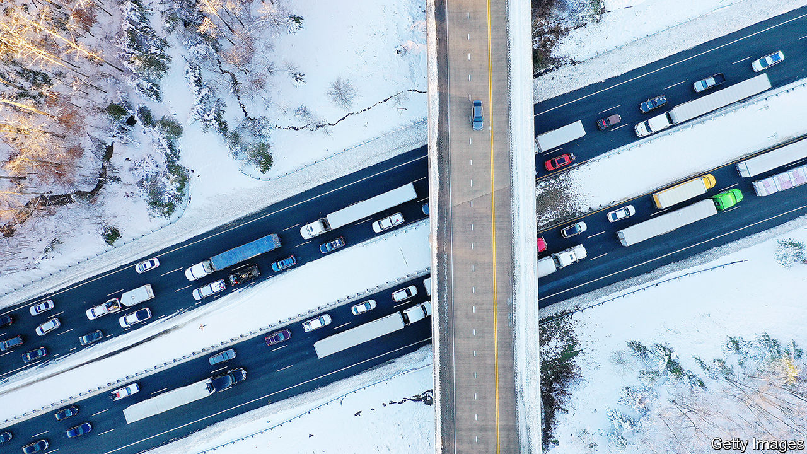

###### Crashing truths

# Why car insurance in America is actually too cheap 

##### Prices are rising, but most drivers still have paltry coverage 

 

> Jan 18th 2024 

In 2010, Eric DuBarry and his two-year-old son Seamus were crossing a street in Portland, Oregon, when an elderly driver mistook the accelerator for the brake, and ploughed into the pair and another man. They were flung across the street—the pram wrapping itself around a lamppost. In hospital that evening, Michelle DuBarry, Seamus’s mother, recalls “this realisation of, my God, how are we going to pay for this?” The day after the crash, Seamus died. The hospital charged the couple’s insurance $180,000 for his care. The DuBarrys had to raise $4,500 of that themselves; and had no coverage for the time off work they had to take. Ms DuBarry thought that at least the driver’s car insurance would pay for some of those costs.

She quickly discovered that there was little hope of that. The driver who killed Seamus had just $100,000 of liability coverage per victim. Before the DuBarrys saw a penny, their health and car insurers claimed the entire amount to cover their costs. Eventually, with the help of a lawyer, they clawed some back. But, says Ms DuBarry, “I still was just left with this feeling: How can it be this hard?” 

She began campaigning for a change in the law in Oregon which had allowed hospitals and insurers to get the first bite of any settlement—and succeeded. Yet the real problem, she points out, was the low level of liability coverage. “In Oregon, the minimum amount of insurance you’re required to have is $25,000,” she says. “Even if you’re just admitted to the ER, there’s not going to be money left over.”

Car insurance in America is getting far more expensive. In the year to December 2023, prices paid for it, as measured by the consumer-price index, rose by 20%, even as inflation overall moderated. Prices are often controlled at state level, but regulators are approving the increases because the industry is losing money hand over fist. According to the American Property Casualty Insurance Association (APCIA), a trade association, last year insurers paid out $1.08 in claims for every $1 in premiums they took in. 

And yet what Ms DuBarry’s story shows is that, in fact, American car insurance is still far too cheap. As much as drivers may resent paying higher premiums, insurance covers only a small fraction of the costs inflicted in car crashes. Instead, health insurers, government and drivers involved in crashes shoulder the burden, and victims are rarely fully compensated.

According to a study published last year by the NHTSA, America’s highway-safety regulator, the direct economic costs of car crashes in 2019 was $340bn, or about 1.6% of GDP. Yet the NHTSA says insurance—and not just car insurance—covered just 54% of that. The agency put the true social cost, including lost life years, at nearly $1.4trn. In 2019, 9m people were involved in serious car crashes; around 4.5m people suffered injuries and 36,000 were killed. 

Since then, the number of severe crashes has climbed. It is hard to say exactly why. New, heavier sports utility vehicles and pick-up trucks seem to be deadlier. Since the pandemic, traffic has spread out more evenly through the day, and so speeds have increased. Insurers also point to more people driving while looking at their phones. Whatever the cause of the spike, in 2022 nearly 43,000 people were killed in car crashes, including 7,500 pedestrians—the highest figure since 1981.

America’s spartan car insurance stands out in the rich world. Legal minimum bodily-injury coverage varies state by state, but nowhere does it pass $100,000 per accident. According to the Insurance Research Council (IRC), an industry data group, 29% of claims nationally (and over 50% in several states) involve people insured at the state minimums. Few policies go beyond a few hundred thousand dollars of liability. The cost of a serious crash “is never going to be covered by that”, says Dale Porfilio, of the IRC. By contrast, in Germany drivers are required to have €7.5m ($8.2m) of bodily-injury coverage, and in Britain liability is unlimited. And in those countries, going into hospital does not mean running up a life-altering bill.

Hardly by accident

Why not raise the liability legal limits? The problem, points out Robert Gordon, a vice-president at the APCIA, is that it would make insurance cost more. And that is deeply unpopular. 

In October California raised its minimum limits for bodily-injury coverage—but to just $30,000 per victim. A few states are going in the other direction. Michigan, where car insurance is “no fault”, which means that victims claim from their own policies regardless of whose fault the crash was, in 2019 removed a requirement for people to buy coverage for unlimited medical costs. That led to a big drop in premiums, defying the national trend (previously Michigan drivers had higher bills than most). Gretchen Whitmer, the state’s Democratic governor, considers that to be a victory for consumers.

Cheaper premiums do not mean that the costs go away. Indeed, as prices rise nationally, in part because of the greater number of crashes, some worry that more drivers will forsake buying insurance altogether. Already around one in eight American drivers is not covered, a far higher share than in other rich countries. David Abels, a personal-injury lawyer in Illinois, says that “in reality, you have to protect yourself.” Drivers are subsidised, and society at large pays the bill. ■


