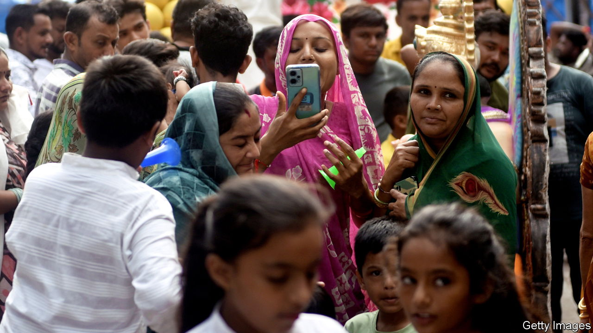

###### As may be prescribed

# India tightens the screws on online dissent 

##### A bouquet of new laws gives the government huge new powers 

 

> Jan 25th 2024 

JUST HALF a decade ago India was still an analogue country. Only a fifth of its people used the internet, mobile phones were mainly used for making calls, and television and cinema halls were where people went to be entertained. But a combination of ambitious policy, private players and pandemic lockdowns has brought huge change. Today one in two Indians is online, mostly via their phones. The audience for streaming video was 481m last year, up a third from 2021. Facebook, WhatsApp, Instagram and YouTube each have more users in India than anywhere else. 

In a belated effort to keep pace with this transformation, lawmakers have produced a flurry of initiatives. Last August India’s parliament passed a data-protection act and in December it nodded through a telecommunications bill, which replaces the Indian Telegraph Act of 1885. A draft of a new broadcasting bill has been released, which when passed will replace a 1995 law regulating cable television. Also in the works is a “Digital India” act intended to regulate platforms and minimise harm to users, which will take the place of the 24-year-old Information and Technology Act. 

The initiatives can be seen as a package intended to overhaul the legal basis on which India’s internet operates. Supporters argue that it is past time India updated its laws to reflect advances in technology. Critics fret that the new laws amount to an all-out assault on free speech in India. The two views are not mutually exclusive.

One way of looking at the laws is to imagine them as layers, says Rahul Matthan, a technology-focused lawyer whose recent book, “The Third Way”, explains India’s approach to data governance. At the base is the telecoms act regulating the hard infrastructure of mobile and internet providers, which supply the pipes through which data flow. For instance, it vastly simplifies rules around the licensing of spectrum. Above that sits data protection, which is intended to safeguard individuals whose data are rushing through the pipes. At the top is the forthcoming Digital India law, which will regulate content of that data and assign responsibility for it. In an age of streaming, the broadcasting bill’s job is to extend regulation that covers traditional media to new ways of delivering content. 

The government is not always as systematic in its thinking. Vagueness and overreach are common features of all the new initiatives. In addition to dealing with the nitty-gritty of infrastructure, the telecoms act allows the government to demand that mobile operators and internet providers intercept or block messages without judicial authorisation. It also requires that the intercepted messages are provided in an “intelligible format”, laying the legal groundwork for demands to undermine the encryption that protects messages in apps such as WhatsApp. The conditions under which these powers can be used are left to future rule-making. The phrase “as may be prescribed” appears 31 times in the 26-page act.

Similarly, “the discretionary rule-making powers” the data-protection act affords the government could “undermine the protections provided in the law”, writes Anirudh Burman of Carnegie India, a think-tank in Delhi. The draft broadcasting bill’s language is also vague, expansive and reliant on future rule-making. According to the Internet Freedom Foundation, an Indian digital-rights group, these flaws render it “open for misuse through subjective and selective application”. 

India has long had a tricky relationship with free speech. Its police regularly arrest people for posts on social media under existing laws. In a large survey last year by CSDS-Lokniti, a pollster, 65% of respondents said they were very or somewhat scared of posting their political or social opinions online for fear of legal action. Website blocking orders have ballooned from 2,799 in 2018 to 6,775 in 2022. “It’s not like there was a time when digital media was completely free,” says Abhinandan Sekhri, a co-founder of NewsLaundry, a media-watching website. “But it has become alarmingly horrible.” ■


