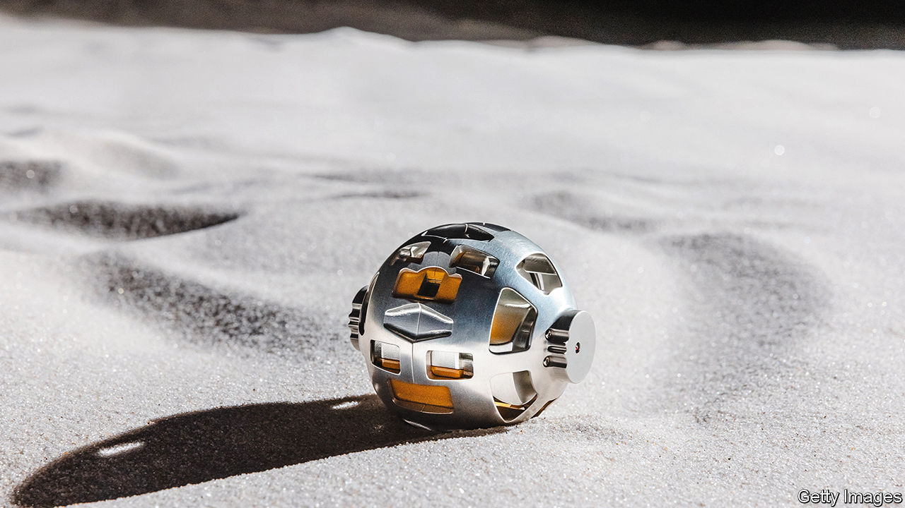

###### Lunar landing

# Japan lands on the Moon 

##### This makes Japan the fifth country to achieve the feat 

 

> Jan 19th 2024 

January 20th was a big day for Japan’s space programme. At 00:20 Japan time, Smart Lander for Investigating Moon (slim), a spacecraft owned by JAXA, the Japanese space agency, made its first Moon landing. Japan is the fifth country—following the  by India’s Chandrayaan-3—to have achieved that feat.

Enthusiasm at JAXA was somewhat tempered. Owing to problems with its solar panels, the spacecraft soon lost its ability to generate electricity. JAXA officials duly announced that they had shut down the space probe’s power after its battery level dropped to 12%. Even so, the landing showed the strength of Japan’s space programme, which has long made scientific contributions through specialisms such as robotics. The lunar landing also underlines the strategic role of Japan, an ally of America, in the new space race. 

SLIM, also known as Moon Sniper, could transform space exploration. Whereas conventional landers touch down within a range of tens of kilometres, SLIM can land within 100 metres of a target. Such advances are in demand, because decades after the Apollo landings, countries are tilting at the Moon again. 

Exploring its south pole is especially important. That region is likely to contain water ice, from which fuel and oxygen could be produced in order to propel further space explorations. To study the Moon’s resources, precision-landing technology will be necessary, says Sakai Shinichiro, SLIM’s project manager at JAXA.

Rivalry between America and China is one reason for the renewed interest in space. Under its Artemis programme, America plans to send astronauts to the lunar south pole by 2026, and eventually build a habitable base there.

JAXA is building part of a lunar-orbiting station for Artemis, known as Gateway, which is intended to be a transit point to the Moon and Mars. China also aims to land astronauts on the Moon by 2030, and to build a lunar base. Bill Nelson, NASA’s chief, has warned that China might try to dominate the Moon’s resources, perhaps turning the lunar south pole into “another South China Sea”.

Given such geopolitical pressures, Japan’s long-standing programme has become more associated with defence. A law adopted in 1969 limited the country to using space only for peaceful purposes. That constraint was eased in 2008 with the passage of the Basic Space Law. In June 2023 the government established its first space-security policy, a ten-year road map for expanding information-gathering for missile defence and securing a safe environment for satellites. 

Japan’s strengths are better suited to non-military ventures, however. Last year the government said it would establish a ¥1trn ($6.8bn) space fund. That is modest compared with spending by America and China. Still, Japan has made decent contributions by “carving out niche strengths”, including unmanned missions, says Tokaji Ayumu, a former JAXA engineer. In 2010 Japan’s  spacecraft became the first to take samples from an asteroid and bring them to Earth. 

The SLIM project draws on JAXA’s previous lunar-orbiting mission, by the spacecraft . It created “the most detailed” topographical model of the Moon to date, according to NASA. SLIM uses machine-learning to analyse high-resolution maps of the Moon’s craters produced by , to identify potential landing-spots. JAXA decided to send SLIM to the Shioli crater on the near side of the Moon, because rocks in the area might contain minerals from the Moon’s mantle. Studying them could help explain the Moon’s origins.

Despite the power-generation problems, SLIM successfully deployed two rovers, which managed to take a picture from the Moon and send it back to Earth. After an initial investigation, JAXA’s engineers have concluded that the spacecraft was not crippled, but has tilted westwards, away from the Sun. That holds open a possibility that the craft could yet start generating power. The engineers say they are now “preparing for recovery”. ■

