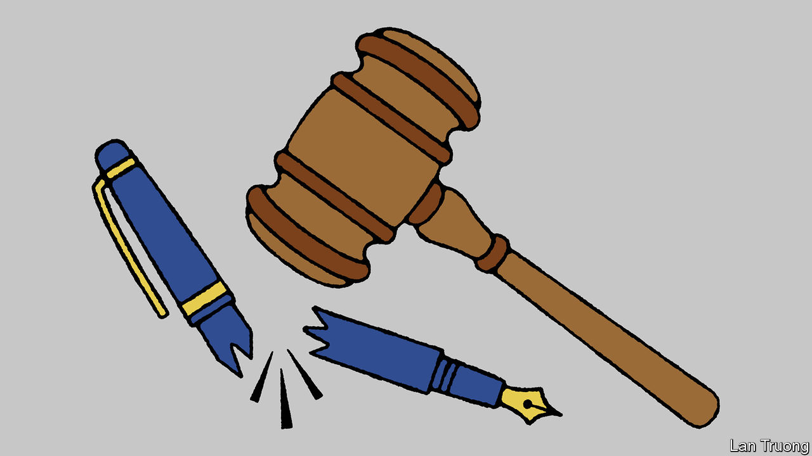

###### Banyan

# South Korea’s ban on praising the North is ridiculous 

##### The government imprisons a dotty fan of Kim Jong Un 

 

> Jan 22nd 2024 

Making someone do porridge (or “eat rice and beans”, to use the Korean expression) for expressing their political views is expected of despotic North Korea. It is not generally associated with its prosperous, democratic southern neighbour. Yet Lee Yoon-seop, a South Korean poet, is currently languishing in prison for just this. The 68-year-old was sentenced to 14 months in November for threatening South Korea’s “existence and security”. His crime? Writing a poem in praise of the North.

The law used to prosecute Mr Lee, the National Security Act (NSA), is designed to protect South Korea from spies and traitors. But it also bans South Koreans from visiting or making contact with the North, reading or watching North Korean media or saying anything good about Kim Jong Un’s tyrannical regime. Though South Korea replaced its former military dictatorship with a democracy in 1987, such restrictions on free speech show that some of the generals’ autocratic tendencies endure.

Every country has counter-espionage laws. And if South Korea’s are rather strict, no wonder. Its capital city is in missile range of a nuclear-armed despot who calls it the “”. The NSA was modelled on a law designed to quash pro-independence activities during Japan’s occupation of Korea from 1910 to 1945. Since 2003 there have on average been more than 60 NSA prosecutions a year, often for pretty clear espionage cases. A businessman and an army officer were arrested for allegedly selling military secrets to North Korea. Soldiers in the South have been prosecuted under the act for endangering morale by distributing pro-North propaganda. 

But the NSA is too often used to prosecute satirists and raid the homes and offices of leftists. Some cases have been ridiculous. Kim Myeong-soo, a PhD student, received six months in prison and a two-year suspended sentence for selling books on North Korea that were widely available in public libraries. A South Korean woman was given a two-year sentence, suspended for four years, for owning recordings of 14 North Korean songs. 

This is not Mr Lee’s first offence. But the claim that the sexagenarian posed a threat to South Korea is absurd. His ode was published on a North Korean website. Access to such sites is banned by the NSA and forbidden from a South Korean IP address. More important, it is hard to imagine Mr Lee’s childish verse persuading anyone of the glories of North Korea’s leader. It consists of a list of South Korean problems that Mr Kim, in the poet’s view, would instantly solve given the chance.

Mr Lee’s real offence appears to have been believing his own nonsense. By contrast, police decided not to investigate a man under the draconian law for selling shirts with a smiling Mr Kim and the slogan “Walk a flowery path, comrade”. That was OK, officials said, because he was selling them to make a buck. 

Worse, the issue points to a broader authoritarian tendency in the South. Its president, Yoon Suk-yeol, often demonises his political opponents by calling them “anti-state forces”, a phrase inspired by the NSA. Unfavourable press coverage is routinely labelled “fake news” and the offices of offending outlets have been raided. The administration and its allies have sued more press outfits for defamation—which in South Korea can be a crime even when the offending words are manifestly true—in Mr Yoon’s first 18 months in office than any of its three predecessors did during their entire five-year terms.

Yet even a more liberal government would be unlikely to remove the NSA’s illiberal clauses. No administration has made a serious attempt to reconsider it in 20 years. There is very little political support for scrapping the law, point out Steven Denney and Christopher Green of Leiden University. The current administration at least flirted with allowing South Koreans access to North Korean media, but it recently abandoned the idea. The opposing Democratic Party is no more liberal; it previously tried to pass a similar law criminalising praise of Japanese colonial rule. 

Mr Yoon talks often about South Korea’s democratic values. They are at the heart of his pitch for the country to be a strategic link between East and West, developed and developing countries. For that reason alone he should take them more seriously. South Korea is undoubtedly a democracy, but not a terribly liberal one so long as it locks up old men for their dotty opinions. Reforming the NSA would be a better rebuttal to the sentiment Mr Lee expressed than banning it. ■


