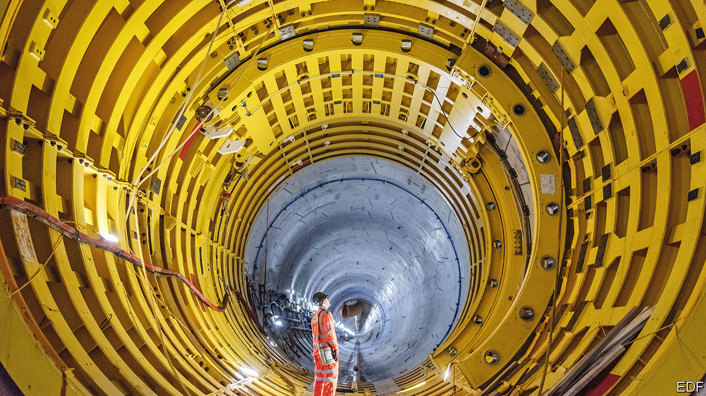
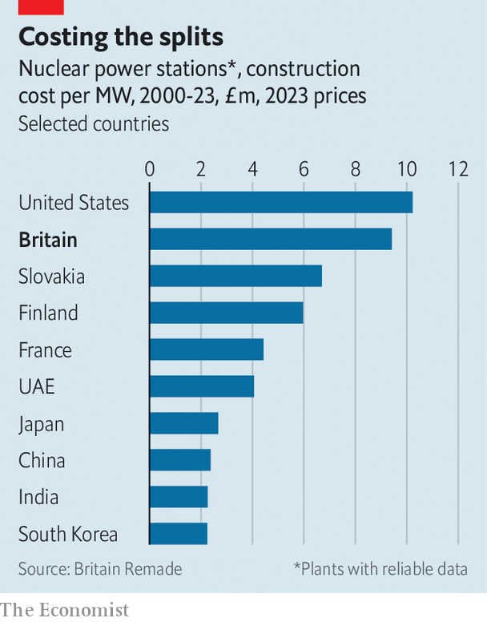
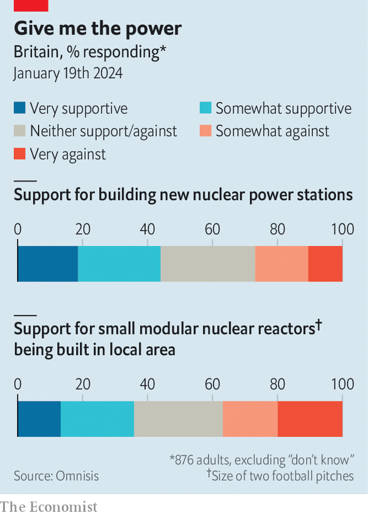

###### Nuclear energy

# Britain wants to make nuclear power plants cheaper to build 

##### Can new technologies and smarter regulation reduce delays and cost overruns? 

 

> Jan 24th 2024 

British politicians like talking about nuclear power. Earlier this month the energy secretary, Claire Coutinho, trumpeted plans for “the biggest expansion of nuclear capacity in 70 years”. Ms Coutinho’s “roadmap” is the latest in a long line of such plans: one in 2022, from the then prime minister, Boris Johnson, for a “nuclear renaissance” with a reactor built each year; one in 2015 from George Osborne, a chancellor keen to woo Chinese investment; and one promoted in 2008 by Gordon Brown, another prime minister, to have eight new reactors running by 2023. 

What seems to be harder is actually getting any plants built. Not one of Mr Brown’s reactors has yet materialised. In 2016 EDF, a French company, and CGN, a Chinese firm, started work on Hinkley Point C, a 3.2-gigawatt (GW)-capacity plant. The planned completion date was 2025 and the budget was £24bn ($30.6bn) in current prices. On January 23rd EDF admitted that the plant may not be ready until 2031, and could cost up to £46bn. 

When it eventually opens it will be the first new plant in Britain in more than three decades and the second-most expensive in the world. Yet Britain needs it. As it moves towards the goal of net-zero greenhouse-gas emissions by 2050, cheap wind and solar will increasingly dominate electricity supply. But some “firm power” will be needed to ensure that demand can be met on still, and cloudy, days. 

The latest strategy grapples with problems that have bedevilled nuclear policy for decades. But questions remain, particularly over finance. Britain’s nuclear capacity peaked almost 30 years ago at around 13GW—enough to supply a quarter of the country’s electricity. It has since fallen by half. The other reactors are ageing fast: five of the six plants in operation were due for retirement by the end of the decade (they may now be forced to keep splitting atoms a little longer). 

Ms Coutinho is the latest to try to reverse this decline. Her aim is to quadruple Britain’s nuclear capacity to 24GW by 2050, with a combination of “giga-scale” reactors like Hinkley Point C and Small Modular Reactors (SMRs), a newer class which can be a sixth of the size of the big reactors, and proponents imagine them being built from components constructed off-site. 

The target is sensible enough. Even with electricity demand set to increase as electric vehicles and heat pumps proliferate, meeting it might get Britain back to producing around a quarter of its power in nuclear plants by 2050. If other technologies turn out to be better at balancing the grid, less nuclear power may be needed. Or nuclear plants may be used to supply heavy industry when it is windy and supply the grid when it isn’t. Much remains uncertain—apart from the need for abundant clean power. Planning for different eventualities is wise.

 


The core challenge is to bring the cost of nuclear power down. That is something policymakers and the industry have focused on less than they have for wind and solar, says Guy Newey of Energy Systems Catapult, a think-tank. Long and risky construction processes mean that the cost of financing nuclear projects starts high—and spirals when things go wrong. Nevertheless British projects are among the costliest in the world (see chart). 

Some countries’ safety rules are less stringent. But the biggest lesson from international experience is how beneficial repetition can be. South Korea has two designs; for each it builds 8-12 reactors in a row, says Sam Dumitriu of Britain Remade, another think-tank, enabling it to apply learning and benefit from economies of scale. France used a similar approach to build its fleet of reactors in the 1970s; its government is planning as many as 14 new ones. The United Arab Emirates is close to completing four plants that will supply a quarter of its electricity.

Britain has failed to do this. A 20-year hiatus before Hinkley Point C meant that workforce skills and supply chains had to be rebuilt. A second new-generation plant, Sizewell C in Suffolk, was planned as a replica of the first. Yet it has been hit by delays even before construction has begun. Eight years after approving the investment at Hinkley, the government has still not reached a decision on a second site. That has left firms in the supply chain sitting on their hands, says an industry insider.

Central to Britain’s woes has been what Greg Clark, a former business secretary, calls its “intermittent nuclear policy”. Some energy ministers have been enthusiastic; others indifferent. Politicians have also been loth to deal with the costs, whether they show up on the government’s balance-sheet or in electricity bills. Mr Newey says the state’s role should be to intervene to help bring overall construction costs down, and then step away. 

Ms Coutinho’s plan offered some grounds for optimism that costs can be reduced. It proposed a range of ways to finance future projects, including one in which costs are partly recouped during construction from electricity bills, lowering financing costs. Options for a third big plant will be explored. SMRs will continue to be developed. All of that has cross-party support: indeed Labour claims it would go faster. That gives the industry some hope for the next parliament. 

 


The roadmap also promises to reduce overly burdensome regulation. The French reactor design for Hinkley Point C had been used in Finland and China. To get approval in Britain EDF still had to make more than 7,000 design changes. Making better use of assessments carried out by trusted regulators in America and the EU could free up Britain’s regulator to spend more time on approving novel SMR designs. 

A third constraint is how slow it is to get approval for new sites, or for work on existing sites. In some cases, like Sizewell C, there is also well-organised local opposition. Big reactors have to be near the sea, but the government may reform planning to allow SMRs to be sited more flexibly. Polling for  suggests local communities may not be as opposed to hosting a reactor as some might think (see chart). 

So, once again, talk of a British nuclear renaissance does not seem entirely fanciful. But the industry has been through too many false starts to give way to unguarded optimism this time. ■


