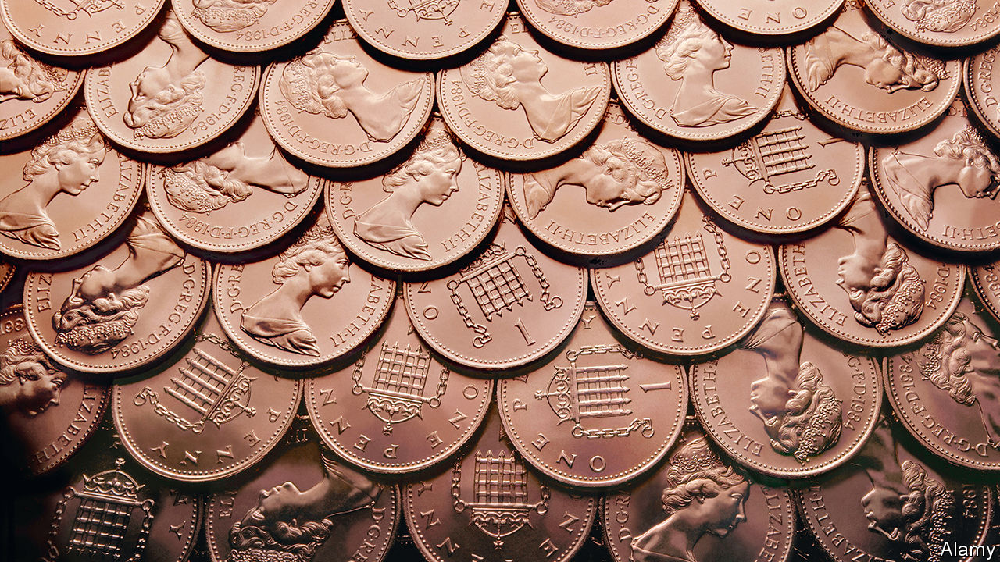

###### Penny slain

# Britain’s least valuable coin is in terminal decline 

##### Inflation is the prime culprit for the problems of the penny 

 

> Jan 21st 2024 

For many centuries using Britain’s currency demanded advanced arithmetic skills. The pound was divided into 20 shillings; a shilling into 12 pennies; and each penny further subdivided into two halfpennies or four farthings. Many argued for a less complex system. As early as 1696 Christopher Wren was arguing that a decimal system would be “very proper for accounts”. 

Wren eventually got his wish. In 1961 the government dropped the farthing, the spending power of which had fallen by so much that bus conductors were refusing to accept it. A decade later, in 1971, decimalisation divided the pound into 100 new pennies, and shillings and halfpennies both stopped being minted.

Another five decades on, some of the decisions made then are looking rather dated. The price level has risen by more than 12 times since decimalisation was carried out. The humble penny is much humbler as a result. When the new penny was first introduced, its spending power was close to that of a modern ten-pence piece; now it is closer in value to the old farthing at the time of that coin’s withdrawal.

This loss in value has been a slow process, but recent changes have brought the penny much closer to its demise. The pandemic accelerated a long-running trend of falling cash usage. Physical money was used in just 14% of all transactions in 2022, down from 54% a decade before. Contactless cards and mobile phones have replaced notes and coins in many exchanges.

The recent sharp  has been more significant still. The 21% rise in prices since January 2021 has forced a general reappraisal of pricing strategies by consumer firms. “Charm pricing” long sought to persuade consumers of an item’s cheapness by pricing it just below a whole number; a 1997 study found that 60% of all advertised prices back then ended in the digit “9”. 

Such strategies are far less common now. Supermarkets have generally switched to prices ending in zeros and fives. Pret, a ubiquitous coffee chain, had kept the price of a cup of filter coffee at 99p for more than a decade; in 2021 it moved to £1.25, and a year later it bumped it up again, to £1.40. Even when cash is used in a transaction, pennies are rarely that useful.

Nor is seigniorage, the profit that governments can make from the difference between the face value of money and the cost of its production, any reason to keep them. The National Audit Office, a public-sector watchdog, noted in 2020 that the Royal Mint had been losing money on coin-making for several years. 

Slowly but surely, then, the penny is going the way of the farthing. Just 30m pennies were minted in 2022 (the last year for which full data are available) compared with more than 200m a decade before, and with more than half a billion annually in the 2000s. The same forces are also at work to reduce the value of the two-pence coin. When the penny does finally disappear, it may have a companion. ■


