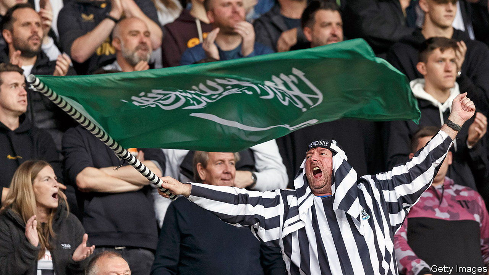

###### Howay the Sauds

# Football attracts Saudi investment to England’s north-east 

##### It can do for Newcastle what the UAE did for Manchester—for good and ill 

 

> Jan 22nd 2024 

THESE DAYS Saudi Arabian flags often fly among football fans in Newcastle, a city in the north-east of England. That has been happening since October 2021, when the kingdom’s Public Investment Fund (PIF), a sovereign wealth fund, , the beloved but perennially underperforming local football team. Celebrating fans rushed to St James’ Park, the club’s stadium, waving flags and wearing tea-towels on their heads as improvised keffiyehs.

Two years later hopes are rising that the PIF’s investment is but the first drop of a torrent of Saudi cash into the region. The model is the takeover of Manchester City by Sheikh Mansour of Abu Dhabi in 2008, which was followed by billions of pounds of Emirati investment into the city.

The acquistion of Newcastle’s football club . First mooted in 2020, the notion of Saudi ownership drew accusations of “sportswashing” from Amnesty International, a human-rights champion. It was also opposed by the other 19 clubs in English football’s top division, and was approved only after implausible assurances were given that the Saudi state does not control PIF.

Yasir Al-Rumayyan, the PIF’s governor, who is chairman of Newcastle United and also of Saudi Aramco, the state-owned oil company, insists that the transaction makes sense on purely commercial terms. The fund paid onIy £305m ($417m) for its stake. It notes that Chelsea, a club in London, was sold in 2022 for $5.4bn. Such a valuation would require success on the pitch, but in modern football that is closely linked to a club’s wage bill, even if so-called “financial fair play” rules limit how quickly spending can be ramped up. Clubs that have fallen foul of such rules can face big fines and points deductions.

A successful football club is good for a city. An academic at Newcastle University says it is already seeing more interest from foreign students. The Centre for Economic and Business Research, a think-tank, reckons that a league-winning team adds 1.1 percentage points to the growth of local economic output that year through increased hospitality spending.

After Newcastle’s 2-0 win over Arsenal in May 2022, one of the club’s directors posted a social-media video of celebrations in the directors’ box, complete with the Saudi ambassador to Britain waving a Newcastle flag. “Very soon”, he wrote in the comments, “we will turn to the city and the area together and make them all better.” 

Economic links between Britain and Saudi Arabia have been expanding in recent years, with total trade rising by 32.8% in the year to June 2023. The PIF acquired a 25% stake in London’s Heathrow airport in November. In the north-east of England, Saudi firms other than the PIF are already active. SABIC, a chemicals manufacturer, invested £1bn in a new plant in Teesside in 2021. A nearby green recycling facility received another £1bn of Saudi investment in 2022. In recent months Saudi investors have been asking about both hotels and high-profile retail locations.

In May last year the Saudi-North-East England Trade and Investment Dialogue, the only body that promotes Saudi investment in a specific British region, was set up to facilitate further investment. DWF, a law firm with offices in the north of England and the Middle East, predicts that Saudi investment in the region will soar in 2024. Returns on property in the north, they note, have been much healthier for international investors in recent years than those available in London. Annual investment yields of up to 8% are still available, compared with 2-2.5% in the capital. Saudi investors are already converting a disused office in central Newcastle into 241 high-end build-to-rent apartments.

Newcastle City Council’s £1.5bn regeneration scheme for the city hopes to attract additional private-sector funds worth £5bn. “A lot of that will no doubt come from Riyadh,” notes one official. Investment is welcome; but some fear that Manchester offers a cautionary tale. In 2014 Manchester City Council formed Manchester Life, a joint venture with Manchester City Football Club’s owners, to build new housing. Manchester Life has completed 1,500 rental units. But none is classified as “affordable”, despite the council’s guidance that 20% of all new developments should be accessible to lower-income households. A report in 2022 for the Urban Institute, a think-tank, by academics at the University of Sheffield, argued that the distribution of returns from the scheme was skewed: the city council bore much of the risk but received very little. 

Some fans may flourish Saudi flags, but others have qualms about the PIF’s investment in Newcastle United. Qualifying for the Champions League, a European elite competition, for the first time in two decades was a delight. But many worry that the on-pitch success brings moral compromises. Similarly, local politicians are of course keen to see much-needed investment in the city. But privately they worry about where the money comes from. ■


