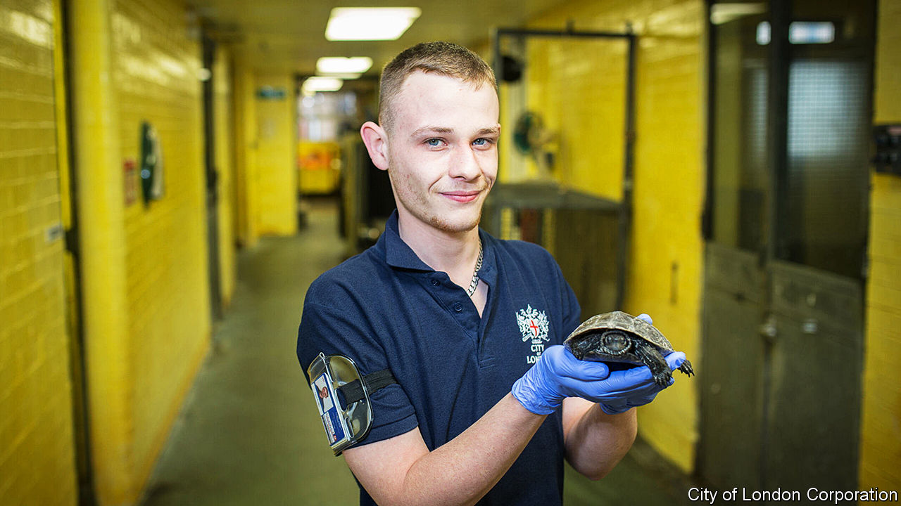

###### Snakes (and tortoises, rhinos and gibbons) on a plane

# How to transport a rhino 

##### Heathrow Airport deals with millions of humans a year—but billions of animals 

 

> Jan 25th 2024 

Transporting tortoises is tricky. You need the right crate (they like space to stretch their necks), with the right ventilation (ample), and the right base (emphatically non-slip). However, as the International Air Transport Association’s animal handbook makes clear, transporting tortoises is far easier than transporting camels (they bite), zebras (they panic) or rhinos (it’s essential to bolt the box). But above all, as the guide explains, the most important thing is that “This Way Up” labels are affixed to each and every crate. Because no one wants an inverted tortoise, let alone an upside-down elephant. 

Heathrow is one of the world’s busiest airports: in a normal year, around 80m people go through it. That is piffling, however, compared with how many animals do. In 2023, 6.5bn animals passed through, including 30m-odd butterfly pupae, 20m fish, 143,000 reptiles and amphibians, two mongooses, one panda and a gibbon. Just as with the human passengers, such animals must have their papers checked (horse passports are very particular) and, where appropriate, be inspected for contraband (mules can be drugs mules too). This is done by X-ray if the animals fit through; or visual inspection if not. As one Heathrow official explains, “You don’t pat down a lion.”

On a quiet Wednesday in January, the Heathrow Animal Reception Centre is calm. Inside the office of its director there is an alligator skull, a stuffed owl, a live python and a purposeful atmosphere. The centre is there not just to make it easier for animals to travel (dogs can stretch their legs) but harder for diseases: it was built in the mid-1970s, mainly to ensure that rabies didn’t enter the country by air. The centre also helps deal with animal smuggling: if illegally transported animals are found and seized, they can, if needed, be kept here. Today, the centre is holding some fleshy tarantulas. Until recently, a crocodile had lived at Heathrow for two years. Though they tend not to talk about it: Heathrow is a bit cagey about its crocodile. 

Most animals move through more snappily. Today, 500 tiny tortoises from Tashkent have arrived (they have already been slid, like boxes of scaly pebbles, through the X-ray machine). The centre offers hints that other arrivals can be more demanding: on one wall signs read “APES-DOGS-LARGE CATS”; in another room, there are cages. 

Heathrow often has little warning of what will arrive, so cupboards are kept well-stocked. In one fridge, containers bear such labels as “Macaw Nuts”, “Leaf Eater Primate Pellet” and “Parrot Mix” (for, rather than of). In a nearby freezer, rats and mice lie in zippered bags, tails curled under, feet frozen (the categories of “customer” and “dinner” can occasionally overlap uncomfortably). Keeping these supplies ready is, however, necessary since, if an alligator arrives unexpectedly, “you can’t nip to Tescos and buy your frozen rats.” ■


