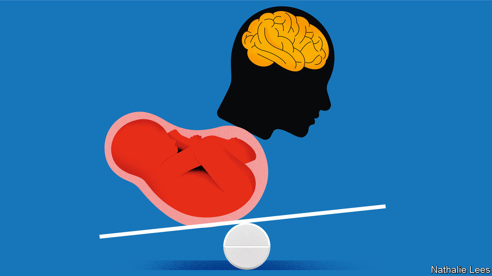

###### Hard choices

# The ethical quagmire of a fetus-harming epilepsy drug 

##### Britain is restricting the use of valproate. Charities are alarmed 

 

> Jan 23rd 2024 

When hannah mulcahy was 14 she had what she calls “the big, bad one”: the kind of seizure everyone imagines when they think of epilepsy. But her doctors hesitated to give her sodium valproate, a highly effective drug, because it could harm the fetus should she become pregnant. Ms Mulcahy instead spent years on drugs that did not prevent her seizures; her mental health and schooling suffered. “It felt like my unborn, imagined child was more important than I was,” she says, now 20 and, thanks to valproate, seizure-free.

Long used to treat epilepsy and bipolar disorder, valproate is at the centre of a scandal “bigger than thalidomide”, says Henrietta Hughes, England’s first “patient-safety commissioner”. For decades pregnant women have been prescribed valproate without being properly warned that 11% of babies exposed to the drug in the womb are born with physical defects, such as spina bifida, and that 30-40% later show symptoms of ADHD, autism, low IQ or other disabilities. Many will never live independent lives. Around 20,000 British children are thought to have been affected. But epilepsy charities worry that the Medicines and Healthcare products Regulatory Agency (MHRA) has overreacted to this. Under a new policy that enters force on January 31st, valproate will be off-limits to new patients under 55, unless two specialists agree that only it will work. Later this year, those already with a prescription will need a second opinion to retain it.

The latest data suggest that in Britain about 35 women using valproate get pregnant each year, despite a ruling from the MHRA in 2018, in line with international practice, that women and girls should not take valproate unless they were on birth control and it could be shown that other drugs did not work. Since that ruling, the number of women and girls on valproate has fallen from around 27,400 to 19,800. 

Unusually, the new rules will also apply to men and boys, 83,000 of whom take valproate. Studies on whether a father’s valproate use can harm his children have been inconclusive. But it is well known that the drug can harm male fertility, and there is growing evidence that, in animals, “autism-like” symptoms can pass to children through males exposed to the drug. 

The animal data are “very worrying”, says Tony Marson, a neurologist at the University of Liverpool who advised the MHRA on implementing the policy. But his work shows that valproate is the most effective medicine for people with generalised epilepsy, who make up a third of the 633,000 people with epilepsy in Britain. For some, it is the only thing that works. 

Epilepsy charities are alarmed. They fear that both new and old patients will, like Ms Mulcahy, be prescribed less effective medicines, harming their ability to finish school, pursue a career and lead normal lives. In extreme cases, this could be deadly. Sudden maternal deaths from epilepsy in pregnancy have nearly doubled in Britain since before the restrictions, from eight in 2013-15 to 14 in 2019-21.


This confronts regulators with what Dr Marson calls a difficult equation: how many epilepsy deaths, however rare, are equivalent to how many abnormal babies? Others, like Rachel Arkell, a legal scholar at the University of Kent, argue that not allowing people to weigh up the risks themselves veers into medical paternalism. 

 The question is whether the people who need valproate—often the ones with the most dangerous seizures—will get timely treatment. Their doctors may be caught between following the MHRA’s rules and respecting people’s well-informed choices. 

It is not just valproate. The MHRA is reviewing topiramate, another anti-seizure medicine, for its effects on fetuses. Several other drugs also carry heightened risks. Doctors will have difficult calls to make. Lawyers are paying close attention.■


