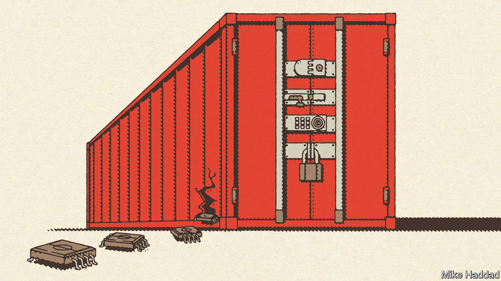
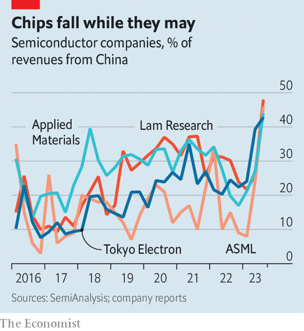

###### Picking losers

# Why America’s controls on sales of AI tech to China are so leaky 

##### For increasingly hawkish lawmakers, that’s a problem 

 

> Jan 21st 2024 

GINA RAIMONDO seemed frustrated when she took the stage at the Reagan National Defence Forum in California in December. The Department of Commerce, which she leads, had just  on the sale of American semiconductors to China. But Nvidia, the world’s , had immediately started developing a new, slightly less powerful  (AI) chip for the Chinese market, to which the restrictions would not apply. “If you redesign a chip…that enables [China] to do AI, I’m going to control it the very next day,” Ms Raimondo warned. 

That was bombastic, given that it had taken her department a full year to rework the restrictions to cut off Nvidia’s previous workaround. Nevertheless, America’s five-year campaign against Chinese technology is intensifying. Earlier this month it was reported that Jensen Huang, Nvidia’s chief executive, and two fellow chip bosses had been summoned to testify in Congress about their Chinese business. On January 19th ABB, a Swiss industrial group, revealed that American lawmakers were investigating its links with China. ABB said it was co-operating with the investigation; Nvidia has said that it is working closely with the government to ensure compliance with the export controls. 

Neither Democrats nor Republicans are likely to relent. In a presidential-election year Joe Biden, the unpopular Democratic president, cannot afford to look weak on China. His Republican predecessor and main rival, Donald Trump, has long been America’s China-basher-in-chief. China hawks in Washington want to stymie Chinese efforts both to get around the rules and to recreate the necessary technological capabilities at home. Yet the mixed record of export controls so far shows why harsher measures will be difficult to design—and not necessarily more successful. 

China has found ways to work around the existing controls. To Ms Raimondo’s chagrin, for instance, it is possible to train AI models using semiconductors that are not necessarily at the cutting edge, so long as you have enough of them. If the sale of any chip which can “do AI” is to be banned, as she implies, America must restrict the flow of a much broader array of microprocessors to China.

The China shock

It is hard to know just how much broader. Trade statistics do not break out the graphics processing units (GPUs) used to train and run AI models from the larger flow of integrated circuits. But a sense of the scale of such a ban can be gleaned by examining the financial statements of Nvidia, which sells a range of GPUs. It has earned between 21% and 26% of its revenues from China over the past few years. In the nine months to October the company took in $8.4bn from the Chinese market. Almost all of Nvidia’s products can be used to “do AI”. Mr Huang has said that his company has no “contingency” for being cut off from China. This month he paid his first visit to the country in four years.

Another difficulty for America stems from enforcement. The Department of Commerce is empowered to punish any transgressions it discovers. Last year it fined Seagate, a hard-drive manufacturer, $300m for allegedly breaching export controls by sending components to Huawei, a blacklisted Chinese tech champion. But it is the chip firms themselves that are largely responsible for enforcement. That includes ensuring that their customers are not, in fact, a front for Chinese entities with which trade is prohibited. Good luck with that. “You have coin-sized devices and technologies that are widely commercially available, and indistinguishable from the controlled technologies, distributed around the planet,” says Kevin Wolf, an American lawyer and former official. 

The result is a situation ripe for smuggling, which experts say is impossible to quantify but doubtless rife. It also encourages transshipment. Firms in countries that have not signed on to the American export-control regime, like Singapore, can buy chips and send them on to Chinese entities without the knowledge of the American firms or the Department of Commerce. Nvidia’s most recent quarterly earnings from 2023 show that its sales to Singapore grew by a factor of five over the same period in 2022, faster than anywhere else. 

Of all customers in China, the one best placed to use such workarounds to get the chips it needs is the . If one of America’s main aims is to deny China access to advanced technology for developing military AI, it is probably failing. Instead the controls are raising the costs to Chinese buyers of acquiring American AI chips. That in turn is aligning China’s tech sector with its government’s policy of indigenous technological development. Chinese tech giants used to prefer buying higher-quality American technology to investing in research and development. Their incentives have changed. 

The clearest evidence that this is happening comes from Huawei. The company, whose core business is making telecoms gear, was first targeted by America in 2019 for allegedly breaching sanctions on Iran. A measure called the “foreign direct product rule” (FDPR) cut Huawei off from any chips that had been produced using American technology (which is to say virtually all sophisticated ones). In 2022 the FDPR was deployed against the entire Chinese AI industry, and broadened in October to encompass a wider range of AI chips and chipmaking tools, and to require licences to ship products to countries such as the United Arab Emirates (albeit not Singapore) that are thought to serve as middlemen for Chinese buyers.

Before it was blacklisted, Huawei had its microprocessors manufactured by TSMC, a giant Taiwanese contract chipmaker. It spent $5.4bn on TSMC-made chips in 2020, before America’s export controls were extended to the Taiwanese firm. Now it is doing more business with SMIC, China’s biggest chip manufacturer. SMIC’s capabilities were thought to be many years behind those of TSMC. But last year it came to light that the company was making a Huawei-designed AI chip, the Ascend (and a smartphone chip, the Kirin, which raised many Western eyebrows after Huawei unexpectedly launched a handset containing it in September).

With their access to foreign semiconductors curtailed, Chinese AI companies are now turning to Huawei and SMIC for chips. China’s government is encouraging them, and continuing to shower the industry with subsidies in the hope of creating an industry to rival Nvidia and other American companies. Export controls have, in effect, forced China to embrace import substitution.

The designers of America’s controls foresaw some of this. That is why, from the start, they also targeted China’s ability to recreate advanced technology at home. The controls restrict trade not just in chips themselves but also in tools used to make them. That has involved bringing on board allies such as the Netherlands and Japan, home to many of the toolmakers. As with chips, the tool controls place limits on the sophistication of the equipment that can be sold to Chinese buyers. And as with chips, just how sophisticated a tool has to be to fall under the controls has been the subject of intense debate. 

Heavy investment in light

The critical machines are those used to etch transistors onto silicon wafers. The most cutting-edge equipment of this sort is manufactured and sold exclusively by , and has been blocked from China for years. But older generations of such lithography tools can still be sold to Chinese buyers. ASML’s sales to China have grown dramatically over the past year, as have those of companies that produce other chipmaking tools. In the most recent quarter Chinese sales made up almost half of ASML’s total revenue. Other toolmakers also sell lots of their wares to China (see chart).

 


But, as with chips, export controls are giving Chinese toolmakers a strong incentive to invest in catching up technologically with foreign rivals. Already domestic toolmakers’ sales are growing apace. On January 15th one of them, NAURA, which manufactures other etching tools, said it expected its revenue to have risen by almost 50% in 2023. 

America’s campaign against Chinese technology may, then, be both ineffective and counterproductive. Ineffective, because China is proving itself adept at exploiting loopholes. And counterproductive, because it is leading to the creation of a more sophisticated Chinese industry. It may also be predicated on a wrong assumption: that the future economic and military balance of power depends on AI, and that AI depends on computing power. “Both of these are guesses,” points out Chris Miller, a historian of technology at Tufts University in Boston. It is far from clear that AI will have strategic importance. And even if it does, computing power may not be the overriding factor in its development. As Mr Miller points out, oomph is expensive, so AI developers will try to use it as sparingly as possible. 

Despite all this, America seems likely to toughen up its export controls on ai chips, as Ms Raimondo all but promised in December. And Republican lawmakers are eyeing more expansive controls still. Some of them see a new threat coming from the other end of the sophistication spectrum, which is less about China’s techno-military might and more about its economic power. Chips are required in growing volumes as components in everything from electric vehicles and heat pumps to electricity grids. By 2027 China could be making almost 40% of such semiconductors, reckons TrendForce, a research firm. The current export controls do nothing to curb China’s dominance of this business, which uses a lot of older American technology. 

Three congressional Republicans, Mike Gallagher, Elise Stefanik and Michael McCaul, are thus working on a bill which will force the commerce department to cut China off from all American chip technology, not just the most advanced stuff. Gaining support from allies for such an extreme policy will be hard. Japanese and Dutch businesses—and their governments—rankle even at the porous controls that are in place today. But if Mr Trump, an alliance sceptic, returns to power, the lack of support is unlikely to matter one bit. ■


