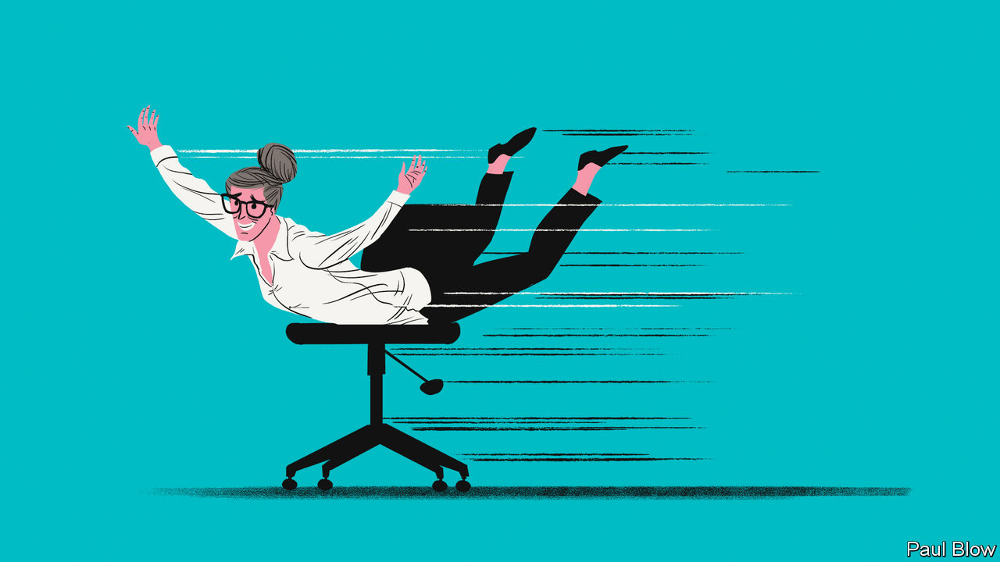

###### Bartleby

# Why you should never retire 

##### Pleasure cruises, golf and tracing the family tree are not that fulfilling 

 

> Jan 25th 2024 

In an episode of “The Sopranos”, a popular television series which started airing in the 1990s, a gangster tells Tony, from the titular family, that he wants to retire. “What are you, a hockey player?” Tony snaps back. Non-fictional non-criminals who are considering an end to their working lives need not worry about broken fingers or other bodily harm. But they must still contend with other potentially painful losses: of income, purpose or, most poignantly, relevance. 

Some simply won’t quit. Giorgio Armani refuses to relinquish his role as chief executive of his fashion house at the age of 89. Being Italy’s second-richest man has not dampened his work ethic. Charlie Munger, Warren Buffett’s sidekick at Berkshire Hathaway, worked for the investment powerhouse until he died late last year at the age of 99. Mr Buffett himself is going strong at 93.

People like Messrs Armani, Buffett or Munger are exceptional. But in remaining professionally active into what would historically be considered dotage, they are not unique. One poll this year found that almost one in three Americans say they may never retire. The majority of the nevers said they could not afford to give up a full-time job, especially when inflation was eating into an already measly Social Security cheque. But suppose you are one of the lucky ones who can choose to step aside. Should you do it? 

The arc of corporate life used to be predictable. You made your way up the career ladder, acquiring more prestige and bigger salaries at every step. Then, in your early 60s, there was a Friday-afternoon retirement party, maybe a gold watch, and that was that. The next day the world of meetings, objectives, tasks and other busyness faded. If you were moderately restless, you could play bridge or help out with the grandchildren. If you weren’t, there were crossword puzzles, TV and a blanket. 

Although intellectual stimulation tends to keep depression and cognitive impairment at bay, many professionals in the technology sector retire at the earliest recommended date to make space for the younger generation, conceding it would be unrealistic to maintain their edge in the field. Still, to step down means to leave centre stage—leisure gives you all the time in the world but tends to marginalise you as you are no longer in the game. 

Things have changed. Lifespans are getting longer. It is true that although the post-retirement, twilight years are stretching, they do not have to lead to boredom or to a life devoid of meaning. Once you retire after 32 years as a lawyer at the World Bank, you can begin to split your time between photography and scrounging flea markets for a collection of Americana. You don’t have to miss your job or suffer from a lack of purpose. If you are no longer head of the hospital, you can join Médecins Sans Frontières for occasional stints, teach or help out at your local clinic. Self-worth and personal growth can derive from many places, including non-profit work or mentoring others on how to set up a business. 

But can anything truly replace the framework and buzz of being part of the action? You can have a packed diary devoid of deadlines, meetings and spreadsheets and flourish as a consumer of theatre matinees, art exhibitions and badminton lessons. Hobbies are all well and good for many. But for the extremely driven, they can feel pointless and even slightly embarrassing. 

That is because there is depth in being useful. And excitement, even in significantly lower doses than are typical earlier in a career, can act as an anti-ageing serum. Whenever Mr Armani is told to retire and enjoy the fruits of his labour, he replies “absolutely not”. Instead he is clearly energised by being involved in the running of the business day to day, signing off on every design, document and figure.

In “Seinfeld”, another television show of the 1990s, Jerry goes to visit his parents, middle-class Americans who moved to Florida when they retired, having dinner in the afternoon. “I’m not force-feeding myself a steak at 4.30 just to save a couple of bucks!” Jerry protests. When this guest Bartleby entered the job market, she assumed that when the day came she too would be a pensioner in a pastel-coloured shirt opting for the “early-bird special”. A quarter of a century on, your 48-year-old columnist hopes to be writing for  decades from now, even if she trundles to her interviews supported by a Zimmer frame; Mr Seinfeld is still going strong at 69, after all. But ask her again in 21 years.■


