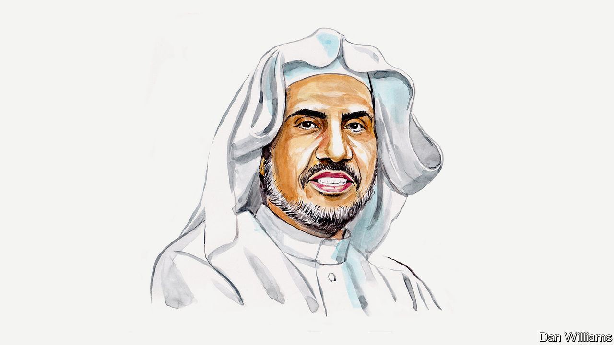

###### Jews and Muslims

# A Muslim faith leader calls for stronger moral leadership in the Middle East 

##### Remember the lessons of Auschwitz, says Muhammad al-Issa 

 

> Jan 25th 2024 

ISRAEL’S MILITARY action in Gaza and the West Bank is tearing apart the fabric of our collective humanity. The prospect of peace in the Middle East is being killed with the thousands of children buried under the rubble in Gaza. I have dedicated my life to healing divides between Muslims and Jews. This work is unravelling before my eyes.

Israel’s assault on Gaza is redefining Muslim-Jewish relations for the worse across the globe. New fault lines are emerging inside schools and universities, in politics and the media, and across countless other communities. I worry these will lead to a spiral of extremism. The repercussions could be devastating. We must do everything to prevent them.

The attacks on October 7th were deplorable—Islam, after all, is against all taking of innocent life—and contributed to a steep loss of trust globally between Jews and Muslims. Israel’s disproportionate response has only made the situation much worse.

Even as the UN recently passed a resolution on delivering aid to Gaza and with an increasing number of states calling for a ceasefire, Israel remains committed to a path of destruction. Its foreign minister has said the war will continue “with or without international support”. Israel’s president wants to “take over the entire Gaza Strip and change the course of history”. Extremists are no longer on the fringes; they are in government, creating facts on the ground.

But the actions of extremists—on all sides—have contributed not only to unspeakable physical destruction and loss of life; they are also extinguishing the sparks of trust that took years to kindle between Jews and Muslims both in the region and the wider world. This loss of trust is exemplified by ambassador recalls, trade suspensions and raising claims of genocide in the International Court of Justice.

The violence is also stoking extremism across the West, with Islamist and far-right groups emboldened and pointing fingers at ordinary Muslims and Jews. Meanwhile, world leaders and international institutions have failed to moderate the conflict. The paralysis of the UN Security Council has only emboldened Israel.

Interfaith dialogue efforts between Muslim and Jewish leaders, so fashionable in times of stability, are today, in a time of crisis, facing their truest test of efficacy. Traditional approaches to interfaith engagement often fail precisely because they lack social and political context. But such efforts and such context are needed now more than ever. 

In my role as head of the largest Islamic organisation based in Mecca, I led the first delegation of Muslim religious leaders to Auschwitz in 2020. There I stood alongside Jewish leaders against antisemitism and Holocaust denialism. This symbolic gesture was an attempt to transcend the inadequacies of traditional politics.

We need moral leadership from religious figures on all sides: a determination to condemn not just the violence against “our own”, but also by those who claim to act on our behalf. After all, there is no path to peace which fails to resolutely address the religious extremism that is pulling both sides apart. Unity among religious moderates is the only antidote to political tribalism and violent polarisation. 

This won’t be easy. But it has been done before. In Northern Ireland, the Good Friday Agreement was supported by both Catholic and Protestant leaders. Interfaith efforts were instrumental in bringing about reconciliation in Bosnia and Serbia. Martin Luther King’s and Desmond Tutu’s interventions helped transform stubborn American policy on Apartheid South Africa.

This “diplomacy of the heart” can now move Muslim and Jewish communities closer together. But to achieve this, leaders of both faiths must lead from the front. We must invite each other to attend and speak at religious events. We must hold joint rallies for peace. We must call on political leaders to embrace moderation. 

We must also reject the overt politicisation of Muslims worldwide as being unsympathetic to Jewish suffering and opposed to peace. At the same time, we must oppose any presumption that all Jews support Israeli policies in Gaza or the West Bank. 

Our task now, as faith leaders who reach billions, is to spread messages of peace from every synagogue, mosque and church around the world, messages which explicitly seek to acknowledge the “other”. That is why the Muslim World League is calling for both the immediate release of Israeli hostages and Palestinian prisoners, an end to the targeting of civilians in Gaza, and a ceasefire of hostilities that should pave the way for a “ceasefire on hate”. 

It was in this spirit that I addressed the rise of Islamophobia and antisemitism across America in New York this month. I invite other faith leaders to use the platforms entrusted to them to do the same. 

The crisis in Gaza is not just a regional conflict; it is a battle for the hearts and minds of future generations, who will be lost to cynicism and hatred without decisive moral leadership today. So, the time for all of us to stay true to our moral convictions has come. I invite Jewish leaders to stand with me and demand an end to this tragedy now.

History has proven that the fates of Jews and Muslims are tied together, as was the case when Caliph Umar removed the long-standing Roman-era ban on Jews from entering Jerusalem in the seventh century.

When I visited Auschwitz, the phrase that struck me was “never again”. It is a phrase that is as relevant today as ever. As I walked through the former concentration camp, I pondered the tragedy of how the world’s faith leadership had failed to confront such mass violence, and how easily history seems to repeat itself.

Let us—Muslims, Jews and the world at large—remember the lessons of Auschwitz.■


