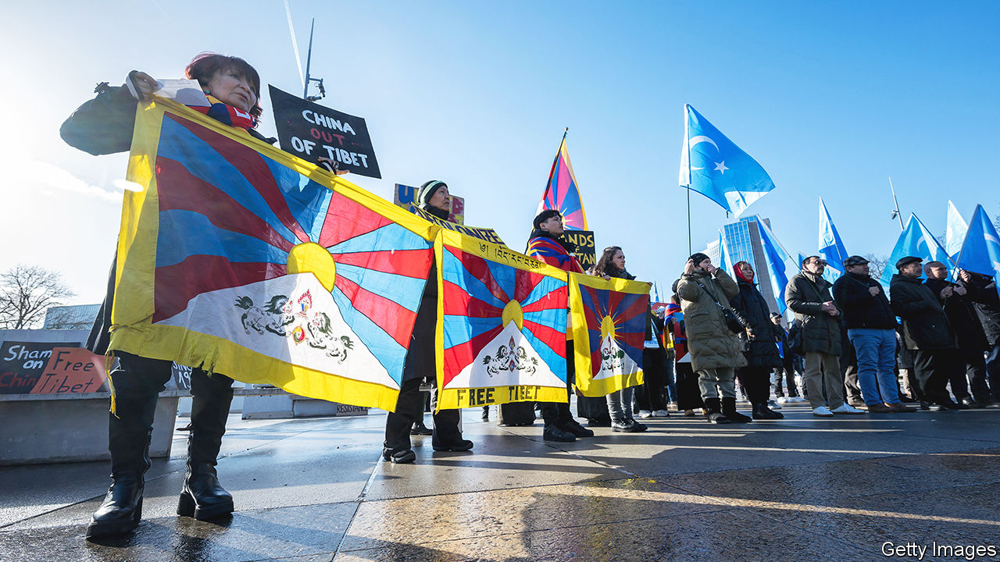

###### Easy questions only

# At a UN review, China basks in the flattery of friendly countries 

##### While dismissing criticism as lies 

 

> Jan 25th 2024 

Once every five years or so, each UN member state has to have its human-rights record examined under a so-called Universal Procedural Review (UPR) overseen by the body’s Human Rights Council. Every country in the UN may pose questions and recommendations to the state under review. This week China had its turn. The event merely illustrated its success in creating a split between most countries in the global south, which tended to flatter China with friendly questions, and Western democracies, which castigated it.

Rights campaigners had hoped the UPR would offer scrutiny of China’s many abuses since its last review in 2018. It would be the first discussion of China’s human rights within the UN since the body published a report in 2022 alleging possible crimes against humanity in the region of Xinjiang, home to the Uyghurs and other ethnic minorities. China has since blocked attempts to discuss the report.

This latest review was largely farcical. More than 160 countries had asked to make speeches; thus each got just 45 seconds. China had reportedly lobbied non-Western countries beforehand to fill up the time with praise and talking points. Most of them lauded China for alleviating poverty. Most effusive were those in heavy debt or in tight geopolitical alignment, such as Iran, Laos and Russia. Few Muslim countries mentioned China’s brutal treatment of the mostly Muslim Uyghurs. Many countries echoed Chinese terms such as “people-oriented philosophy of human rights” and “whole-process democracy”. These are jargon for the idea that security, stability and rising living standards should take priority over individual freedoms.

Western countries and some democracies elsewhere spoke up against China’s abuses, with an emphasis on Hong Kong, Tibet and Xinjiang. At least 50 states made recommendations such as ending arbitrary detention and forced disappearances. Six states said China should stop “residential surveillance at a designated location”, a form of extralegal pre-trial detention used by China’s ministry of state security. Twenty states touched on Tibet, more than double the number who raised it in 2018. Several called for China to abolish a boarding-school system that separates Tibetan children from their families to assimilate them into majority-Han Chinese culture.

Some developing countries also made criticisms, albeit couched in soft language. Thirteen states, including several Latin American democracies, urged China to allow unfettered visits by UN experts. This shows that some countries in the global south do want China to stop flouting UN rules, says Raphael Viana David of the International Service for Human Rights, a campaigning group. But the UPR has no enforcement teeth. So China still happily uses it to promote the notion of the bullying West versus the righteous rest. ■


